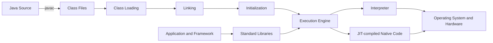

# Java 아키텍처

> [!summary]
> Java의 핵심은 단순히 “운영체제와 무관한 언어”가 아니다. 소스 코드를 플랫폼 중립적인 Class File로 변환하고, JVM이 이를 검증·로딩·실행하며, 표준 라이브러리와 런타임 도구가 운영 환경을 구성하는 계층형 플랫폼이다.

## 1. 개요

Java 아키텍처는 다음 계층의 협력으로 이해해야 한다.

1. **Java 언어**: 타입 시스템, 객체 모델, 예외, 동시성 문법 등 개발자가 사용하는 규칙
2. **컴파일러와 Class File**: 소스 코드를 JVM이 소비할 수 있는 구조화된 중간 표현으로 변환
3. **JVM(Java Virtual Machine)**: 클래스를 로딩·링크·초기화하고 바이트코드를 실행
4. **표준 라이브러리**: 컬렉션, I/O, 네트워크, 동시성 등 공통 기능 제공
5. **운영체제와 하드웨어**: 스레드 스케줄링, 파일, 소켓, 메모리 같은 실제 자원 제공
6. **애플리케이션과 프레임워크**: 도메인 로직과 서버 런타임 구성

시니어 개발자는 이 계층을 구분해야 장애가 언어 사용법의 문제인지, JVM 런타임의 문제인지, 네이티브 자원 또는 애플리케이션 설계의 문제인지 빠르게 좁힐 수 있다.

## 2. 왜 필요한가

### 이식성과 배포 단위

네이티브 실행 파일은 일반적으로 대상 CPU와 운영체제 ABI에 맞춰 만들어진다. Java는 소스를 Class File로 컴파일하고, 각 플랫폼에 맞는 JVM 구현이 그 Class File을 실행하는 간접 계층을 둔다. 이 구조가 흔히 말하는 **Write Once, Run Anywhere**의 기반이다.

다만 이식성은 무조건적인 보장이 아니다. 애플리케이션이 네이티브 라이브러리, 특정 파일 경로, 문자 인코딩, 파일 권한, 운영체제 명령, 시간대 설정에 의존하면 플랫폼 차이가 다시 노출된다.

### 안전한 실행 경계

Class File에는 타입과 메서드, 필드, 명령어에 대한 구조적 정보가 있다. JVM은 클래스 로딩 과정에서 형식과 바이트코드의 제약을 검사한다. 이 검증은 잘못된 바이트코드가 런타임 상태를 임의로 훼손할 가능성을 줄이지만, 애플리케이션 보안 취약점이나 논리 오류까지 막아 주지는 않는다.

### 관리형 런타임

Java는 객체 메모리 회수, 클래스 로딩, 런타임 최적화 같은 책임을 관리형 런타임에 둔다. 개발 생산성과 안정성을 높이는 대신 다음 비용과 운영 과제가 생긴다.

- Garbage Collection에 따른 지연 시간 변동
- JIT 컴파일과 워밍업에 따른 초기 성능 변화
- Heap 외 메모리까지 포함한 런타임 관측 필요
- JVM 옵션과 컨테이너 자원 제한의 상호작용

## 3. 핵심 개념

### Java SE 명세와 JVM 구현의 구분

Java 플랫폼을 설명할 때 보장 수준을 구분해야 한다.

| 구분 | 설명 | 예시 |
|---|---|---|
| Java 언어 규칙 | 소스 코드의 의미와 타입 규칙 | 오버로딩 선택, 접근 제어, 예외 처리 |
| Class File/JVM 규칙 | Class File 형식과 JVM 실행 모델 | 클래스 초기화 순서, 런타임 데이터 영역의 논리적 역할 |
| JVM 구현 선택 | 특정 JVM이 성능과 메모리를 구현하는 방식 | JIT 전략, GC 구현, 객체 배치 방식 |
| 운영체제 동작 | 프로세스와 실제 자원을 제공하는 방식 | 스레드 스케줄링, 소켓, 파일 디스크립터 |
| 프레임워크 동작 | 라이브러리가 추가하는 생명주기와 추상화 | Spring Bean 생성, 트랜잭션 Proxy |

특정 HotSpot 구현에서 관찰한 객체 헤더 크기나 JIT 최적화를 모든 JVM의 보장 사항으로 답하면 안 된다.

### JDK, 런타임, JVM

- **JDK**는 개발·진단 도구, 컴파일러, 표준 라이브러리, Java 런타임에 필요한 구성 요소를 포함하는 배포 단위다.
- **JVM**은 Class File을 로딩하고 실행하는 추상 머신 및 그 구현을 가리킨다.
- **런타임 이미지**는 애플리케이션 실행에 필요한 모듈과 네이티브 구성 요소의 집합이다.

“JRE”라는 용어는 역사적으로 독립 실행용 배포 패키지를 지칭할 때 널리 사용됐다. 실제 배포 형태와 도구 제공 방식은 JDK 공급자 및 버전에 따라 달라질 수 있으므로, 면접에서는 개념적 역할과 특정 배포 상품을 구분하는 편이 정확하다.

### Class File은 단순한 명령어 배열이 아니다

Class File에는 대체로 다음 정보가 구조화되어 있다.

- 형식 식별 정보와 버전
- Constant Pool
- 클래스 및 상위 타입 정보
- 필드와 메서드 메타데이터
- 메서드 바이트코드와 부가 속성

정확한 바이너리 레이아웃과 허용 속성은 JVM 명세 및 Class File 버전에 의존한다. 일반 원리를 설명할 때 검증하지 않은 세부 바이트 수나 구현 내부 구조를 단정하지 않는다.

## 4. 내부 동작 원리



### 4.1 컴파일

`javac`는 Java 소스의 구문과 타입을 검사하고 Class File을 생성한다. 이 단계에서 모든 런타임 문제가 사라지는 것은 아니다.

- 동적 클래스 로딩 대상은 컴파일 시 존재 여부를 확정하지 못할 수 있다.
- 실행 시 사용되는 클래스 버전이 컴파일 시점과 다르면 링크 오류가 발생할 수 있다.
- Reflection이나 Service Provider 구조는 런타임 구성에 의존한다.

### 4.2 클래스 로딩

Class Loader는 클래스의 바이너리 표현을 찾아 JVM 안에 클래스 정의를 만든다. 동일한 완전 수식 클래스명이라도 정의한 Class Loader가 다르면 런타임에서 서로 다른 타입으로 취급될 수 있다. 이 특성은 애플리케이션 서버, 플러그인, 모듈형 시스템에서 `ClassCastException`, `ClassNotFoundException`, `NoClassDefFoundError`를 분석할 때 중요하다.

클래스 로딩을 “파일을 메모리에 읽는 일”로만 설명하면 부족하다. 런타임 타입 정체성, 가시성, 격리 경계를 함께 형성한다.

### 4.3 링크와 초기화

개념적으로 링크에는 검증, 클래스 및 정적 필드에 필요한 저장 공간 준비, 심볼 참조 해석이 포함된다. 해석 시점은 JVM 구현과 실행 경로에 따라 지연될 수 있으므로 “모든 참조가 시작 시 한 번에 해석된다”고 단정하면 안 된다.

클래스 초기화 단계에서는 초기화가 필요한 정적 상태가 정해진 순서에 따라 실행된다. 정적 초기화에 무거운 I/O나 외부 시스템 연결을 넣으면 다음 문제가 생길 수 있다.

- 최초 접근 스레드의 긴 지연
- 초기화 실패 후 클래스 사용 불가
- 테스트 간 전역 상태 오염
- 장애 원인이 실제 호출 지점과 멀어짐

### 4.4 실행 엔진

JVM은 바이트코드를 해석할 수 있고, 자주 실행되는 경로를 네이티브 코드로 컴파일해 최적화할 수 있다. 구체적인 컴파일 임계값과 최적화 정책은 JVM 구현 및 옵션에 따라 달라진다.

JIT 최적화는 런타임 프로파일을 활용할 수 있다는 장점이 있지만 다음 운영 특성을 만든다.

- 프로세스 시작 직후와 워밍업 이후의 처리량 차이
- 호출 패턴 변화에 따른 최적화 또는 최적화 해제 가능성
- 짧게 실행되는 배치에서 워밍업 비용이 상대적으로 커질 가능성

### 4.5 메모리와 자원

JVM 명세의 런타임 데이터 영역은 논리적 실행 모델이다. 운영체제가 보는 RSS나 컨테이너 메모리와 일대일로 대응하지 않는다. Java 프로세스의 메모리는 일반적으로 다음을 함께 고려해야 한다.

- Java Heap
- 클래스 메타데이터 관련 영역
- 스레드 Stack
- JIT 컴파일 코드 저장 영역
- Direct Buffer 및 네이티브 라이브러리 할당
- JVM 자체 자료구조

따라서 `-Xmx`를 컨테이너 메모리 제한과 같게 설정하면 Heap 외 메모리를 위한 여유가 사라져 프로세스가 운영체제 또는 컨테이너 런타임에 의해 종료될 수 있다.

## 5. 상세 설명

### 플랫폼 독립성과 플랫폼 의존성의 경계

| 상대적으로 플랫폼 독립적인 부분 | 플랫폼 차이가 노출되는 부분 |
|---|---|
| Java 언어 의미 | 파일 경로와 권한 |
| Class File 실행 모델 | 기본 문자 인코딩과 Locale |
| 표준 API 계약 | 네이티브 라이브러리와 JNI |
| 예외 및 타입 시스템 | 운영체제별 소켓·파일 제한 |
| Java Memory Model | CPU, 커널, 컨테이너 자원 정책 |

`System.getProperty("os.name")`로 분기하는 코드가 많아질수록 이식성의 이점은 감소한다. 플랫폼 차이는 어댑터 계층에 격리하고, 핵심 도메인 로직은 플랫폼 API로부터 분리하는 것이 좋다.

### 관리형 런타임의 트레이드오프

**장점**

- 메모리 안전성과 자동 메모리 회수 지원
- 풍부한 표준 라이브러리와 도구 생태계
- 런타임 프로파일 기반 최적화 가능
- 스레드 덤프, Heap Dump, JFR 같은 진단 수단 활용 가능

**비용**

- GC 및 Safepoint와 관련된 지연 가능성
- 런타임과 애플리케이션 메모리를 함께 관리해야 함
- 워밍업과 동적 최적화로 인한 성능 변동
- Class Loader 누수처럼 관리형 런타임 고유의 장애 유형

## 6. Java 예제

다음 예제는 실행 환경을 명시적으로 수집하되, 환경별 분기를 핵심 로직에 퍼뜨리지 않는 구조를 보여 준다.

```java
import java.nio.charset.Charset;
import java.time.ZoneId;
import java.util.Locale;
import java.util.Map;

public record RuntimeEnvironment(
        String javaVersion,
        String vmName,
        String operatingSystem,
        Charset defaultCharset,
        ZoneId defaultZone,
        Locale defaultLocale,
        long availableProcessors,
        long maxHeapBytes
) {
    public static RuntimeEnvironment capture() {
        Runtime runtime = Runtime.getRuntime();
        return new RuntimeEnvironment(
                System.getProperty("java.version", "unknown"),
                System.getProperty("java.vm.name", "unknown"),
                System.getProperty("os.name", "unknown"),
                Charset.defaultCharset(),
                ZoneId.systemDefault(),
                Locale.getDefault(),
                runtime.availableProcessors(),
                runtime.maxMemory()
        );
    }

    public Map<String, String> asDiagnosticFields() {
        return Map.of(
                "javaVersion", javaVersion,
                "vmName", vmName,
                "operatingSystem", operatingSystem,
                "defaultCharset", defaultCharset.name(),
                "defaultZone", defaultZone.getId(),
                "defaultLocale", defaultLocale.toLanguageTag(),
                "availableProcessors", Long.toString(availableProcessors),
                "maxHeapBytes", Long.toString(maxHeapBytes)
        );
    }
}
```

```java
public final class Application {
    private Application() {
    }

    public static void main(String[] args) {
        RuntimeEnvironment environment = RuntimeEnvironment.capture();
        environment.asDiagnosticFields()
                .forEach((key, value) -> System.out.printf("%s=%s%n", key, value));
    }
}
```

이 코드는 Java 17에서 사용할 수 있는 `record`를 활용한다. 중요한 점은 이 값을 기능 분기의 만능 근거로 쓰는 것이 아니라, 시작 로그와 장애 진단 정보로 활용하는 것이다. 민감한 시스템 속성이나 환경 변수 전체를 로그로 출력하면 자격 증명이 노출될 수 있으므로 허용 목록 방식으로 수집해야 한다.

컴파일과 실행 예시는 다음과 같다.

```text
javac RuntimeEnvironment.java Application.java
java Application
```

운영에서는 빌드에 사용한 JDK와 실행 환경의 호환성을 CI 단계에서 검증하고, 컨테이너 이미지에 포함된 런타임 버전을 배포 산출물 메타데이터로 남기는 편이 안전하다.

## 7. 운영 환경 활용

### 시작 시 기록할 진단 정보

애플리케이션 시작 로그에는 다음과 같은 정보를 선택적으로 남기면 환경 불일치 분석에 유용하다.

- 애플리케이션 버전과 빌드 식별자
- Java 버전과 JVM 구현 이름
- 활성화된 핵심 프로파일
- 기본 시간대와 문자 인코딩
- 프로세서 인식 개수와 Heap 상한
- 민감 정보를 제외한 주요 런타임 옵션

### 배포 아티팩트 일관성

“개발 PC에서는 동작한다”는 문제는 Java 자체보다 빌드·실행 환경 차이에서 발생하는 경우가 많다.

- 컴파일 대상 Java 릴리스가 실행 런타임보다 높은 경우
- 로컬에는 있지만 배포 패키지에는 없는 의존성
- Classpath 순서 또는 중복 클래스 차이
- CPU 아키텍처와 맞지 않는 JNI 라이브러리
- 시간대·Locale·인코딩 기본값 차이

재현 가능한 빌드, 의존성 잠금 또는 검증, 불변 배포 이미지, 시작 시 환경 로깅이 이 문제를 줄인다.

## 8. 성능 및 메모리 고려 사항

### 측정 경계를 JVM 안으로 제한하지 않는다

응답 지연은 애플리케이션 코드, GC, JIT, 운영체제 스케줄링, 네트워크, 디스크, 외부 서비스가 합쳐진 결과다. CPU 사용률이 낮다고 JVM 문제가 아니라고 결론 내릴 수 없고, GC 로그가 있다고 모든 지연을 GC 탓으로 돌려서도 안 된다.

### 워밍업을 포함한 성능 평가

JIT가 있는 런타임에서는 시작 직후 수치와 정상 상태 수치를 구분한다. 마이크로벤치마크는 JVM 최적화로 코드가 제거되거나 실제 운영 부하를 대표하지 못할 수 있으므로 전용 도구와 검증된 방법론이 필요하다. 이 문서에서는 검증하지 않은 처리량 수치를 제시하지 않는다.

### 프로세스 메모리 예산

Heap만 계산하지 말고 스레드 수, Stack 크기, Direct Buffer, 클래스 수, 네이티브 에이전트와 라이브러리를 포함해 예산을 잡는다. 특히 스레드 수 증가는 Stack과 스케줄링 비용을 함께 늘린다.

## 9. 동시성과 스레드 안전성

Java 언어와 라이브러리는 동시성 도구를 제공하지만 JVM이 데이터 경쟁을 자동으로 해결하지는 않는다.

- 공유 가변 상태에는 명확한 동기화 정책이 필요하다.
- `volatile`, Lock, 원자 클래스는 서로 다른 보장과 비용을 가진다.
- Java Memory Model은 가시성과 순서의 규칙을 정의하지만 운영체제 스케줄링 공정성을 보장하지 않는다.
- 스레드 안전한 컬렉션을 사용해도 여러 단계의 복합 연산 전체가 자동으로 원자적이 되는 것은 아니다.

Java 아키텍처를 설명할 때 “멀티스레드를 지원한다”에 그치지 말고 언어 수준 메모리 모델, JVM 실행, OS 스케줄링의 경계를 구분해야 한다.

## 10. 실패 시나리오와 문제 해결

### `UnsupportedClassVersionError`

**의미**: 실행 JVM이 지원하지 않는 버전의 Class File을 로딩하려는 경우다.

**확인 순서**

1. 빌드에 사용한 Java 버전과 컴파일 대상 릴리스를 확인한다.
2. 실제 프로세스가 사용하는 `java` 실행 파일을 확인한다.
3. CI, 컨테이너 빌드 단계, 운영 이미지의 런타임 버전을 비교한다.
4. 다중 모듈 프로젝트에서 일부 모듈만 다른 설정을 쓰는지 확인한다.

### `NoClassDefFoundError`와 `ClassNotFoundException`

둘 다 클래스 로딩과 관련되지만 발생 맥락이 같다거나 항상 같은 방식으로 처리되는 것은 아니다. Classpath 누락뿐 아니라 정적 초기화 실패, Class Loader 가시성, 패키징 오류를 함께 점검해야 한다.

### 시작은 되지만 운영에서 OOM 종료

`OutOfMemoryError` 메시지와 컨테이너의 강제 종료는 구분해야 한다. Heap Dump가 없고 프로세스가 갑자기 종료됐다면 컨테이너 제한, 운영체제 로그, RSS, 네이티브 메모리 증가도 확인한다.

### 환경별 결과 불일치

시간대, Locale, 인코딩, 파일 시스템 대소문자 구분, 줄바꿈, 인증서 저장소 차이를 점검한다. 기본값에 의존하는 대신 업무 규칙상 필요한 값을 명시적으로 설정한다.

## 11. 흔한 실수

- Java, JDK, JVM을 같은 의미로 사용한다.
- 바이트코드를 “어떤 환경에서도 무조건 실행되는 코드”라고 단정한다.
- HotSpot의 구현 세부 사항을 JVM 명세의 보장으로 설명한다.
- `-Xmx`만으로 Java 프로세스 전체 메모리를 설명한다.
- JIT가 있으므로 Java가 항상 빠르거나 항상 느리다고 일반화한다.
- 모든 클래스가 애플리케이션 시작 시 한 번에 로딩된다고 설명한다.
- Class Loader 문제를 단순한 파일 누락으로만 판단한다.
- 운영 환경의 시간대, 인코딩, Locale 기본값을 신뢰한다.

## 12. 모범 사례

- 컴파일 대상 Java 릴리스와 실행 런타임의 호환성을 CI에서 검사한다.
- 동일한 배포 산출물을 환경별로 재빌드하지 않고 승격한다.
- 런타임 버전, 빌드 ID, 시간대 등 핵심 진단 정보를 시작 로그에 남긴다.
- Heap과 네이티브 메모리를 포함한 프로세스 단위 자원 예산을 관리한다.
- 플랫폼 의존 코드는 어댑터 뒤에 격리한다.
- JVM 옵션을 근거 없이 복사하지 말고 목표 지표와 검증 절차를 함께 기록한다.
- Classpath 및 의존성 충돌을 빌드 단계에서 탐지한다.
- 장애 시 애플리케이션 지표, JVM 지표, OS·컨테이너 지표를 시간축으로 함께 본다.

## 13. 면접 질문

### 질문 1. Java가 플랫폼 독립적이라는 말의 정확한 의미는 무엇인가?

**면접관이 평가하는 항목**

언어, Class File, JVM, 운영체제의 경계를 구분하는지 평가한다.

**간결한 답변**

Java 소스는 플랫폼 중립적인 Class File로 컴파일되고, 각 운영체제와 CPU에 맞는 JVM 구현이 이를 실행한다. 다만 JNI, 파일 시스템, 인코딩 같은 플랫폼 자원에 의존하면 애플리케이션 수준의 이식성은 깨질 수 있다.

**시니어 수준의 확장 답변**

플랫폼 독립성은 Class File과 JVM 추상화가 제공하는 실행 모델의 이식성을 뜻한다. 실제 실행은 플랫폼별 JVM과 운영체제 위에서 일어나므로 네이티브 라이브러리, 자원 제한, 파일 권한, 시간대 등의 차이는 남는다. 따라서 운영에서는 동일한 Class File만 확인할 것이 아니라 런타임 이미지와 OS 의존성까지 불변 배포 단위로 관리해야 한다.

**예상 후속 질문**

- Class File 버전이 맞지 않으면 어떤 오류가 발생하는가?
- JNI를 사용하면 배포 전략이 어떻게 달라지는가?
- 컨테이너를 사용하면 플랫폼 차이가 완전히 사라지는가?

**약하거나 잘못된 답변**

“JVM이 있으므로 어느 환경에서나 무조건 똑같이 동작한다.”

### 질문 2. JVM은 바이트코드를 어떻게 실행하는가?

**면접관이 평가하는 항목**

클래스 생명주기와 실행 엔진, 인터프리터와 JIT의 역할을 연결하는지 평가한다.

**간결한 답변**

Class Loader가 클래스를 로딩하고 링크·초기화한 뒤 실행 엔진이 바이트코드를 실행한다. JVM 구현은 해석 실행과 JIT 컴파일을 조합할 수 있으며 구체적인 최적화 정책은 구현에 따라 다르다.

**시니어 수준의 확장 답변**

실행 전에 클래스 형식과 바이트코드 제약을 검증하고 런타임 타입을 구성한다. 처음에는 해석될 수 있고 실행 프로파일이 축적되면 빈번한 경로가 네이티브 코드로 최적화될 수 있다. 이 때문에 시작 직후와 정상 상태 성능이 다르며 운영 성능 검증에서는 워밍업과 최적화 해제 가능성도 고려해야 한다.

**예상 후속 질문**

- JIT와 AOT의 장단점은 무엇인가?
- 워밍업이 짧은 배치에 어떤 영향을 주는가?
- Class Loader가 다르면 같은 클래스명이 왜 다른 타입이 되는가?

**약하거나 잘못된 답변**

“JVM은 모든 바이트코드를 시작할 때 네이티브 코드로 한 번에 변환한다.”

### 질문 3. Java 프로세스 메모리를 Heap만으로 판단하면 안 되는 이유는 무엇인가?

**면접관이 평가하는 항목**

JVM 논리 영역과 실제 프로세스 자원 사용을 구분하는지 평가한다.

**간결한 답변**

Java 프로세스에는 Heap 외에도 스레드 Stack, 클래스 메타데이터, JIT 코드, Direct Buffer, 네이티브 라이브러리와 JVM 자체 메모리가 존재하기 때문이다.

**실무 예시**

가상의 예로, 컨테이너 메모리 제한과 `-Xmx`를 동일하게 설정하면 Heap 외 메모리 증가 시 컨테이너가 프로세스를 종료할 수 있다. 이때 Heap 사용량만 보면 원인을 놓치기 쉽다.

## 14. 후속 질문

- 컴파일 타임 오류, 링크 오류, 런타임 예외를 어떻게 구분하는가?
- Parent Delegation이 해결하려는 문제는 무엇인가?
- Class Loader 누수는 어떤 상황에서 발생하는가?
- Java Memory Model과 JVM 메모리 영역은 어떻게 다른가?
- GC 선택은 처리량과 지연 시간 목표에 어떤 영향을 주는가?
- 동일한 JAR가 환경별로 다르게 동작할 때 무엇부터 비교하는가?
- JIT 워밍업을 운영 배포 전략에 어떻게 반영할 수 있는가?

## 15. 면접관의 관점

주니어 답변은 보통 “소스 → 바이트코드 → JVM”의 흐름에서 끝난다. 시니어 답변은 다음까지 연결해야 한다.

- 명세의 보장과 JVM 구현 선택의 구분
- Class Loader가 만드는 타입 격리와 장애 유형
- JIT·GC가 성능과 지연 시간에 미치는 운영 영향
- Heap 외 메모리를 포함한 자원 계획
- 환경 기본값과 네이티브 의존성이 이식성을 깨는 사례
- 장애를 애플리케이션, JVM, OS 계층으로 나누는 진단 접근

## 16. 시니어 수준의 답변

> Java는 언어 하나가 아니라 언어 규칙, Class File 형식, JVM 실행 모델, 표준 라이브러리와 도구로 구성된 플랫폼입니다. 소스는 Class File로 컴파일되고 플랫폼별 JVM이 로딩·링크·초기화한 뒤 해석 또는 JIT 컴파일 방식으로 실행합니다. 이 구조가 이식성과 관리형 런타임의 이점을 제공하지만, 실제 운영에서는 JNI, 파일 시스템, 시간대, 컨테이너 자원 같은 플랫폼 차이가 남습니다. 또한 성능과 메모리를 볼 때 Heap만 보지 않고 JIT 워밍업, GC, 스레드 Stack, Direct Buffer, 네이티브 메모리까지 프로세스 전체 관점에서 봐야 합니다. 장애 분석에서도 언어 명세, JVM 구현, 프레임워크, OS 계층을 분리해 가설을 세우는 것이 중요합니다.

## 17. 흔한 오답

- “JDK는 컴파일러이고 JVM은 실행기다.” — 역할을 지나치게 축약해 표준 라이브러리, 도구, 런타임 이미지의 관계를 놓친다.
- “Java는 운영체제와 완전히 무관하다.” — 실제 자원 접근과 네이티브 의존성을 무시한다.
- “GC가 있으므로 메모리 누수는 없다.” — 도달 가능한 객체의 불필요한 유지와 네이티브 자원 누수를 설명하지 못한다.
- “JIT가 바이트코드를 전부 컴파일한다.” — 실행 프로파일과 구현별 정책을 무시한다.
- “Heap이 남아 있으면 OOM이 아니다.” — Heap 외 메모리와 컨테이너 종료를 구분하지 못한다.

## 18. 운영 경험 체크리스트

- [ ] 빌드 JDK와 실행 런타임 버전 불일치를 진단한 경험이 있는가?
- [ ] Classpath 또는 Class Loader 문제를 분석한 경험이 있는가?
- [ ] Heap Dump, Thread Dump 또는 JFR을 수집하고 해석한 경험이 있는가?
- [ ] 컨테이너 제한과 JVM 메모리 옵션을 함께 설계한 경험이 있는가?
- [ ] 시간대·인코딩·Locale 차이로 발생한 문제를 예방하거나 해결했는가?
- [ ] 시작 시간과 워밍업 이후 성능을 구분해 측정했는가?
- [ ] JNI 또는 네이티브 라이브러리의 플랫폼 호환성을 관리했는가?
- [ ] 배포 산출물과 런타임 정보를 추적 가능하게 남겼는가?

## 19. 면접 직전 10분 요약

- Java 플랫폼은 **언어 + Class File + JVM + 표준 라이브러리 + 도구**로 본다.
- `javac`는 소스를 Class File로 만들고 JVM은 로딩·링크·초기화 후 실행한다.
- 인터프리터와 JIT의 조합은 JVM 구현 선택이며 세부 정책을 보편적 보장으로 말하지 않는다.
- 플랫폼 독립성은 JVM 추상화의 결과지만 OS 자원, JNI, 인코딩, 시간대 차이는 남는다.
- Class Loader는 바이트를 읽는 기능뿐 아니라 타입 정체성과 격리 경계를 만든다.
- Java 프로세스 메모리는 Heap 외 Stack, 메타데이터, JIT 코드, Direct Buffer, 네이티브 메모리를 포함한다.
- `-Xmx = 컨테이너 제한`은 위험할 수 있다.
- 성능 측정에서는 JIT 워밍업과 정상 상태를 구분한다.
- 장애는 애플리케이션·JVM·OS/컨테이너 계층으로 나누어 조사한다.
- 좋은 시니어 답변은 기술 구조를 배포, 성능, 장애 대응까지 연결한다.

## 20. 관련 주제

현재 관련 장이 아직 생성되지 않아 존재하지 않는 문서의 Wiki Link는 추가하지 않는다. 향후 Class File, ClassLoader, JVM Architecture 관련 장이 실제로 생성되면 연결한다.

## 21. 요약

Java 아키텍처의 본질은 계층 분리다. Java 언어와 Class File은 이식 가능한 프로그램 표현을 제공하고, JVM은 로딩·검증·실행·최적화를 담당하며, 운영체제는 실제 자원을 제공한다. 관리형 런타임은 생산성과 관측 가능성을 높이지만 GC, JIT 워밍업, Heap 외 메모리 같은 운영 과제를 만든다. 시니어 개발자는 각 계층의 책임과 보장 범위를 구분하고, 배포 호환성·성능·메모리·장애 분석을 하나의 실행 모델로 설명할 수 있어야 한다.
