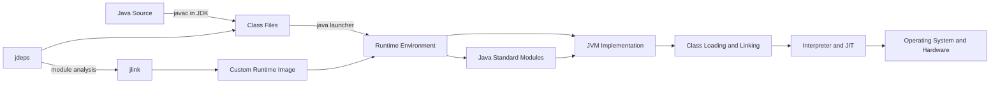

# JVM vs JRE vs JDK

> [!summary]
> JVM은 Class File을 로딩하고 실행하는 추상 머신의 명세와 구현을 가리키고, JRE는 Java 애플리케이션 실행에 필요한 환경을 뜻하며, JDK는 실행 환경에 컴파일·패키징·분석·진단 도구를 더한 개발 키트다. Java 17 환경에서는 과거의 독립 JRE 패키지, JDK 배포판, `jlink`로 만든 사용자 정의 런타임 이미지를 구분해야 한다.

## 1. 개요

JVM, JRE, JDK는 흔히 다음 포함 관계로 소개된다.

```text
JDK ⊃ JRE ⊃ JVM
```

입문 단계에서는 유용하지만 현대 Java의 배포 형태를 모두 설명하지는 못한다. 이 그림만 암기하면 JRE가 언제나 독립 설치 파일로 제공되고, JDK는 JRE에 `javac` 하나를 더한 제품이며, JVM은 `java` 명령 자체라고 오해하기 쉽다.

실무에서는 세 용어를 다음 관점으로 구분해야 한다.

| 구분  | 핵심 역할               | 대표 구성                                                   |
| --- | ------------------- | ------------------------------------------------------- |
| JVM | Class File 로딩·검증·실행 | Class Loader, 실행 엔진, 런타임 데이터 영역의 구현                     |
| JRE | 애플리케이션 실행 환경        | JVM, 표준 라이브러리, 실행에 필요한 네이티브 구성 요소                       |
| JDK | 개발·빌드·진단용 도구 모음     | 런타임, `javac`, `jar`, `javadoc`, `jdeps`, `jlink`, 진단 도구 |

Java 17 기준으로는 “서버에 JRE를 설치한다”보다 **어떤 공급자의 어떤 런타임 이미지를 어떤 모듈과 도구 구성으로 배포하는가**가 더 정확한 질문일 수 있다.

## 2. 왜 구분해야 하는가

### 빌드와 실행 환경은 다를 수 있다

CI는 JDK 21로 빌드하고 운영 서버는 Java 17 런타임을 사용할 수 있다. 컴파일 대상 릴리스를 제한하지 않으면 빌드는 성공해도 운영에서 `UnsupportedClassVersionError`가 발생할 수 있다.

### 운영 진단 가능성이 달라진다

작게 만든 런타임 이미지는 공격 표면과 이미지 크기를 줄이는 데 도움이 될 수 있다. 하지만 장애 분석에 필요한 도구까지 제거하면 스레드 덤프, Flight Recording, 프로세스 상태 확인이 어려워질 수 있다. 운영 이미지는 “실행 가능”뿐 아니라 “진단 가능”해야 한다.

### 업데이트 책임을 판단해야 한다

JVM과 표준 라이브러리, 인증서 저장소, 시간대 데이터에는 보안 및 안정성 업데이트가 적용된다. 애플리케이션 JAR만 교체하고 런타임 이미지를 장기간 고정하면 런타임 취약점과 데이터 노후화가 남을 수 있다.

### 공급자와 구현을 구분해야 한다

Java SE 규격, OpenJDK 프로젝트, HotSpot JVM, 특정 공급자의 JDK 바이너리는 같은 개념이 아니다. 호환되는 JDK라도 지원 기간, 패치 제공 방식, 인증, 포함 도구와 컨테이너 이미지 정책이 다를 수 있다.

## 3. 핵심 개념

### 3.1 JVM

JVM(Java Virtual Machine)은 Class File 형식과 실행 모델을 정의하는 명세이자 그 명세를 구현한 가상 머신을 가리킨다. 주요 책임은 다음과 같다.

- 클래스 로딩, 링크, 초기화
- Class File 형식과 바이트코드 제약 검증
- 바이트코드 실행
- 객체와 스레드 실행 상태 관리
- Garbage Collection과 JIT 컴파일 같은 구현 기능 제공
- JNI 등을 통한 네이티브 환경 연동

명세와 구현을 구분해야 한다. 런타임 데이터 영역의 논리적 역할은 명세로 설명할 수 있지만 객체 헤더 크기, JIT 임계값, 특정 GC의 동작은 JVM 구현과 옵션에 따라 달라질 수 있다.

JVM은 단독으로 일반적인 Java 애플리케이션을 완성하지 않는다. 애플리케이션은 문자열, 컬렉션, 파일, 네트워크 같은 표준 API에도 의존한다.

### 3.2 JRE

JRE(Java Runtime Environment)는 Java 애플리케이션을 실행하는 데 필요한 환경을 의미한다. 개념적으로 다음을 포함한다.

- JVM 구현
- Java 표준 라이브러리
- 실행을 지원하는 네이티브 라이브러리와 구성 파일
- 런처 등 실행에 필요한 구성 요소

과거에는 최종 사용자를 위한 독립 JRE 설치 패키지가 널리 배포됐다. 그러나 Java 9에서 모듈 시스템이 도입된 이후 런타임 구성과 배포 방식이 달라졌다. 현대 Java를 설명할 때는 JRE의 **개념적 역할**과 특정 공급자가 제공하던 **독립 JRE 상품**을 구분해야 한다.

따라서 “Java 17에는 JRE가 없다”는 표현도 지나치게 단순하다. 애플리케이션을 실행할 런타임 환경은 여전히 필요하지만, 그것이 과거와 동일한 독립 JRE 설치 패키지 형태로 항상 제공된다는 뜻은 아니다.

### 3.3 JDK

JDK(Java Development Kit)는 Java 애플리케이션을 개발, 빌드, 실행, 분석, 패키징, 진단하기 위한 배포 단위다.

대표 도구는 다음과 같다.

| 도구 | 역할 |
|---|---|
| `java` | Java 애플리케이션 실행 |
| `javac` | Java 소스를 Class File로 컴파일 |
| `jar` | JAR 아카이브 생성·조회·수정 |
| `javadoc` | API 문서 생성 |
| `javap` | Class File 구조와 바이트코드 확인 |
| `jdeps` | 클래스·모듈 의존성 분석 |
| `jlink` | 선택한 모듈로 사용자 정의 런타임 이미지 생성 |
| `jcmd` | 실행 중 JVM에 진단 명령 전달 |
| `jstack` | 스레드 상태 확인 |
| `jmap` | Heap 및 메모리 관련 정보 확인 |
| `jfr` | Java Flight Recorder 파일 관리·분석 |

도구의 정확한 제공 여부와 사용 가능 범위는 JDK 배포판과 버전을 확인해야 한다. JDK를 “컴파일러가 포함된 JRE”로만 설명하면 모듈 분석, 패키징, 관측과 장애 진단 역할을 놓친다.

## 4. 내부 동작과 관계



1. 개발자는 JDK의 `javac`로 소스를 Class File로 컴파일한다.
2. `java` 런처가 런타임 구성을 시작한다.
3. JVM 구현이 필요한 클래스를 로딩·링크·초기화한다.
4. 애플리케이션은 런타임에 포함된 표준 모듈과 라이브러리를 사용한다.
5. 실행 엔진이 바이트코드를 해석하거나 JIT 컴파일된 네이티브 코드로 실행한다.
6. 파일, 소켓, 스레드 같은 실제 자원은 운영체제와 하드웨어가 제공한다.

`java` 명령은 JVM과 완전히 같은 말이 아니다. `java`는 애플리케이션 실행을 시작하는 런처이고, 그 뒤에 런타임 구성과 JVM 구현이 협력한다.

## 5. 역사적 JRE와 현대 런타임 이미지

### Java 8 시대의 전형적인 설명

전통적인 설치 모델에서는 개발 PC에 JDK를, 실행만 하는 사용자 환경에 JRE를 설치하는 구분이 자연스러웠다. 이 맥락에서 `JDK ⊃ JRE ⊃ JVM`은 배포 패키지의 포함 관계까지 비교적 직관적으로 보여 줬다.

### Java 9 이후의 변화

Java Platform Module System은 런타임을 모듈 단위로 구성할 기반을 제공한다. `jlink`는 필요한 모듈을 조합해 특정 애플리케이션용 런타임 이미지를 만들 수 있다.

이 변화의 핵심은 “JRE라는 실행 역할이 사라졌다”가 아니라, **모든 애플리케이션이 동일한 범용 독립 JRE를 공유해야 한다는 배포 가정이 약해졌다**는 점이다.

### 사용자 정의 런타임 이미지의 장단점

**장점**

- 애플리케이션에 필요한 모듈만 포함 가능
- 배포 단위와 런타임 버전을 함께 고정 가능
- 불필요한 구성 요소를 줄여 이미지 크기와 공격 표면을 관리할 수 있음

**비용**

- 누락 모듈로 인한 실행 실패 가능성
- 런타임 보안 업데이트 시 이미지 재생성·재배포 필요
- 동적 로딩과 Reflection 때문에 정적 의존성 분석만으로 부족할 수 있음
- 진단 도구와 관측 기능을 제거하면 운영 대응력이 저하될 수 있음
- 운영체제와 CPU 아키텍처에 맞는 이미지를 각각 만들어야 할 수 있음

## 6. 상세 비교

| 질문 | JVM | JRE/런타임 환경 | JDK |
|---|---|---|---|
| 주 목적 | Class File 실행 모델 구현 | 애플리케이션 실행 | 개발·빌드·실행·분석·진단 |
| 표준 라이브러리 | JVM 자체와 별도 개념 | 포함 | 런타임 구성으로 포함 |
| 컴파일러 | 필수 아님 | 일반적으로 없음 | 제공 |
| 개발 도구 | 필수 아님 | 일반적으로 제한적 | 제공 |
| 진단 도구 | 구현 기능은 있으나 배포 도구는 별도 | 이미지 구성에 따라 다름 | 일반적으로 폭넓게 제공 |
| 배포 형태 | 런타임 내부 구현 | 독립 패키지 또는 사용자 정의 이미지 | 공급자별 JDK 바이너리·이미지 |
| 플랫폼 의존성 | 플랫폼별 구현 필요 | OS·CPU별 네이티브 구성 필요 | OS·CPU별 배포판 필요 |

## 7. Java 17 예제

### 빌드와 실행 도구 확인

Windows PowerShell에서는 실제 선택된 도구와 버전을 함께 확인한다.

```powershell
where.exe java
where.exe javac
java -version
javac -version
```

`JAVA_HOME`이 올바르더라도 `PATH` 앞쪽에 다른 Java가 있으면 예상과 다른 `java.exe`가 실행될 수 있다. 반대로 일부 도구는 `JAVA_HOME`을 직접 참조하므로 두 설정이 서로 다른 JDK를 가리키면 빌드 도구와 터미널 결과가 달라질 수 있다.

### 컴파일 대상 릴리스 명시

```powershell
javac --release 17 Application.java
java Application
```

`--release 17`은 단순히 소스 문법 수준만 낮추는 옵션이 아니다. 대상 Java SE 릴리스에 맞는 언어 수준, Class File 대상과 공개 API 사용을 함께 제한하는 데 사용한다. 다만 서드파티 라이브러리의 런타임 호환성과 네이티브 의존성까지 보장하지는 않는다.

### 런타임 정보를 제한적으로 수집

```java
import java.util.Map;

public final class JavaRuntimeInfo {
    private JavaRuntimeInfo() {
    }

    public static Map<String, String> capture() {
        Runtime.Version version = Runtime.version();
        return Map.of(
                "javaVersion", version.toString(),
                "javaVendor", System.getProperty("java.vendor", "unknown"),
                "runtimeName", System.getProperty("java.runtime.name", "unknown"),
                "vmName", System.getProperty("java.vm.name", "unknown"),
                "vmVendor", System.getProperty("java.vm.vendor", "unknown"),
                "osName", System.getProperty("os.name", "unknown"),
                "osArch", System.getProperty("os.arch", "unknown")
        );
    }

    public static void main(String[] args) {
        capture().forEach((key, value) ->
                System.out.printf("%s=%s%n", key, value));
    }
}
```

이 정보는 시작 로그와 장애 보고서에 유용하다. 환경 변수나 시스템 속성 전체를 출력하면 토큰, 비밀번호, 내부 경로가 노출될 수 있으므로 허용 목록만 수집해야 한다.

### 모듈 의존성 확인

```powershell
jdeps --print-module-deps app.jar
```

출력 결과는 `jlink` 구성의 출발점으로 사용할 수 있지만 충분 조건은 아니다. Service Provider, Reflection, JNI, 실행 시 선택되는 구현처럼 정적 분석에서 드러나지 않는 의존성이 있을 수 있으므로 실제 배포 이미지에서 통합 테스트해야 한다.

## 8. 운영 환경 활용

### 빌드 환경

- 빌드 JDK 공급자와 정확한 버전을 고정한다.
- Gradle 또는 Maven Toolchain으로 개발자 PC와 CI의 JDK 선택을 일치시킨다.
- 컴파일 대상 릴리스를 명시한다.
- 생성된 아티팩트와 빌드 메타데이터에 소스 리비전, JDK 버전, 대상 릴리스를 기록한다.

### 실행 환경

- 애플리케이션 시작 시 실제 Java 및 JVM 버전을 기록한다.
- 개발·스테이징·운영에서 동일한 아티팩트를 승격한다.
- 런타임 이미지의 OS와 CPU 아키텍처를 배포 대상과 맞춘다.
- 인증서, 시간대 데이터, Locale, 기본 인코딩 차이를 관리한다.
- 런타임과 베이스 이미지의 보안 업데이트 주기를 정한다.

### 컨테이너 환경

멀티 스테이지 빌드에서는 빌드 단계에 전체 JDK를 사용하고 실행 단계에는 필요한 런타임만 둘 수 있다. 그러나 이미지 크기만 최소화해서는 안 된다.

- Heap 외 메모리를 포함해 컨테이너 메모리 예산을 계산한다.
- 스레드 덤프와 JFR 등 필요한 진단 경로를 확보한다.
- 컨테이너에 도구가 없다면 외부 관측, Sidecar, 진단용 이미지 등 대안을 검증한다.
- 태그만 신뢰하지 말고 이미지 Digest와 런타임 패치 수준을 추적한다.

## 9. 성능 및 메모리 고려 사항

JDK와 런타임 이미지의 구분 자체가 애플리케이션 성능을 결정하지는 않는다. 실제 성능은 JVM 구현, GC, JIT, 애플리케이션 코드, 부하 패턴과 운영체제 자원에 영향을 받는다.

### 이미지 크기와 런타임 성능

모듈을 줄이면 배포 이미지 크기와 전송량은 감소할 수 있다. 이것을 처리량 증가나 GC 지연 감소와 동일시하면 안 된다. 개선하려는 지표가 이미지 Pull 시간인지, 프로세스 시작 시간인지, 메모리인지 분리해 측정해야 한다.

### JDK를 운영에 두는 비용

전체 JDK는 더 많은 도구와 파일을 포함한다. 이것이 곧 실행 성능 저하를 의미하지는 않지만 배포 크기, 관리 대상, 잠재적 공격 표면에 영향을 줄 수 있다. 반대로 필요한 진단 도구의 제거는 장애 복구 시간을 늘릴 수 있다.

### 프로세스 메모리

Java 프로세스 메모리는 Heap 외에도 다음을 포함한다.

- 스레드 Stack
- 클래스 메타데이터
- JIT 컴파일 코드
- Direct Buffer
- JVM 및 네이티브 라이브러리 할당

따라서 어떤 런타임 패키지를 사용하든 `-Xmx`만으로 컨테이너 메모리 제한을 채우면 위험하다.

## 10. 실패 시나리오와 문제 해결

### `UnsupportedClassVersionError`

**원인**

실행 런타임이 지원하는 것보다 높은 Class File 버전으로 컴파일된 클래스를 로딩했다.

**확인 순서**

1. `java -version`으로 실제 실행 런타임을 확인한다.
2. `javac -version`과 빌드 로그에서 빌드 JDK를 확인한다.
3. 빌드 설정의 Toolchain과 `--release` 또는 대상 호환성 설정을 확인한다.
4. 다중 모듈 중 일부만 높은 대상으로 컴파일됐는지 확인한다.

### 터미널과 IDE의 Java 버전이 다름

**원인 후보**

- IDE가 프로젝트별 JDK를 사용한다.
- `PATH`와 `JAVA_HOME`이 다른 설치를 가리킨다.
- 빌드 데몬이 이전 JDK로 시작된 상태다.
- 셸을 재시작하지 않아 변경된 환경이 반영되지 않았다.

실제 프로세스 경로와 빌드 도구가 선택한 Toolchain을 각각 확인한다.

### 사용자 정의 이미지에서 모듈을 찾지 못함

`jlink` 이미지에 애플리케이션 또는 런타임 경로가 요구하는 모듈이 없을 수 있다. `jdeps` 결과, `module-info.java`, Service Provider 구성과 동적 로딩 경로를 확인하고 실제 이미지 기반 테스트를 수행한다.

### 로컬에서는 실행되지만 컨테이너에서 시작 실패

다음을 비교한다.

- CPU 아키텍처
- 기반 OS와 C 라이브러리
- JNI 라이브러리
- 인증서 저장소
- 파일 권한
- 시간대 데이터와 기본 인코딩
- 컨테이너 자원 제한

Java 바이트코드가 이식 가능하더라도 런타임 이미지와 네이티브 구성 요소는 플랫폼의 영향을 받는다.

### 장애 시 진단 명령을 사용할 수 없음

실행 이미지에 필요한 도구가 없거나 컨테이너 권한이 제한됐을 수 있다. 운영 전 장애 대응 훈련을 통해 Thread Dump, Heap Dump, JFR, 종료 로그를 실제로 수집할 수 있는지 검증해야 한다.

## 11. 흔한 실수

- JVM, `java` 런처, Java 프로세스를 같은 의미로 사용한다.
- JDK를 “JRE + `javac`”로만 설명한다.
- Java 17에는 실행 환경이라는 개념 자체가 없다고 말한다.
- 독립 JRE가 모든 공급자와 버전에서 같은 형태로 제공된다고 가정한다.
- JDK 공급자, OpenJDK 프로젝트, HotSpot JVM을 동일시한다.
- `java -version`만 보고 빌드에 사용된 `javac`도 같다고 가정한다.
- 높은 JDK로 빌드한 코드는 낮은 런타임에서도 자동으로 실행된다고 믿는다.
- `jlink` 이미지가 작으면 애플리케이션 처리량도 자동으로 증가한다고 생각한다.
- 운영 이미지에서 진단 도구를 제거하고 대체 수집 경로를 마련하지 않는다.
- 런타임 보안 패치와 인증서·시간대 데이터 갱신을 애플리케이션 배포와 분리해 방치한다.

## 12. 모범 사례

- 빌드 JDK, 대상 Java 릴리스, 실행 런타임을 별도 항목으로 관리한다.
- Toolchain과 재현 가능한 빌드로 개발·CI 환경 차이를 줄인다.
- 운영 시작 로그에 애플리케이션 버전과 허용된 런타임 정보를 남긴다.
- 사용자 정의 런타임 이미지는 실제 통합·회귀 테스트를 통과시킨다.
- 런타임 이미지와 베이스 OS에 정기적인 보안 업데이트 정책을 적용한다.
- 이미지 크기, 시작 시간, 메모리, 처리량을 서로 다른 지표로 측정한다.
- 최소 실행 구성과 최소 운영 가능 구성을 구분한다.
- JDK 공급자 선택 시 호환성뿐 아니라 지원 기간과 패치 정책을 확인한다.
- 플랫폼 의존 네이티브 구성 요소를 배포 매트릭스에 명시한다.

## 13. 면접 질문

### 질문 1. JVM, JRE, JDK의 차이를 설명해 주세요.

**면접관이 평가하는 항목**

단순 포함 관계를 넘어 명세·실행 환경·도구 배포 단위를 구분하는지 평가한다.

**간결한 답변**

JVM은 Class File을 로딩하고 실행하는 추상 머신의 명세와 구현이고, JRE는 JVM과 표준 라이브러리 등 애플리케이션 실행에 필요한 환경이며, JDK는 런타임에 컴파일·패키징·분석·진단 도구를 포함한 개발 키트입니다.

**시니어 수준의 확장 답변**

전통적으로 `JDK ⊃ JRE ⊃ JVM`으로 설명했지만 Java 9 이후에는 모듈 기반 사용자 정의 런타임 이미지도 고려해야 합니다. 그래서 JRE의 개념적 실행 역할과 과거의 독립 JRE 상품을 구분해야 합니다. 운영에서는 빌드 JDK, 컴파일 대상 릴리스, 실제 런타임과 진단 도구 구성을 독립적으로 검증합니다.

**예상 후속 질문**

- Java 17에서 JRE가 없다는 말은 정확한가?
- `java` 명령과 JVM은 같은가?
- JDK를 운영 서버에 두면 안 되는가?

**약하거나 잘못된 답변**

“JDK는 개발용, JRE는 실행용, JVM은 바이트코드를 읽는 프로그램입니다.” 역할의 방향은 맞지만 현대 배포 모델과 각 경계를 설명하지 못한다.

### 질문 2. 높은 JDK로 낮은 Java 버전을 대상으로 안전하게 빌드하려면 어떻게 해야 합니까?

**간결한 답변**

Toolchain으로 빌드 JDK를 통제하고 `--release` 또는 빌드 도구의 대응 설정으로 대상 릴리스의 문법, Class File 버전과 공개 API 사용을 제한합니다. 서드파티 라이브러리와 실제 운영 런타임 호환성은 별도로 테스트합니다.

**예상 후속 질문**

- `-source`와 `-target`만 지정할 때 놓칠 수 있는 문제는 무엇인가?
- 다중 모듈에서 일부 모듈만 설정이 다르면 어떻게 탐지하는가?
- 런타임 호환성을 CI에서 어떻게 검증하는가?

### 질문 3. 운영 이미지에는 JDK와 최소 런타임 중 무엇을 사용해야 합니까?

**간결한 답변**

정답은 하나가 아닙니다. 배포 크기와 공격 표면뿐 아니라 필요한 표준 모듈, 보안 업데이트, 장애 진단 도구와 수집 대안을 기준으로 결정해야 합니다.

**실무 예시**

최소 런타임을 사용한다면 배포 전에 동일 이미지에서 Thread Dump나 JFR 같은 필수 진단 정보를 실제로 수집할 수 있는지 검증합니다. 도구를 제외했다면 외부 수집이나 진단용 이미지 등 대체 절차를 마련합니다.

### 질문 4. `jlink`의 장점과 주의점은 무엇입니까?

**간결한 답변**

필요한 모듈로 애플리케이션 전용 런타임 이미지를 만들어 배포 단위와 런타임을 함께 고정할 수 있습니다. 반면 동적 의존성 누락, 플랫폼별 이미지 관리, 보안 업데이트 시 재생성과 진단 도구 부족을 주의해야 합니다.

## 14. 후속 질문

- Java SE 명세와 JDK 배포판은 어떻게 다른가?
- OpenJDK와 HotSpot은 어떤 관계인가?
- Class File 버전은 어디에서 확인할 수 있는가?
- Toolchain은 `JAVA_HOME` 문제를 어떻게 줄이는가?
- 사용자 정의 런타임 이미지에서 Reflection 의존성을 어떻게 검증하는가?
- 컨테이너 이미지의 Java 패치 수준을 어떻게 추적하는가?
- 최소 런타임과 CDS, JIT 워밍업은 각각 어떤 문제를 다루는가?
- 운영 진단 도구가 없는 경우 어떤 대체 관측 체계를 마련할 수 있는가?

## 15. 면접관의 관점

주니어 답변은 세 용어의 포함 관계와 개발용·실행용 차이를 말하면 기본을 충족한다. 시니어 답변은 다음까지 연결해야 한다.

- JVM 명세와 특정 구현의 구분
- 역사적 JRE 상품과 현대 런타임 이미지의 구분
- 빌드 JDK, 대상 릴리스, 실제 실행 런타임의 호환성
- JDK 공급자와 보안 패치 정책
- 컨테이너 및 `jlink` 배포의 장단점
- 최소 이미지와 운영 진단 가능성의 트레이드오프
- OS·CPU·JNI 같은 플랫폼 의존성

## 16. 시니어 수준의 답변

> JVM은 Class File을 로딩·검증·실행하는 추상 머신의 명세와 구현입니다. JRE는 JVM과 표준 라이브러리, 네이티브 구성 요소를 포함해 애플리케이션을 실행할 수 있게 하는 환경이고, JDK는 여기에 컴파일·패키징·모듈 분석·런타임 이미지 생성·진단 도구를 포함한 개발 키트입니다. 전통적인 `JDK ⊃ JRE ⊃ JVM`은 개념 이해에는 유용하지만 Java 9 이후의 모듈형 런타임과 공급자별 배포 정책을 모두 표현하지는 못합니다. 운영에서는 빌드 JDK, `--release`로 정한 대상 버전, 실제 실행 런타임을 각각 검증하고, 최소 이미지의 크기뿐 아니라 패치 정책과 장애 진단 가능성까지 함께 설계해야 합니다.

## 17. 흔한 오답

- “JVM은 Java 코드를 기계어로 번역하는 컴파일러다.” — 로딩, 검증, 실행 상태 관리와 해석 실행을 놓친다.
- “JRE는 JVM의 다른 이름이다.” — 표준 라이브러리와 실행 구성 요소를 구분하지 못한다.
- “JDK는 JRE에 `javac`만 추가한 것이다.” — 패키징, 모듈 분석, 런타임 생성과 진단 도구를 놓친다.
- “Java 17에는 JRE가 없으므로 런타임도 없다.” — 개념적 역할과 독립 배포 상품을 혼동한다.
- “JDK 21로 컴파일하면 Java 17에서도 실행된다.” — 대상 Class File과 API 호환성 설정이 필요하다.
- “최소 런타임 이미지는 항상 더 빠르다.” — 배포 크기와 실행 성능 지표를 혼동한다.
- “JDK를 운영에 두면 무조건 보안 취약점이다.” — 위협 모델과 진단 요구를 평가하지 않은 단정이다.

## 18. 운영 경험 체크리스트

- [ ] `java`와 `javac`의 실제 경로 및 버전 불일치를 진단한 경험이 있는가?
- [ ] Toolchain으로 로컬과 CI의 JDK를 통제했는가?
- [ ] `UnsupportedClassVersionError`의 빌드·실행 버전을 추적했는가?
- [ ] 런타임 공급자와 패치 수준을 배포 메타데이터로 관리하는가?
- [ ] `jdeps` 또는 모듈 의존성 분석을 사용해 본 적이 있는가?
- [ ] 사용자 정의 런타임 이미지의 누락 모듈을 테스트했는가?
- [ ] 운영 이미지에서 Thread Dump, Heap Dump, JFR 수집 절차를 검증했는가?
- [ ] CPU 아키텍처 또는 JNI 호환성 문제를 진단했는가?
- [ ] 런타임 및 베이스 이미지 보안 업데이트 절차가 있는가?
- [ ] 이미지 크기와 애플리케이션 성능을 별도 지표로 측정하는가?

## 19. 면접 직전 10분 요약

- JVM은 Class File 실행 모델의 명세와 구현이다.
- JRE는 JVM, 표준 라이브러리와 네이티브 구성 요소를 포함한 실행 환경이다.
- JDK는 실행 환경과 컴파일·패키징·분석·진단 도구를 포함한다.
- `java`는 실행 런처이며 JVM과 완전히 같은 말이 아니다.
- 전통적인 포함 관계는 유용하지만 현대 모듈형 배포 전체를 설명하지 못한다.
- Java 17에서는 과거의 독립 JRE 상품과 사용자 정의 런타임 이미지를 구분한다.
- 빌드 JDK, 대상 릴리스, 실행 런타임은 서로 다를 수 있다.
- `--release`는 대상 문법, Class File과 공개 API 사용을 함께 제한한다.
- `jlink`는 작은 전용 이미지를 만들 수 있지만 누락 모듈, 패치, 진단성을 관리해야 한다.
- 최소 실행 구성보다 최소 운영 가능 구성이 중요하다.

## 20. 관련 주제

- [[01-Java-Core/001-Java-Architecture|Java 아키텍처]] — Java 언어, Class File, JVM과 운영체제의 전체 실행 계층

향후 Java Compilation Process, Class File & Bytecode, JVM Architecture 문서가 실제로 생성되면 빌드 호환성, Class File 구조와 JVM 내부 동작을 각각 연결한다.

## 21. 요약

JVM, JRE, JDK의 차이는 단순한 크기 비교가 아니라 책임과 배포 경계의 차이다. JVM은 Class File을 실행하는 추상 머신이고, JRE는 애플리케이션 실행 환경이며, JDK는 개발과 운영 분석에 필요한 도구까지 제공한다.

Java 17의 실무에서는 독립 JRE라는 역사적 상품 모델에만 의존하지 않는다. JDK 배포판 또는 애플리케이션 전용 런타임 이미지를 선택하고, 빌드 대상 릴리스, 실제 실행 버전, 모듈, OS와 CPU 아키텍처, 보안 패치와 진단 가능성을 함께 관리해야 한다. 좋은 시니어 답변은 세 용어의 정의를 배포 재현성, 운영 안정성, 성능 측정과 장애 대응으로 연결한다.
