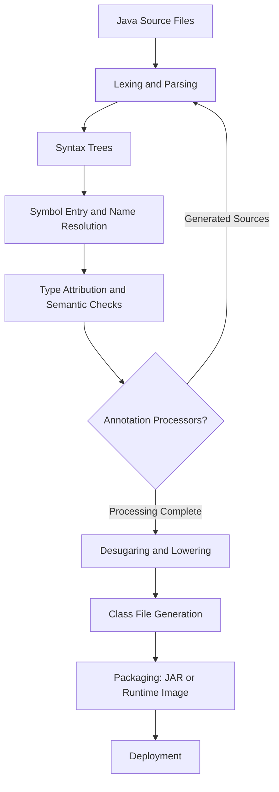

# Java 컴파일 과정

> [!summary]
> Java 컴파일은 소스 코드를 단순히 바이트코드로 치환하는 작업이 아니다. 컴파일러는 구문과 타입을 검증하고, Annotation Processor가 생성한 소스를 다시 처리하며, 일부 문법을 더 단순한 표현으로 낮춘 뒤 Class File을 만든다. 운영 관점에서는 컴파일 JDK, `--release`, 의존성 Classpath·Module Path, 생성 코드와 빌드 캐시가 재현 가능한 산출물을 좌우한다.

## 1. 개요

Java 애플리케이션의 일반적인 실행 흐름은 다음과 같다.

1. 개발자가 `.java` 소스 파일을 작성한다.
2. Java 컴파일러가 소스를 분석하고 `.class` Class File을 생성한다.
3. 빌드 도구가 Class File과 리소스를 JAR 또는 애플리케이션 이미지로 패키징한다.
4. 실행 시 JVM이 필요한 클래스를 로딩·링크·초기화하고 바이트코드를 실행한다.
5. JVM 구현은 필요에 따라 실행 중인 바이트코드를 해석하거나 JIT 컴파일한다.

이 장의 범위는 주로 1~3단계다. Class File 자체의 상세 구조, JVM 클래스 로딩 및 실행 엔진은 별도 주제로 다룬다.

Java Language Specification은 소스 프로그램의 의미를, JVM Specification은 Class File과 실행 모델을 정의한다. 반면 `javac`의 구체적인 내부 단계, 진단 메시지, 최적화 방식은 컴파일러 구현과 버전에 의존한다. 따라서 이 문서에서 설명하는 컴파일 단계는 Java 컴파일러의 일반 원리와 OpenJDK `javac`를 이해하기 위한 개념 모델이며, 모든 Java 컴파일러의 동일한 내부 파이프라인을 보장한다는 뜻은 아니다.

## 2. 왜 필요한가

### 실행 전에 오류를 제거한다

컴파일러는 다음과 같은 문제를 실행 전에 발견한다.

- 문법 오류
- 존재하지 않는 타입이나 멤버 참조
- 호환되지 않는 타입 대입
- 접근 제어 위반
- 검사 예외(Checked Exception) 처리 누락
- 제네릭 타입 제약 위반
- 중복 선언과 도달할 수 없는 일부 코드

정적 검사는 운영 장애를 줄이지만 모든 오류를 막지는 못한다. 잘못된 업무 규칙, `null` 사용, 데이터 경쟁, 외부 시스템 장애, Reflection을 통한 동적 접근은 여전히 런타임 문제가 될 수 있다.

### 플랫폼 중립적인 배포 표현을 만든다

Java 컴파일러의 대표적인 출력은 특정 CPU의 기계어가 아니라 JVM Class File이다. 플랫폼별 JVM이 동일한 실행 모델을 제공하기 때문에 애플리케이션 소스와 운영체제 사이에 추상화 계층이 생긴다. 자세한 플랫폼 구조는 [[01-Java-Core/001-Java-Architecture|Java 아키텍처]]를 참고한다.

### 빌드 계약을 고정한다

프로덕션에서 중요한 것은 “내 PC에서 컴파일된다”가 아니라 다음 계약이 반복 가능하게 유지되는가다.

- 어떤 JDK 배포판과 버전으로 빌드했는가?
- 어떤 Java 릴리스를 대상으로 했는가?
- 정확히 어떤 의존성과 Annotation Processor를 사용했는가?
- 생성 코드와 리소스가 동일하게 포함되는가?
- 같은 소스로 추적 가능한 산출물을 다시 만들 수 있는가?

컴파일 과정은 소스와 운영 산출물 사이의 공급망 경계다.

## 3. 핵심 개념

### Source, Target, Release

세 옵션은 목적이 다르다.

- `-source`: 허용할 Java 소스 문법 수준과 관련된다.
- `-target`: 생성할 Class File 대상 수준과 관련된다.
- `--release`: 해당 Java 릴리스의 언어 수준, Class File 대상 및 지원 API 집합을 함께 제한하기 위한 옵션이다.

낮은 버전에서 실행할 산출물을 높은 JDK로 빌드할 때는 일반적으로 `--release`가 더 안전하다. `-source`와 `-target`만 낮춰도 컴파일러가 현재 JDK에만 존재하는 API를 볼 수 있다면, 빌드는 성공하고 낮은 런타임에서 링크 오류가 발생할 수 있다.

정확한 지원 릴리스 범위는 사용하는 JDK 버전과 도구 문서로 확인해야 한다. 이 문서는 특정 최신 지원 범위를 단정하지 않는다.

### Classpath와 Module Path

컴파일러는 소스에 등장하는 타입과 멤버를 해석하기 위해 의존성을 찾아야 한다.

- **Classpath**는 전통적인 클래스 및 JAR 탐색 경로다.
- **Module Path**는 명명된 모듈의 모듈 그래프를 구성하는 데 사용된다.

의존성이 누락되면 컴파일 오류가 발생한다. 더 위험한 경우는 중복 클래스나 버전 충돌로 인해 의도하지 않은 정의를 보고 컴파일하는 것이다. 컴파일 Classpath와 런타임 Classpath가 다르면 `NoSuchMethodError`, `NoClassDefFoundError` 같은 런타임 링크 오류로 이어질 수 있다.

### Annotation Processing

Annotation Processor는 컴파일 중 Annotation과 프로그램 구조를 읽고 새 소스나 리소스를 생성할 수 있다. 일반적인 활용 예는 메타데이터 생성, 매퍼 구현 생성, 정적 코드 생성이다.

중요한 경계는 다음과 같다.

- Processor가 애플리케이션의 임의 런타임 로직을 실행하는 것은 아니다.
- 생성된 소스는 이후 컴파일 라운드에서 다시 처리될 수 있다.
- Processor는 빌드 시 실행되는 코드이므로 신뢰할 수 있는 의존성으로 관리해야 한다.
- Processor의 비결정적 출력은 재현 가능한 빌드를 깨뜨릴 수 있다.

### Compile-Time과 Runtime의 구분

| Compile-Time | Runtime |
|---|---|
| 소스 구문 및 타입 검사 | 클래스 로딩과 링크 |
| Annotation Processing | 객체 생성과 메서드 실행 |
| Class File 생성 | 인터프리터·JIT 실행 |
| 일부 상수식 계산 | 입력 데이터에 따른 분기 |
| 컴파일 의존성 확인 | 실제 배포 Classpath 확인 |

컴파일 성공은 실행 성공의 필요조건에 가깝지만 충분조건은 아니다.

## 4. 내부 동작 원리



이 다이어그램은 이해를 위한 논리적 흐름이다. 실제 `javac` 구현의 단계 명칭, 순서의 세부 사항 및 단계 간 결합은 JDK 버전에 따라 달라질 수 있다.

### 4.1 Lexing과 Parsing

컴파일러는 문자 스트림을 토큰으로 구분하고 문법에 따라 구문 트리(Syntax Tree)를 만든다.

예를 들어 세미콜론 누락이나 괄호 불일치는 이 단계에서 발견될 수 있다. 하지만 `payment.authorize()`의 `authorize` 메서드가 실제로 존재하는지는 이름과 타입 정보가 필요하므로 Parsing만으로 판단할 수 없다.

### 4.2 Symbol 등록과 이름 해석

컴파일러는 패키지, 클래스, 필드, 메서드, 지역 변수 같은 선언을 Symbol로 관리하고 이름이 무엇을 가리키는지 해석한다.

여기에는 다음 요소가 영향을 준다.

- 현재 패키지와 `import`
- 중첩 Scope와 Shadowing
- 상속 관계
- Classpath 또는 Module Path의 타입
- 접근 제어자
- 메서드 오버로딩 후보

같은 단순 이름의 타입이 여러 패키지에서 들어오면 모호성이 발생할 수 있다. 와일드카드 import는 코드를 짧게 만들 수 있지만 충돌 가능성과 출처 파악 비용을 높인다.

### 4.3 타입 검사와 의미 분석

구문이 맞아도 프로그램 의미가 Java 타입 규칙에 맞지 않으면 컴파일되지 않는다.

```java
long orderId = "ORD-100"; // incompatible types
```

이 단계에서는 대입 호환성, 메서드 호출 인자, 제네릭 제약, 반환 타입, 예외 처리, 접근 가능성 등을 검사한다. 오버로딩은 Compile-Time에 선언된 타입과 적용 가능한 메서드 후보를 바탕으로 선택된다. 반면 오버라이딩된 인스턴스 메서드의 실제 구현 선택은 Runtime 동적 디스패치와 관련된다.

### 4.4 Annotation Processing Round

Processor가 새 소스를 생성하면 컴파일러는 생성된 타입을 포함해 추가 처리 Round를 수행할 수 있다. 더 생성할 파일이 없을 때 처리가 종료된다.

운영에서 자주 겪는 문제는 다음과 같다.

- IDE에서는 Processor가 활성화되지만 CI에서는 설정이 빠짐
- Processor와 컴파일러 또는 라이브러리 버전이 호환되지 않음
- 생성 소스 디렉터리가 잘못 캐시됨
- Processor가 시간, 파일 순서, 외부 환경에 의존해 출력이 달라짐

Annotation Processing은 빌드 그래프에 명시적으로 포함하고, 일반 런타임 의존성과 분리해 관리하는 편이 좋다.

### 4.5 Desugaring과 Lowering

컴파일러는 일부 고수준 문법을 JVM이 표현하기 쉬운 낮은 수준의 형태로 변환한다. 이를 흔히 Desugaring 또는 Lowering이라고 부른다.

예를 들어 향상된 `for` 문, 일부 문자열 결합, `try-with-resources`, Lambda 표현은 소스와 Class File에서 같은 형태로 남지 않을 수 있다. 다만 정확한 변환 전략은 언어 기능, 컴파일러 및 대상 릴리스에 따라 달라질 수 있다.

이 때문에 다음에 주의해야 한다.

- 소스 한 줄과 바이트코드 명령어 수는 일대일이 아니다.
- Stack Trace의 줄 번호는 디버그 메타데이터와 최적화에 영향을 받는다.
- Decompiler 결과는 원본 소스가 아니라 Class File로부터 복원한 근사 표현이다.

### 4.6 Class File 생성

컴파일러는 검증된 프로그램 구조를 Class File로 기록한다. Class File에는 타입 정보, Constant Pool, 필드·메서드 정보, 바이트코드 및 여러 속성이 포함될 수 있다.

`javac`는 일반적으로 애플리케이션 성능을 위해 공격적인 전체 프로그램 최적화를 수행하는 도구로 이해하면 안 된다. 많은 최적화 판단은 실행 프로파일을 가진 JVM의 JIT 컴파일러가 Runtime에 수행할 수 있다. 구체적인 최적화 분담은 컴파일러 및 JVM 구현에 따라 다르다.

## 5. 상세 설명

### 별도 컴파일과 Binary Compatibility

Java 프로젝트는 모든 모듈을 항상 함께 컴파일하지 않는다. 라이브러리 A를 먼저 배포하고 애플리케이션 B가 A의 공개 API를 기준으로 별도 컴파일될 수 있다.

이때 소스 호환성과 Binary Compatibility는 다르다.

- 기존 바이너리가 재컴파일 없이 새 라이브러리와 연결되는가?
- 소스를 새 라이브러리로 다시 컴파일할 수 있는가?
- 동작 의미가 이전과 같은가?

메서드 시그니처 변경이나 의존성 버전 충돌은 컴파일에서는 드러나지 않고 배포 후 링크 오류로 나타날 수 있다. 라이브러리 변경 시 공개 API와 바이너리 호환성을 별도로 검토해야 한다.

### 제네릭과 Type Erasure

Java 제네릭의 많은 타입 정보는 Compile-Time 타입 검사에 활용되고, Class File에는 Erasure를 반영한 표현과 필요한 메타데이터가 기록된다. 컴파일러는 타입 안전성을 위해 Cast나 Bridge Method가 필요한 코드를 생성할 수 있다.

따라서 다음 두 문장은 모두 부정확하다.

- “제네릭 타입 정보는 Runtime에 완전히 존재한다.”
- “제네릭 정보는 Class File에서 전부 사라진다.”

실행 시 객체가 `List<String>`과 `List<Integer>`를 서로 다른 런타임 클래스로 가지는 것은 아니지만, Reflection에서 활용할 수 있는 선언 Signature 메타데이터가 남을 수 있다. Reifiable Type과 비구체화 타입의 차이를 구분해야 한다.

### 상수 Inlining

컴파일 시점 상수로 인정되는 `static final` Primitive 또는 `String` 값은 이를 사용하는 Class File 쪽에 값이 포함될 수 있다. 라이브러리의 상수만 변경하고 소비자를 재컴파일하지 않으면 소비자가 이전 값을 계속 사용할 수 있다.

따라서 외부 계약으로 공개한 상수 값을 바꾸는 것은 단순한 서버 측 변경이 아닐 수 있다. 라이브러리 배포에서는 소비자 재컴파일 필요 여부를 검토해야 한다.

### Incremental Compilation

Gradle이나 IDE는 변경된 소스와 영향받는 부분만 다시 컴파일해 시간을 줄일 수 있다. 그러나 증분 컴파일의 정확성은 빌드 도구가 의존 관계와 입력을 정확히 추적한다는 전제에 의존한다.

캐시 키에 포함되지 않은 환경 변수, 비결정적인 Processor, 직접 참조한 외부 파일은 다음 문제를 만든다.

- 깨끗한 빌드는 성공하지만 증분 빌드는 실패
- 개발자 PC와 CI 결과 불일치
- 오래된 생성 코드가 산출물에 잔존

이상 징후가 있을 때 무조건 캐시를 지우는 것은 임시 복구일 뿐이다. 어떤 입력이 빌드 모델에서 누락되었는지 찾아야 재발을 막을 수 있다.

## 6. Java 17 예제

### 6.1 컴파일과 실행

다음 두 파일은 Compile-Time 타입 검사와 Runtime 동적 디스패치를 구분한다.

```java
// PaymentGateway.java
public interface PaymentGateway {
    PaymentResult authorize(long orderId, long amount);
}
```

```java
// PaymentResult.java
public record PaymentResult(long orderId, boolean approved) {
    public PaymentResult {
        if (orderId <= 0) {
            throw new IllegalArgumentException("orderId must be positive");
        }
    }
}
```

```java
// InMemoryPaymentGateway.java
public final class InMemoryPaymentGateway implements PaymentGateway {
    @Override
    public PaymentResult authorize(long orderId, long amount) {
        if (amount <= 0) {
            throw new IllegalArgumentException("amount must be positive");
        }
        return new PaymentResult(orderId, true);
    }
}
```

```java
// PaymentApplication.java
public final class PaymentApplication {
    private PaymentApplication() {
    }

    public static void main(String[] args) {
        PaymentGateway gateway = new InMemoryPaymentGateway();
        PaymentResult result = gateway.authorize(1001L, 50_000L);
        System.out.printf("orderId=%d approved=%s%n",
                result.orderId(), result.approved());
    }
}
```

컴파일과 실행은 다음과 같이 분리된다.

```text
javac --release 17 PaymentGateway.java PaymentResult.java InMemoryPaymentGateway.java PaymentApplication.java
java PaymentApplication
```

컴파일러는 `PaymentGateway`에 `authorize(long, long)`가 존재하고 반환 타입이 맞는지 확인한다. 실행 시에는 `gateway`의 실제 객체가 `InMemoryPaymentGateway`이므로 오버라이딩된 구현이 호출된다.

### 6.2 Class File 관찰

```text
javap -classpath . -c -p PaymentApplication
```

`javap` 출력은 Class File을 관찰하기 위한 도구이며, Java 소스를 그대로 복원하는 도구가 아니다. 출력 형식과 세부 표시는 사용하는 JDK에 따라 다를 수 있다.

더 자세한 정보를 확인할 때는 다음 형태를 사용할 수 있다.

```text
javap -classpath . -verbose PaymentApplication
```

운영 산출물을 조사할 때는 반드시 실제 배포된 JAR에서 Class File을 추출하거나 올바른 Classpath를 지정해야 한다. 로컬 빌드 결과를 보고 운영 바이너리도 같다고 추정하면 안 된다.

### 6.3 Compile-Time 오류 예시

```java
PaymentGateway gateway = new InMemoryPaymentGateway();
PaymentResult result = gateway.authorize("1001", 50_000L);
```

첫 번째 인자는 `long`이어야 하므로 컴파일러가 타입 오류를 보고한다. 하지만 `50_000L`이 업무적으로 허용되는 금액인지는 컴파일러가 알 수 없다. 타입 안전성과 도메인 유효성 검증은 서로 다른 책임이다.

## 7. 운영 환경 활용

### 빌드 환경을 운영 자산으로 관리한다

다음을 소스와 함께 추적해야 한다.

- JDK 공급자 및 버전 정책
- 컴파일 대상 릴리스
- Gradle Wrapper 또는 Maven Wrapper
- 의존성 및 Plugin 버전
- Annotation Processor 설정
- 컴파일 옵션과 경고 정책

개발자가 각자 설치한 전역 도구보다 Wrapper와 선언적 빌드 설정을 우선한다.

### CI에서 깨끗한 빌드를 검증한다

로컬 증분 빌드만 성공하는 상태를 방지하려면 CI에서 격리된 환경의 Clean Build를 수행한다. 생성 코드가 저장소에 포함되는 정책이라면 생성 결과가 최신인지 검사하고, 포함하지 않는 정책이라면 빌드가 반드시 재생성할 수 있어야 한다.

### 컴파일 경고를 관리한다

경고를 전부 무시하면 중요한 타입 안전성 문제를 놓치고, 모든 경고를 즉시 오류로 취급하면 레거시 코드 전환이 중단될 수 있다. 다음과 같이 단계적으로 운영한다.

1. 새 코드에 적용할 경고 기준을 정한다.
2. 경고 종류별 수량을 CI에서 관찰한다.
3. Suppression에는 좁은 범위와 근거를 남긴다.
4. 핵심 모듈부터 오류 승격을 검토한다.

### 산출물 Provenance

어떤 Commit, 빌드 실행, JDK, 의존성으로 JAR가 만들어졌는지 추적할 수 있어야 한다. 단, 빌드 시각이나 머신별 절대 경로를 무조건 산출물에 넣으면 동일 입력의 재현성을 해칠 수 있으므로 메타데이터 정책을 명시한다.

## 8. 성능 및 메모리 고려 사항

### 컴파일 시간 병목

대규모 프로젝트의 컴파일 시간은 개발자 피드백 주기와 CI 처리량에 직접 영향을 준다. 주요 병목 후보는 다음과 같다.

- 지나치게 큰 모듈과 넓은 의존 관계
- 비용이 큰 Annotation Processor
- 비효율적인 생성 코드
- 불안정한 원격 캐시
- 병렬 작업에 비해 부족한 CPU·메모리
- Classpath Snapshot 또는 증분 분석 무효화

최적화 전에 Clean Build, 증분 Build, Test, Packaging 시간을 분리해 측정한다. “컴파일이 느리다”는 전체 빌드가 느리다는 의미와 같지 않다.

### 컴파일러 메모리

컴파일러도 대규모 Syntax Tree, Symbol, 타입 정보와 생성 코드를 메모리에 유지한다. 무작정 Heap을 늘리기 전에 어떤 모듈과 Processor가 메모리를 사용하는지 확인한다. 빌드 Worker를 과도하게 병렬화하면 Worker당 메모리 합계가 CI 컨테이너 제한을 초과할 수 있다.

### Runtime 성능과의 관계

컴파일 시간이 길다고 Runtime 코드가 빠른 것은 아니다. 반대로 `javac`가 빠르게 끝나도 Runtime 병목이 없다는 뜻이 아니다. Java에서는 Runtime 프로파일을 활용하는 JIT가 성능에 큰 역할을 할 수 있으므로 Compile-Time 비용과 Runtime 성능을 별도 지표로 관리한다.

## 9. 동시성과 스레드 안전성

컴파일러의 타입 검사는 공유 가변 상태의 데이터 경쟁을 자동으로 방지하지 않는다.

```java
public final class UnsafeCounter {
    private int value;

    public void increment() {
        value++;
    }

    public int value() {
        return value;
    }
}
```

이 클래스는 정상적으로 컴파일되지만 여러 스레드가 동시에 `increment()`를 호출하면 갱신 손실이 발생할 수 있다. `value++`는 언어 수준에서 여러 스레드에 대해 원자적 연산으로 보장되지 않는다.

시니어 답변은 “컴파일 성공 = 안전한 프로그램”이라는 오해를 피하고, 타입 안전성·메모리 안전성·스레드 안전성·업무 정합성을 구분해야 한다.

## 10. 실패 시나리오와 문제 해결

### `cannot find symbol`

**가능한 원인**

- 오탈자 또는 잘못된 `import`
- 의존성 누락
- 생성 코드가 만들어지지 않음
- 잘못된 Source Set
- Module Export 또는 Readability 문제

**진단 순서**

1. 오류가 난 Symbol의 완전 수식 이름을 확인한다.
2. 해당 타입이 소스, 생성 소스, 의존 JAR 중 어디에 있어야 하는지 확인한다.
3. 실제 컴파일 명령과 Classpath·Module Path를 확인한다.
4. Annotation Processing 로그와 생성 디렉터리를 확인한다.
5. IDE가 아닌 Wrapper 기반 Clean Build로 재현한다.

### `UnsupportedClassVersionError`

컴파일은 성공했지만 실행 JVM이 해당 Class File 버전을 지원하지 못할 때 발생할 수 있다.

**대응**

- 실제 컴파일 JDK와 실행 JVM을 각각 확인한다.
- 대상 릴리스를 `--release` 또는 빌드 도구의 Toolchain 설정으로 고정한다.
- 일부 모듈이나 의존 JAR만 높은 버전으로 빌드되지 않았는지 확인한다.

JDK·JVM·런타임 배포 모델의 구분은 [[01-Java-Core/002-JVM-vs-JRE-vs-JDK|JVM vs JRE vs JDK]]를 참고한다.

### `NoSuchMethodError`

소스는 컴파일됐지만 Runtime에 로딩된 라이브러리 버전에 기대한 메서드가 없을 때 발생할 수 있다. 이는 보통 컴파일 Classpath와 런타임 Classpath 불일치 또는 의존성 충돌의 신호다.

컴파일을 다시 시도하는 것만으로 해결하지 말고 다음을 비교한다.

- 컴파일 시 선택된 의존성 그래프
- 패키징된 실제 JAR 목록
- Runtime Classpath와 Class Loader
- 중복 클래스 및 Shading 결과

### CI에서만 컴파일 실패

- JDK 및 Locale 차이
- 대소문자 구분 파일 시스템 차이
- 로컬에만 남은 생성 파일
- 선언되지 않은 환경 변수 또는 외부 파일
- CI의 메모리 제한
- 의존성 저장소 또는 캐시 문제

로컬 환경을 CI에 맞추는 것보다 빌드 입력을 선언하고 격리된 환경에서 재현하는 것이 근본 해결책이다.

### Annotation Processor 실패

Processor Stack Trace의 가장 안쪽 원인, Processor 버전, 컴파일러 버전, 입력 Annotation 및 생성 경로를 확인한다. 내부 Compiler API에 의존하는 Processor는 JDK 변경에 민감할 수 있으므로 호환성 표를 검증해야 한다.

## 11. 흔한 실수

- `-source`와 `-target`만 낮추면 하위 Java 런타임 호환성이 완전히 보장된다고 생각한다.
- IDE 빌드 성공만 확인하고 CI의 실제 컴파일 명령을 보지 않는다.
- Compile Classpath와 Runtime Classpath가 같다고 가정한다.
- Annotation Processor를 일반 런타임 의존성처럼 관리한다.
- Decompiler 결과를 원본 소스와 동일하다고 믿는다.
- 제네릭 정보가 Runtime에 전부 존재하거나 전부 사라진다고 단정한다.
- 캐시를 지우는 것으로 증분 빌드 문제의 원인을 해결했다고 판단한다.
- 컴파일 성공을 동시성 안전성과 업무 정합성의 증거로 사용한다.

## 12. 모범 사례

- Toolchain과 `--release`로 빌드 JDK 및 대상 릴리스를 명시한다.
- Wrapper를 사용해 빌드 도구 버전을 고정한다.
- 컴파일 의존성과 런타임 의존성을 구분한다.
- Annotation Processor를 별도 구성으로 선언하고 출력을 재현 가능하게 만든다.
- CI에서 격리된 Clean Build를 정기적으로 검증한다.
- 경고 Suppression의 범위와 이유를 기록한다.
- 공개 라이브러리 변경 시 Source·Binary·Behavior Compatibility를 구분한다.
- 빌드 시간은 컴파일, 테스트, 패키징 단계별로 측정한다.
- 실제 배포 산출물의 Class File과 의존성 그래프를 기준으로 장애를 분석한다.

## 13. 면접 질문

### 질문 1. Java 소스가 실행되기까지 과정을 설명해 주세요.

**면접관이 평가하는 항목**

Compile-Time과 Runtime을 구분하고, 컴파일·클래스 로딩·JIT의 책임을 연결하는지 평가한다.

**간결한 답변**

`javac`가 소스를 Parsing하고 이름과 타입을 검증한 뒤 Class File을 생성합니다. 빌드 도구가 이를 JAR로 패키징하고, 실행 시 JVM이 클래스를 로딩·링크·초기화합니다. 실행 엔진은 바이트코드를 해석하거나 JVM 구현 정책에 따라 JIT 컴파일할 수 있습니다.

**시니어 수준의 확장 답변**

컴파일 단계에는 구문 트리 생성, Symbol 해석, 타입 검사, Annotation Processing, 일부 문법 Lowering, Class File 생성이 포함됩니다. 운영에서는 이 흐름뿐 아니라 컴파일 JDK와 `--release`, 컴파일 Classpath와 런타임 Classpath의 일치, 생성 코드의 재현성을 관리해야 합니다. 컴파일 성공 후에도 낮은 JVM에서의 Class File 비호환이나 배포 의존성 충돌로 링크 오류가 발생할 수 있습니다.

**예상 후속 질문**

- `--release`와 `-source`·`-target`의 차이는 무엇인가?
- JIT 컴파일은 `javac`와 어떻게 다른가?
- Annotation Processor는 언제 실행되는가?

**약하거나 잘못된 답변**

“`javac`가 Java 소스를 기계어로 만들고 JVM이 그 기계어를 실행합니다.”

### 질문 2. 컴파일은 성공했는데 운영에서 `NoSuchMethodError`가 발생하는 이유는 무엇인가요?

**면접관이 평가하는 항목**

별도 컴파일, Binary Compatibility, 의존성 그래프 및 Class Loader를 이해하는지 평가한다.

**간결한 답변**

컴파일할 때 본 라이브러리와 Runtime에 실제 로딩된 라이브러리가 달라, 호출하도록 기록된 메서드를 실행 시 찾지 못했을 가능성이 큽니다.

**시니어 수준의 확장 답변**

먼저 컴파일 의존성 그래프, 패키징된 JAR, Runtime Classpath를 비교합니다. Transitive Dependency 충돌, 컨테이너 기본 라이브러리, 중복 클래스, Shading, Class Loader 격리도 확인합니다. 단순히 클린 빌드만 반복하기보다 실제 운영 프로세스가 어느 JAR에서 클래스를 로딩했는지 증거를 확보해야 합니다.

**실무 예시**

가상의 예로, 서비스가 라이브러리 A의 새 메서드를 기준으로 컴파일됐지만 배포 이미지에 이전 A가 포함되면 시작 또는 해당 경로 최초 실행 시 `NoSuchMethodError`가 발생할 수 있다.

### 질문 3. Annotation Processing의 운영상 위험은 무엇인가요?

**면접관이 평가하는 항목**

코드 생성 편의성뿐 아니라 빌드 공급망, 재현성, 호환성까지 보는지 평가한다.

**간결한 답변**

Processor는 빌드 시 실행되는 코드이므로 신뢰성과 버전 호환성을 관리해야 합니다. 비결정적 생성, IDE와 CI 설정 차이, 증분 컴파일 오판이 빌드 불일치를 만들 수 있습니다.

**예상 후속 질문**

- 생성 코드를 저장소에 Commit할 것인가?
- Processor를 Runtime 의존성과 어떻게 분리할 것인가?
- CI에서 생성 결과를 어떻게 검증할 것인가?

## 14. 후속 질문

- Parsing과 타입 검사는 왜 별도 단계인가?
- 오버로딩과 오버라이딩은 각각 언제 결정되는가?
- Type Erasure 때문에 어떤 제약이 생기는가?
- Bridge Method는 왜 필요할 수 있는가?
- Compile-Time 상수 변경이 소비자 재컴파일을 요구할 수 있는 이유는 무엇인가?
- Classpath와 Module Path의 차이는 무엇인가?
- Clean Build와 Incremental Build 결과가 다르면 어떻게 조사하는가?
- 컴파일 경고를 운영 정책으로 어떻게 관리하는가?

## 15. 면접관의 관점

주니어 답변은 흔히 “소스 → `javac` → 바이트코드 → JVM 실행”에서 끝난다. 시니어 답변은 다음을 설명해야 한다.

- Parsing, Symbol 해석, 타입 검사, Annotation Processing의 책임
- `--release`를 포함한 하위 런타임 호환성 전략
- Compile Classpath와 Runtime Classpath 불일치가 만드는 링크 오류
- 별도 컴파일과 Binary Compatibility
- 생성 코드와 증분 빌드의 재현성
- Build Toolchain, CI, 배포 산출물 Provenance 관리

## 16. 시니어 수준의 답변

> Java 컴파일은 소스를 바이트코드로 단순 변환하는 과정이 아닙니다. 컴파일러가 Parsing으로 구문 트리를 만들고, Symbol과 타입을 해석해 Java 언어 규칙을 검증하며, Annotation Processing과 문법 Lowering을 거쳐 Class File을 생성합니다. 실행 시에는 JVM이 별도로 클래스를 로딩·링크·초기화하고 인터프리터와 JIT를 통해 실행합니다. 운영에서는 이 단계 구분보다 한 걸음 더 나아가 Toolchain과 `--release`를 고정하고, Compile Classpath와 Runtime Classpath를 일치시키며, 생성 코드와 증분 캐시를 재현 가능하게 관리해야 합니다. 컴파일 성공은 타입 규칙을 통과했다는 뜻이지 동시성 안전성, 업무 정합성, 런타임 의존성 호환성까지 보장한다는 뜻은 아닙니다.

## 17. 흔한 오답

- “`javac`가 Java 코드를 JVM에서 바로 실행한다.”
- “바이트코드는 CPU 기계어다.”
- “컴파일이 성공하면 운영에서도 클래스 호환 문제가 없다.”
- “`-target 17`만 지정하면 Java 17 API 호환성도 보장된다.”
- “Annotation은 모두 Runtime에 Reflection으로 처리된다.”
- “Decompiler로 원본 소스를 완전히 복구할 수 있다.”
- “제네릭 타입은 Class File에서 아무 흔적도 남지 않는다.”

## 18. 운영 경험 체크리스트

- [ ] 빌드 JDK와 실행 JVM 불일치로 발생한 문제를 진단했는가?
- [ ] 실제 컴파일 명령과 Classpath를 확인해 본 경험이 있는가?
- [ ] Annotation Processor 또는 생성 코드 장애를 분석했는가?
- [ ] Clean Build와 증분 Build 결과 불일치를 해결했는가?
- [ ] `NoSuchMethodError` 같은 Binary Compatibility 문제를 추적했는가?
- [ ] CI 빌드 시간에서 컴파일 병목을 분리해 측정했는가?
- [ ] Toolchain과 Wrapper로 빌드 환경을 고정했는가?
- [ ] 공개 상수 또는 API 변경 시 소비자 재컴파일 영향을 검토했는가?

## 19. 면접 직전 10분 요약

- Java 컴파일은 **Parsing → Symbol/타입 분석 → Annotation Processing → Lowering → Class File 생성**으로 이해한다.
- 이는 논리적 모델이며 `javac` 내부 단계의 세부 사항은 버전에 따라 달라질 수 있다.
- `javac`는 보통 CPU 기계어가 아니라 JVM Class File을 만든다.
- `--release`는 대상 언어·Class File·지원 API를 함께 제한하는 데 사용한다.
- Compile Classpath와 Runtime Classpath가 다르면 컴파일 성공 후에도 링크 오류가 날 수 있다.
- Annotation Processor는 빌드 시 실행되는 코드이며 재현성과 공급망 관리 대상이다.
- 고수준 문법은 Lowering되므로 소스와 바이트코드는 일대일이 아니다.
- 제네릭은 Type Erasure를 사용하지만 선언 Signature 같은 메타데이터가 남을 수 있다.
- 증분 빌드 오류는 캐시 삭제로 끝내지 말고 누락된 입력과 의존 관계를 찾는다.
- 컴파일 성공은 타입 안전성의 일부를 제공할 뿐 업무 정합성과 스레드 안전성을 보장하지 않는다.

## 20. 관련 주제

- [[01-Java-Core/001-Java-Architecture|Java 아키텍처]] — Java 언어, Class File, JVM과 운영체제의 계층 관계
- [[01-Java-Core/002-JVM-vs-JRE-vs-JDK|JVM vs JRE vs JDK]] — 빌드 도구, 런타임 환경과 배포 모델의 차이

## 21. 요약

Java 컴파일은 소스의 문법과 의미를 검증하고 JVM이 실행할 수 있는 Class File을 만드는 과정이다. 핵심 단계는 Parsing, 이름·타입 해석, Annotation Processing, 문법 Lowering, Class File 생성이다. 그러나 프로덕션 품질은 컴파일러만으로 만들어지지 않는다. JDK Toolchain, 대상 릴리스, 의존성 그래프, 생성 코드, 캐시, CI 환경과 산출물 추적성을 함께 관리해야 한다. 시니어 개발자는 컴파일 성공과 런타임 성공의 차이를 이해하고, 링크 오류·호환성·재현성 문제를 빌드부터 배포까지 연결해 설명할 수 있어야 한다.
