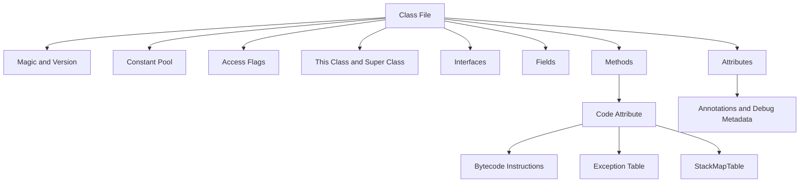

# Class File & Bytecode

> [!summary]
> Class File은 Java 소스를 JVM이 실행할 수 있도록 만든 표준 바이너리 형식이다. 바이트코드는 그 안에 들어 있는 JVM 명령어 집합이며, Constant Pool, 필드·메서드 정보, 검증 메타데이터, 디버그 정보 같은 구조와 함께 동작한다. 운영에서는 Class File 버전, 실제 배포된 바이트코드, 의존성 충돌, 계측 도구가 삽입한 코드까지 확인할 수 있어야 한다.

## 1. 개요

Java 컴파일 결과로 생성되는 `.class` 파일은 단순한 "바이트코드 파일"이 아니다. JVM이 클래스를 로딩하고 검증하고 실행하기 위해 필요한 구조화된 바이너리 문서에 가깝다.

Class File에는 대체로 다음 정보가 들어 있다.

1. 파일 식별자와 Class File 버전
2. Constant Pool
3. 클래스, 상위 클래스, 인터페이스 정보
4. 필드와 메서드 선언
5. 메서드별 Code Attribute와 바이트코드
6. 예외 처리 테이블
7. LineNumberTable, LocalVariableTable 같은 디버그 관련 속성
8. Annotation, Generic Signature, InnerClasses, NestMembers 같은 부가 속성

이 장은 [[01-Java-Core/003-Java-Compilation-Process|Java 컴파일 과정]] 이후 생성되는 산출물의 구조를 다룬다. JVM이 이 파일을 로딩·링크·초기화하고 실행하는 전체 계층은 [[01-Java-Core/001-Java-Architecture|Java 아키텍처]]를 함께 보면 좋다.

## 2. 왜 필요한가

### JVM의 공통 실행 계약이다

Java 소스, Kotlin, Scala, Groovy처럼 서로 다른 JVM 언어도 최종적으로 JVM이 이해하는 Class File을 만들 수 있다. JVM은 소스 언어가 아니라 Class File 형식과 바이트코드 제약을 기준으로 프로그램을 검증하고 실행한다.

따라서 Java 개발자도 Class File을 이해하면 다음 질문에 더 정확히 답할 수 있다.

- 왜 컴파일은 성공했는데 실행 시 `NoSuchMethodError`가 발생하는가?
- 왜 낮은 Java 런타임에서 `UnsupportedClassVersionError`가 발생하는가?
- Lambda, `switch`, `try-with-resources`, Generic은 바이트코드에서 어떻게 달라지는가?
- APM Agent, Mocking Framework, Lombok, Proxy, Byte Buddy 같은 도구가 어디에 개입하는가?

### 운영 산출물을 직접 확인할 수 있다

운영 장애에서 소스 저장소만 보고 판단하면 위험하다. 실제 프로세스가 로딩한 Class File은 다음 이유로 소스와 다를 수 있다.

- 배포 이미지에 오래된 JAR가 포함됨
- 의존성 충돌로 다른 버전의 클래스가 먼저 로딩됨
- Shading 또는 Relocation으로 패키지가 변경됨
- Agent가 바이트코드를 계측함
- CI 빌드와 로컬 빌드의 Toolchain이 다름

실제 배포된 JAR에서 `javap`, 의존성 분석, Class Loader 로그 등을 통해 Class File을 확인할 수 있어야 한다.

## 3. 핵심 개념

### Class File과 Bytecode의 차이

| 구분 | 설명 |
|---|---|
| Class File | JVM이 로딩할 수 있는 전체 바이너리 형식 |
| Bytecode | 메서드의 `Code` 속성 안에 들어 있는 JVM 명령어 |
| Constant Pool | 클래스명, 메서드명, 문자열, 숫자, 참조 정보를 담는 테이블 |
| Attribute | 코드, 디버그 정보, Annotation, Generic Signature 같은 확장 정보 |

면접에서 "Class File은 바이트코드다"라고만 말하면 부족하다. 바이트코드는 Class File의 핵심 일부지만, JVM은 명령어 배열만으로 클래스를 실행하지 않는다. 타입 정보, 접근 제어, 예외 처리 범위, Stack Map Frame 같은 검증 정보도 함께 사용한다.

### Magic Number와 Version

Class File은 `0xCAFEBABE`라는 Magic Number로 시작한다. 그 뒤에는 Minor Version과 Major Version이 있고, JVM은 이 버전이 자신이 지원하는 범위인지 확인한다.

대표적인 Major Version 예시는 다음과 같다.

| Java 릴리스 | Class File Major Version |
|---|---:|
| Java 8 | 52 |
| Java 11 | 55 |
| Java 17 | 61 |
| Java 21 | 65 |

Java 17 런타임은 Java 21 대상으로 컴파일된 Class File을 실행할 수 없다. 이때 대표적으로 `UnsupportedClassVersionError`가 발생한다. 반대로 높은 JDK로 빌드하더라도 `--release 17`을 올바르게 사용하면 Java 17 대상 Class File과 API 사용으로 제한할 수 있다.

### Constant Pool

Constant Pool은 Class File 내부의 참조 테이블이다. 이름만 보면 상수 값만 담는 영역처럼 보이지만 실제로는 문자열, 숫자 리터럴뿐 아니라 클래스, 필드, 메서드, 인터페이스 메서드, 이름과 타입 정보, `invokedynamic` 부트스트랩 관련 참조도 포함할 수 있다.

바이트코드 명령어는 긴 문자열 이름을 매번 직접 담기보다 Constant Pool의 인덱스를 참조한다. 예를 들어 메서드 호출 명령은 "어떤 클래스의 어떤 이름과 어떤 Descriptor를 가진 메서드"를 Constant Pool 항목을 통해 가리킨다.

### Descriptor와 Signature

JVM은 메서드와 필드 타입을 Descriptor로 표현한다.

```text
(Ljava/lang/String;I)Z
```

위 Descriptor는 대략 `String`과 `int`를 받아 `boolean`을 반환하는 메서드를 의미한다.

Generic 정보는 JVM 실행에 필요한 Descriptor와 별도로 `Signature` 속성에 남을 수 있다. 그래서 "Generic은 런타임에 전부 사라진다"도, "Generic 타입이 런타임 객체 타입으로 완전히 보존된다"도 둘 다 부정확하다.

## 4. 내부 구조



### 4.1 클래스 식별 정보

Class File의 앞부분은 JVM이 파일 형식과 버전을 빠르게 판단할 수 있도록 한다. 버전이 지원 범위를 벗어나면 클래스 로딩 초기 단계에서 실패한다.

운영에서는 다음을 확인해야 한다.

```text
javap -verbose SomeClass | findstr "major"
```

PowerShell에서는 다음처럼 확인할 수 있다.

```text
javap -verbose SomeClass | Select-String "major"
```

중요한 점은 소스의 `java.version`이 아니라 실제 배포된 Class File의 Major Version을 확인해야 한다는 것이다.

### 4.2 필드와 메서드 정보

필드와 메서드에는 이름, Descriptor, 접근 플래그와 여러 속성이 기록된다.

예를 들어 Java 소스에서 다음 메서드가 있다고 하자.

```java
public boolean isValid(String name, int age) {
    return name != null && age >= 0;
}
```

JVM 관점에서 메서드의 핵심 식별자는 이름과 Descriptor다.

```text
isValid:(Ljava/lang/String;I)Z
```

라이브러리 업그레이드 후 메서드 이름은 같아 보여도 파라미터 타입, 반환 타입, 접근 수준이 바뀌면 기존 컴파일 산출물과 Binary Compatibility 문제가 생길 수 있다.

### 4.3 Code Attribute

메서드 본문이 있는 메서드는 `Code` 속성을 가진다. 여기에는 다음 정보가 포함된다.

- 최대 Operand Stack 깊이
- Local Variable Slot 개수
- 바이트코드 명령어 배열
- 예외 처리 테이블
- LineNumberTable, LocalVariableTable 같은 선택적 디버그 정보
- StackMapTable 같은 검증 지원 정보

추상 메서드나 인터페이스의 일부 메서드처럼 본문이 없는 경우에는 Code Attribute가 없다.

### 4.4 Operand Stack과 Local Variable

JVM 바이트코드는 스택 기반 명령어 모델을 사용한다. 많은 연산은 값을 Operand Stack에 올리고, 꺼내고, 다시 결과를 올리는 방식으로 동작한다.

```java
public int add(int a, int b) {
    return a + b;
}
```

개념적으로는 다음 흐름이 된다.

```text
iload_1
iload_2
iadd
ireturn
```

`iload_1`과 `iload_2`는 Local Variable Slot에서 값을 Operand Stack에 올리고, `iadd`는 두 값을 꺼내 더한 뒤 결과를 다시 올린다. `ireturn`은 그 결과를 반환한다.

실제 출력은 컴파일러, 옵션, 메서드 형태에 따라 달라질 수 있으므로 핵심은 특정 명령어 암기가 아니라 Stack 기반 실행 모델을 이해하는 것이다.

### 4.5 예외 처리 테이블

바이트코드에는 소스의 `try-catch-finally` 구조가 그대로 중첩 블록으로 저장되지 않는다. Code Attribute 안의 Exception Table이 특정 명령어 범위와 Handler 위치를 기록한다.

이 때문에 Decompiler가 복원한 `try-catch` 구조는 원본 소스와 다를 수 있다. 운영에서 중요한 것은 "소스가 어떻게 보였는가"보다 "실제 배포된 바이트코드의 예외 처리 범위가 어떻게 기록됐는가"다.

## 5. Bytecode 명령어 이해

바이트코드 명령어는 크게 다음 범주로 볼 수 있다.

| 범주 | 예시 | 의미 |
|---|---|---|
| Load/Store | `iload`, `aload`, `istore` | Local Variable과 Operand Stack 사이 이동 |
| Constant | `iconst_0`, `ldc` | 상수 값을 Stack에 적재 |
| Arithmetic | `iadd`, `isub` | 산술 연산 |
| Object | `new`, `getfield`, `putfield` | 객체 생성과 필드 접근 |
| Invoke | `invokestatic`, `invokevirtual`, `invokeinterface`, `invokespecial`, `invokedynamic` | 메서드 호출 |
| Branch | `ifeq`, `ifnonnull`, `goto` | 조건 분기와 점프 |
| Return | `ireturn`, `areturn`, `return` | 메서드 반환 |

### 호출 명령어의 차이

| 명령어 | 주 용도 |
|---|---|
| `invokestatic` | 정적 메서드 호출 |
| `invokevirtual` | 일반 인스턴스 메서드의 동적 디스패치 |
| `invokeinterface` | 인터페이스 메서드 호출 |
| `invokespecial` | 생성자, private 메서드, 상위 클래스 메서드 등 특수 호출 |
| `invokedynamic` | 호출 대상을 런타임 부트스트랩으로 연결하는 동적 호출 |

Lambda 표현식이나 문자열 결합 일부 구현에는 `invokedynamic`이 사용될 수 있다. 정확한 변환 방식은 Java 버전, 컴파일러, 대상 릴리스에 따라 달라질 수 있다.

## 6. Java 17 예제

다음 코드는 Java 17에서 컴파일 가능한 간단한 예제다.

```java
public final class BytecodeSample {
    private final int base;

    public BytecodeSample(int base) {
        this.base = base;
    }

    public int add(int value) {
        return base + value;
    }

    public boolean isPositiveName(String name) {
        return name != null && !name.isBlank();
    }
}
```

컴파일한다.

```text
javac --release 17 BytecodeSample.java
```

바이트코드를 확인한다.

```text
javap -c -p BytecodeSample
```

더 자세한 Class File 정보를 확인한다.

```text
javap -verbose BytecodeSample
```

확인할 포인트는 다음과 같다.

- `major version: 61`인지
- `Constant pool`에 클래스명, 메서드명, 문자열과 참조가 어떻게 들어 있는지
- 생성자가 `invokespecial java/lang/Object."<init>"`를 호출하는지
- `add` 메서드가 필드 값을 읽고 정수 덧셈을 수행하는지
- `isPositiveName` 메서드의 null 체크와 `String.isBlank()` 호출이 어떻게 분기되는지

`javap`는 관찰 도구다. 출력 결과를 원본 소스와 1:1로 대응시키려 하기보다, 컴파일러가 JVM 실행 모델에 맞게 어떤 구조를 만들었는지 보는 데 사용한다.

## 7. 검증과 보안 경계

JVM은 Class File을 로딩하면서 형식과 바이트코드 제약을 검증한다. 검증의 목적은 잘못된 Class File이 JVM 내부 상태를 깨뜨리거나 타입 규칙을 우회하지 못하게 하는 것이다.

검증은 대략 다음을 확인한다.

- Class File 구조가 유효한가
- Operand Stack 사용이 타입 규칙에 맞는가
- Local Variable 사용이 올바른가
- 분기 대상이 유효한 명령어 경계인가
- 메서드 반환 타입과 실제 반환 명령이 맞는가
- 접근 제어와 타입 참조가 JVM 규칙에 맞는가

다만 이 검증이 애플리케이션 보안을 보장하는 것은 아니다. SQL Injection, 인증 우회, 업무 권한 오류, 잘못된 암호화 사용 같은 문제는 유효한 바이트코드 안에서도 얼마든지 발생한다.

## 8. 운영 환경 활용

### 실제 배포 JAR 기준으로 본다

운영 장애 분석에서는 로컬 `build/classes`가 아니라 실제 배포된 JAR 또는 컨테이너 이미지 안의 Class File을 확인한다.

```text
jar tf app.jar
javap -classpath app.jar -verbose com.example.BytecodeSample
```

Spring Boot 실행 JAR처럼 중첩 JAR 구조를 사용하는 경우에는 일반 Classpath와 다르게 보일 수 있다. 이때는 실제 로더 구조, 패키징 방식, 의존성 레이어를 함께 확인한다.

### Agent와 계측 코드

APM, Coverage, Mocking, Profiling 도구는 Class File을 로딩 전후에 변환할 수 있다. 이는 관측성과 테스트 편의성을 높이지만 다음 위험도 만든다.

- 원본 소스와 실행 바이트코드의 차이
- Class File 버전 또는 StackMapTable 재계산 오류
- 성능 오버헤드
- 특정 JVM 버전과 계측 도구의 호환성 문제
- 장애 Stack Trace가 계측 코드와 섞여 복잡해지는 문제

운영 이슈가 특정 Agent 활성화 시에만 발생한다면 Agent 제거, 버전 변경, 계측 대상 제외를 실험해 원인을 좁힌다.

## 9. 성능 및 메모리 고려 사항

### 바이트코드 크기와 JIT

바이트코드가 작다고 항상 빠르고, 크다고 항상 느린 것은 아니다. JVM의 JIT 컴파일러는 실행 프로파일을 바탕으로 인라이닝, 탈가상화, Escape Analysis 같은 최적화를 시도할 수 있다. 구체적인 정책은 JVM 구현과 옵션에 따라 달라진다.

그러나 매우 큰 메서드나 복잡한 분기는 다음 비용을 만들 수 있다.

- JIT 컴파일 비용 증가
- 인라이닝 제한에 걸릴 가능성 증가
- 예외 처리와 분기 경로 분석 복잡도 증가
- 디버깅과 코드 리뷰 난이도 증가

성능 문제를 바이트코드만 보고 단정하지 말고 JFR, 프로파일러, GC 로그, 애플리케이션 지표를 함께 확인한다.

### Class Metadata와 로딩 비용

Class File이 로딩되면 JVM은 런타임 메타데이터를 만든다. 클래스 수가 지나치게 많거나 동적으로 계속 생성되면 메타데이터 영역, Class Loader, JIT 코드 캐시, 초기화 비용이 문제가 될 수 있다.

프레임워크와 Proxy가 많은 애플리케이션에서는 시작 시간과 메모리를 분석할 때 다음을 함께 본다.

- 로딩된 클래스 수
- 동적 Proxy 또는 바이트코드 생성 수
- Class Loader 생명주기
- AOT 또는 CDS 같은 선택지의 효과와 제약

## 10. 실패 시나리오와 문제 해결

### `UnsupportedClassVersionError`

**의미**: 실행 JVM이 Class File의 Major Version을 지원하지 못한다.

**확인 순서**

1. 실제 운영 프로세스의 Java 버전을 확인한다.
2. 문제가 된 클래스의 Major Version을 `javap -verbose`로 확인한다.
3. 빌드 Toolchain과 `--release` 설정을 확인한다.
4. 서드파티 의존 JAR 중 높은 버전으로 컴파일된 것이 있는지 확인한다.

### `VerifyError`

**의미**: JVM 바이트코드 검증을 통과하지 못했다.

**가능한 원인**

- 잘못된 바이트코드 조작
- 오래된 Agent 또는 Proxy 생성 라이브러리
- 잘못된 Shading 또는 클래스 변환
- JVM 버전과 도구의 호환성 문제

소스 코드만 보면 원인이 보이지 않을 수 있으므로 실제 변환된 Class File과 Agent 설정을 확인해야 한다.

### `NoSuchMethodError`

컴파일 시점에는 존재했던 메서드가 런타임에 로딩된 클래스에는 없을 때 발생할 수 있다.

확인할 항목은 다음과 같다.

- 메서드 이름과 Descriptor가 실제 Class File에 존재하는가
- 컴파일 Classpath와 Runtime Classpath가 같은가
- 중복 클래스가 다른 JAR에서 먼저 로딩되지 않았는가
- 라이브러리 업그레이드가 Binary Compatibility를 깨뜨렸는가

### Decompiler 결과 불일치

Decompiler는 Class File에서 Java 소스처럼 보이는 코드를 재구성한다. 원본 소스가 아니다. 특히 Lambda, 익명 클래스, `switch`, `try-with-resources`, Generic, Record, Pattern Matching 관련 코드는 원본과 다르게 보일 수 있다.

## 11. 흔한 실수

- Class File과 바이트코드를 같은 의미로만 사용한다.
- 바이트코드를 CPU 기계어라고 설명한다.
- Java 17로 실행하면 모든 `.class`가 Java 17 호환이라고 가정한다.
- `javap` 출력이 원본 Java 소스와 1:1로 대응한다고 믿는다.
- Generic 정보가 Class File에서 전부 사라진다고 단정한다.
- `NoSuchMethodError`를 단순 컴파일 오류로만 이해한다.
- Agent가 실행 바이트코드를 바꿀 수 있다는 점을 놓친다.
- Class File 검증이 애플리케이션 보안 취약점까지 막아 준다고 생각한다.

## 12. 모범 사례

- 빌드 Toolchain과 `--release`를 명시해 Class File 버전을 통제한다.
- 운영 장애 분석 시 실제 배포 JAR의 Class File을 확인한다.
- 의존성 충돌과 중복 클래스를 빌드 단계에서 탐지한다.
- 바이트코드 조작 도구는 JVM 버전 호환성을 함께 검증한다.
- APM Agent 적용 전후의 성능과 오류 차이를 관측한다.
- 라이브러리 공개 API 변경 시 Descriptor 수준의 Binary Compatibility를 고려한다.
- `javap`, JFR, 의존성 그래프, Class Loader 로그를 함께 사용한다.
- Decompiler 결과를 증거로 사용할 때 원본이 아니라 복원 결과임을 명시한다.

## 13. 면접 질문

### 질문 1. Class File과 Bytecode는 같은 말인가요?

**면접관이 평가하는 항목**

JVM 실행 산출물의 구조를 단순화하지 않고 설명하는지 평가한다.

**간결한 답변**

같은 말은 아닙니다. Class File은 JVM이 로딩하는 전체 바이너리 형식이고, 바이트코드는 그 안의 메서드 Code Attribute에 들어 있는 JVM 명령어입니다.

**시니어 수준의 확장 답변**

Class File에는 바이트코드뿐 아니라 Magic Number, 버전, Constant Pool, 필드와 메서드 메타데이터, 예외 처리 테이블, StackMapTable, Annotation과 Generic Signature 같은 속성이 포함됩니다. JVM은 이 전체 구조를 검증하고 링크한 뒤 메서드의 바이트코드를 실행합니다. 운영에서는 실제 배포된 Class File의 버전과 내용이 소스 및 빌드 설정과 일치하는지 확인할 수 있어야 합니다.

**예상 후속 질문**

- Constant Pool은 어떤 역할을 하나요?
- `javap -c`와 `javap -verbose`는 어떤 차이가 있나요?
- Generic 정보는 Class File에 어떻게 남나요?

**약하거나 잘못된 답변**

"Class File은 그냥 JVM용 기계어 파일입니다."

### 질문 2. `UnsupportedClassVersionError`는 왜 발생하나요?

**면접관이 평가하는 항목**

Class File 버전과 실행 JVM 버전의 관계를 이해하는지 평가한다.

**간결한 답변**

실행 JVM이 로딩하려는 Class File의 Major Version을 지원하지 못할 때 발생합니다. 예를 들어 Java 21 대상으로 컴파일된 클래스를 Java 17 런타임에서 실행하려는 경우입니다.

**시니어 수준의 확장 답변**

먼저 운영 프로세스의 실제 Java 버전과 문제가 된 Class File의 `major version`을 확인합니다. 그다음 빌드 JDK, `--release`, Gradle Toolchain, 서드파티 의존성의 컴파일 대상 버전을 점검합니다. 애플리케이션 소스만 Java 17로 맞춰도 의존 JAR가 더 높은 버전으로 컴파일되어 있으면 같은 문제가 발생할 수 있습니다.

### 질문 3. 운영에서 `NoSuchMethodError`가 발생하면 Class File 관점에서 무엇을 보나요?

**면접관이 평가하는 항목**

소스 코드가 아니라 런타임 바이너리와 Descriptor를 기준으로 진단할 수 있는지 평가한다.

**간결한 답변**

컴파일 시 기록된 메서드 참조와 런타임에 실제 로딩된 클래스의 메서드 Descriptor가 일치하는지 확인합니다.

**시니어 수준의 확장 답변**

`javap`로 실제 배포 JAR의 클래스에 해당 메서드 이름과 Descriptor가 있는지 확인하고, 컴파일 Classpath와 Runtime Classpath를 비교합니다. Transitive Dependency 충돌, 중복 클래스, Shading, Class Loader 격리 때문에 소스상으로는 있어 보이는 메서드가 운영에서 로딩된 클래스에는 없을 수 있습니다.

## 14. 후속 질문

- Constant Pool을 왜 별도 테이블로 두는가?
- `invokevirtual`과 `invokestatic`의 차이는 무엇인가?
- `invokedynamic`은 왜 도입되었는가?
- Stack 기반 VM과 Register 기반 VM은 어떤 차이가 있는가?
- StackMapTable은 왜 필요한가?
- Generic Type Erasure와 Signature Attribute는 어떤 관계인가?
- Decompiler 결과를 신뢰할 때 어떤 점을 조심해야 하는가?
- APM Agent가 바이트코드를 조작하면 어떤 문제가 생길 수 있는가?

## 15. 면접관의 관점

주니어 답변은 보통 "Java 소스가 바이트코드가 되고 JVM이 실행한다"에서 끝난다. 시니어 답변은 다음을 연결해야 한다.

- Class File 전체 구조와 Bytecode의 차이
- Constant Pool과 Descriptor 기반의 메서드·필드 참조
- Class File 버전과 런타임 호환성
- Compile-Time Classpath와 Runtime Classpath 불일치가 만드는 링크 오류
- JVM 검증과 애플리케이션 보안의 경계
- Agent, Proxy, Instrumentation이 실제 실행 바이트코드에 미치는 영향
- 실제 배포 산출물을 기준으로 조사하는 운영 습관

## 16. 시니어 수준의 답변

> Class File은 JVM이 로딩하는 표준 바이너리 형식이고, 바이트코드는 그 안의 메서드 Code Attribute에 들어 있는 JVM 명령어입니다. Class File에는 Magic Number, Major Version, Constant Pool, 필드와 메서드 메타데이터, 예외 처리 테이블, StackMapTable, Annotation과 Generic Signature 같은 속성이 함께 들어갑니다. JVM은 이 구조를 검증하고 링크한 뒤 바이트코드를 해석하거나 JIT 컴파일해 실행합니다. 운영에서는 소스가 아니라 실제 배포된 Class File을 기준으로 Major Version, 메서드 Descriptor, 의존성 충돌, Agent 계측 여부를 확인해야 합니다. `UnsupportedClassVersionError`, `VerifyError`, `NoSuchMethodError` 같은 문제는 Class File 관점으로 보면 원인을 훨씬 빠르게 좁힐 수 있습니다.

## 17. 흔한 오답

- "바이트코드는 JVM이 바로 실행하는 CPU 기계어다." — JVM 명령어이지 CPU ISA가 아니다.
- "Class File에는 명령어만 들어 있다." — Constant Pool, 메타데이터, 속성, 검증 정보가 함께 있다.
- "Java 17로 빌드하면 모든 라이브러리도 Java 17 호환이다." — 의존 JAR의 Class File 버전은 별도 확인해야 한다.
- "`javap` 결과가 어렵기 때문에 운영에서는 볼 일이 없다." — 링크 오류와 버전 오류에서 중요한 증거다.
- "검증을 통과한 바이트코드는 보안상 안전하다." — JVM 타입 안전성과 애플리케이션 보안은 다르다.

## 18. 운영 경험 체크리스트

- [ ] 실제 배포 JAR에서 `javap -verbose`로 Major Version을 확인해 본 적이 있는가?
- [ ] `UnsupportedClassVersionError`를 빌드 Toolchain과 런타임 버전으로 추적해 본 적이 있는가?
- [ ] `NoSuchMethodError`를 메서드 Descriptor와 의존성 충돌 관점에서 분석했는가?
- [ ] APM Agent 또는 Mocking 도구의 바이트코드 조작 문제를 의심해 본 적이 있는가?
- [ ] Decompiler 결과와 원본 소스의 차이를 설명할 수 있는가?
- [ ] Class Loader가 어떤 JAR에서 클래스를 로딩했는지 확인해 본 적이 있는가?
- [ ] Shading, Relocation, 중복 클래스가 런타임에 미치는 영향을 검토했는가?

## 19. 면접 직전 10분 요약

- Class File은 JVM 표준 바이너리 형식이고 Bytecode는 그 일부다.
- Class File은 `0xCAFEBABE`, 버전, Constant Pool, 필드, 메서드, 속성으로 구성된다.
- Java 17의 Class File Major Version은 61이다.
- Java 21 대상 Class File을 Java 17 런타임에서 실행하면 `UnsupportedClassVersionError`가 날 수 있다.
- Constant Pool은 문자열뿐 아니라 클래스, 필드, 메서드 참조를 담는다.
- 메서드 식별은 이름뿐 아니라 Descriptor까지 포함한다.
- JVM 바이트코드는 Operand Stack과 Local Variable 기반으로 동작한다.
- `javap -c`는 바이트코드, `javap -verbose`는 Constant Pool과 버전 등 상세 정보를 보는 데 유용하다.
- `VerifyError`는 바이트코드 검증 실패를 의미하며 바이트코드 조작 도구와 관련될 수 있다.
- 운영에서는 소스가 아니라 실제 배포된 Class File을 기준으로 판단한다.

## 20. 관련 주제

- [[01-Java-Core/001-Java-Architecture|Java 아키텍처]] — Java 언어, Class File, JVM과 운영체제의 계층 관계
- [[01-Java-Core/002-JVM-vs-JRE-vs-JDK|JVM vs JRE vs JDK]] — JVM, 런타임 환경, 개발 도구와 Class File 호환성
- [[01-Java-Core/003-Java-Compilation-Process|Java 컴파일 과정]] — Java 소스가 Class File로 생성되기까지의 빌드 단계

## 21. 요약

Class File은 Java 플랫폼의 핵심 실행 계약이다. 바이트코드는 Class File 내부의 메서드 명령어이며, JVM은 Constant Pool, Descriptor, 접근 플래그, Code Attribute, StackMapTable, Annotation과 같은 구조를 함께 읽고 검증한다. 이 구조를 이해하면 컴파일과 런타임의 경계, Java 버전 호환성, Binary Compatibility, 바이트코드 조작 도구의 영향을 더 정확히 설명할 수 있다. 시니어 개발자는 실제 운영 산출물을 기준으로 Class File 버전과 메서드 참조를 확인하고, 소스 코드와 실행 바이트코드가 언제 달라질 수 있는지 알고 있어야 한다.
