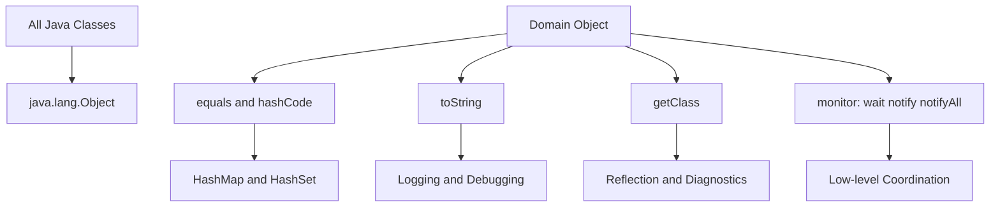

# Object Class

> [!summary]
> `java.lang.Object`는 Java 참조 타입 계층의 루트이며 모든 객체가 공통으로 가지는 최소 계약을 제공한다. `equals`, `hashCode`, `toString`, `getClass`, `clone`, `wait`, `notify`, `notifyAll`은 단순 유틸리티가 아니라 동등성, 해시 기반 컬렉션, 진단 로그, 런타임 타입 확인, 객체 복제, 모니터 기반 동시성의 출발점이다.

## 1. 개요

Java에서 클래스가 명시적으로 다른 클래스를 상속하지 않으면 암묵적으로 `java.lang.Object`를 상속한다. 배열도 객체이므로 `Object` 타입으로 다룰 수 있다. 인터페이스 자체가 `Object`를 상속하는 것은 아니지만, 인터페이스 타입의 참조가 가리키는 실제 인스턴스는 객체이므로 `Object`의 public 메서드를 호출할 수 있다.

`Object`는 다음 역할을 한다.

1. 모든 객체를 담을 수 있는 최상위 참조 타입을 제공한다.
2. 동등성 비교와 해시 코드의 기본 계약을 제공한다.
3. 객체를 문자열로 표현하는 기본 진단 수단을 제공한다.
4. 런타임 클래스 정보를 조회할 수 있게 한다.
5. 얕은 복제와 모니터 기반 대기·통지 메커니즘의 기반을 제공한다.
6. JVM과 표준 라이브러리가 객체를 공통 방식으로 다룰 수 있게 한다.

`Object`를 잘 이해해야 `String`, Wrapper, Collection, Generic, 동시성 API를 더 정확히 설명할 수 있다.

## 2. 왜 필요한가

### 공통 타입이 필요하다

Java는 정적 타입 언어다. 서로 다른 클래스의 인스턴스를 하나의 API에서 다루려면 공통 상위 타입이 필요하다. `Object`는 모든 클래스 인스턴스의 최상위 공통 타입이므로 다음과 같은 범용 API의 기반이 된다.

```java
public void printAny(Object value) {
    System.out.println(value);
}
```

다만 `Object`를 무분별하게 사용하면 타입 정보가 사라진다. modern Java에서는 Generic, sealed type, interface 기반 추상화로 타입 안전성을 유지하는 편이 일반적으로 더 좋다.

### 표준 라이브러리 계약의 출발점이다

`HashMap`, `HashSet`, `List.contains`, `Objects.equals`, Logging, Debugger, Proxy, Reflection 같은 많은 기능이 `Object` 메서드의 계약에 기대어 동작한다.

특히 `equals`와 `hashCode`는 해시 기반 컬렉션에서 핵심이다. 이 둘의 상세한 구현 규칙은 별도 장에서 더 깊게 다루는 것이 좋지만, `Object` 장에서는 기본 계약과 위험한 오해를 먼저 잡아야 한다.

### 운영 진단의 기본 정보가 된다

운영 로그에서 객체가 의미 있는 문자열로 출력되는지, 컬렉션에서 중복 제거가 예상대로 되는지, 동기화 대기 상태가 왜 풀리지 않는지 같은 문제는 종종 `Object` 메서드와 연결된다.

예를 들어 도메인 객체의 `toString`이 민감 정보를 그대로 출력하면 로그 보안 사고가 될 수 있고, `equals`만 재정의하고 `hashCode`를 재정의하지 않으면 `HashSet`에서 중복 제거가 깨질 수 있다.

## 3. 핵심 개념

### Object의 주요 메서드

| 메서드 | 역할 | 실무 포인트 |
|---|---|---|
| `equals(Object obj)` | 객체 동등성 비교 | 값 객체는 명시적 재정의가 필요할 수 있음 |
| `hashCode()` | 해시 기반 자료구조용 정수 값 | `equals`와 함께 계약을 지켜야 함 |
| `toString()` | 문자열 표현 | 로그·디버깅에 중요하나 민감 정보 주의 |
| `getClass()` | 런타임 클래스 조회 | Reflection, 타입 진단에 사용 |
| `clone()` | 객체 복제 | 기본은 얕은 복제이며 사용에 주의 |
| `wait()` | 모니터를 놓고 대기 | 반드시 동기화 영역 안에서 호출 |
| `notify()` | 대기 스레드 하나 깨움 | 조건 루프와 함께 사용해야 함 |
| `notifyAll()` | 대기 스레드 전체 깨움 | 더 안전하지만 깨어난 스레드 재검사 필요 |
| `finalize()` | GC 전 정리 Hook | 현대 Java에서는 사용하지 않는 방향 |

`finalize()`는 Java 9부터 Deprecated 되었고 이후 릴리스에서 제거 방향으로 진행되는 기능이다. 리소스 정리는 `try-with-resources`, `AutoCloseable`, Cleaner, 명시적 생명주기 관리로 처리하는 것이 안전하다.

### Reference Equality와 Logical Equality

`Object`의 기본 `equals`는 참조 동일성에 가깝게 동작한다. 즉 같은 인스턴스인지 비교한다.

```java
Object a = new Object();
Object b = new Object();

System.out.println(a.equals(b)); // false
System.out.println(a.equals(a)); // true
```

도메인에서는 "같은 객체"보다 "같은 값"을 비교해야 할 때가 많다. 예를 들어 `Money(1000, "KRW")` 두 개가 서로 다른 인스턴스라도 값으로는 같아야 할 수 있다. 이 경우 `equals`와 `hashCode`를 함께 재정의해야 한다.

### Runtime Type과 Compile-Time Type

`Object` 참조는 어떤 객체든 가리킬 수 있지만, 컴파일 시점에 보이는 메서드는 `Object`의 public 메서드로 제한된다.

```java
Object value = "hello";
System.out.println(value.toString());
// value.length(); // 컴파일 오류
```

실제 객체는 `String`이지만 참조 타입이 `Object`이므로 `String.length()`는 바로 호출할 수 없다. 이런 차이는 Generic을 왜 사용하는지 이해하는 데 중요하다.

## 4. 내부 동작 원리



### 4.1 암묵적 상속

다음 두 클래스는 상속 선언만 보면 다르지만, 첫 번째도 결국 `Object`를 상속한다.

```java
public class Order {
}
```

```java
public class SpecialOrder extends Order {
}
```

`Order`는 명시적 `extends`가 없으므로 `Object`의 직접 하위 클래스다. `SpecialOrder`는 `Order`를 통해 간접적으로 `Object`를 상속한다.

### 4.2 동적 디스패치

`Object` 타입으로 참조하더라도 실제 인스턴스가 재정의한 메서드가 호출될 수 있다.

```java
Object value = new UserId("u-100");
System.out.println(value.toString());
```

`UserId`가 `toString`을 재정의했다면 `Object.toString`이 아니라 `UserId.toString`이 실행된다. 이는 JVM의 인스턴스 메서드 동적 디스패치와 관련된다. Class File과 호출 명령의 관점은 [[01-Java-Core/004-Class-File-and-Bytecode|Class File & Bytecode]]를 참고한다.

### 4.3 Object Header와 Monitor

`wait`, `notify`, `notifyAll`은 객체마다 연결된 모니터를 사용한다. Java 언어 관점에서는 모든 객체가 모니터를 가질 수 있는 동기화 대상이다.

다만 객체 헤더의 구체적 레이아웃, Lock 상태 표현, 최적화 방식은 JVM 구현에 따라 달라진다. 특정 HotSpot 구현의 내부 구조를 Java 언어 또는 JVM 명세의 보장으로 답하면 안 된다.

## 5. 주요 메서드 상세

### equals(Object)

`equals`는 객체의 논리적 동등성을 표현한다. 기본 구현은 참조가 같은지 확인하는 방식이다.

재정의할 때 지켜야 하는 대표 계약은 다음과 같다.

- Reflexive: 자기 자신과 같아야 한다.
- Symmetric: `a.equals(b)`와 `b.equals(a)`의 결과가 같아야 한다.
- Transitive: `a == b`, `b == c`라면 `a == c`도 성립해야 한다.
- Consistent: 비교에 사용되는 값이 바뀌지 않으면 결과가 일관되어야 한다.
- `null`과 비교하면 `false`를 반환해야 한다.

상속 계층에서 `equals`를 잘못 구현하면 대칭성이나 추이성이 깨질 수 있다. 값 객체라면 불변으로 만들고, 상속을 제한하거나 명확한 타입 비교 정책을 정하는 편이 안전하다.

### hashCode()

`hashCode`는 해시 기반 자료구조에서 버킷을 찾기 위한 정수 값을 제공한다. 핵심 계약은 다음이다.

- 같은 객체라고 `equals`가 판단하면 `hashCode` 값도 같아야 한다.
- 서로 다른 객체가 반드시 다른 `hashCode`를 가져야 하는 것은 아니다.
- 실행 중 객체의 동등성 기준 값이 바뀌지 않는 동안에는 일관된 값을 반환해야 한다.

`equals`만 재정의하고 `hashCode`를 재정의하지 않으면 `HashSet`, `HashMap`에서 찾기, 중복 제거, 키 조회가 예상과 다르게 동작할 수 있다.

### toString()

기본 `toString`은 일반적으로 클래스명과 해시 코드 기반 문자열을 반환한다. 이 값은 사람이 읽기 좋은 도메인 정보라기보다 기본 식별 표현에 가깝다.

도메인 객체에서는 다음을 고려해 재정의한다.

- 운영 로그에서 문제를 좁힐 수 있는 핵심 식별자를 포함한다.
- 개인정보, 토큰, 비밀번호, 카드번호 같은 민감 정보는 제외한다.
- 너무 큰 컬렉션이나 순환 참조를 그대로 출력하지 않는다.
- 지연 로딩 객체를 무심코 접근하지 않는다.

JPA Entity에서 `toString`이 양방향 연관관계를 모두 출력하면 순환 호출이나 불필요한 Lazy Loading을 유발할 수 있다.

### getClass()

`getClass`는 객체의 런타임 클래스를 나타내는 `Class<?>` 객체를 반환한다.

```java
Object value = "hello";
System.out.println(value.getClass().getName()); // java.lang.String
```

`getClass`는 타입 진단, Reflection, 직렬화, 프레임워크 내부에서 자주 쓰인다. 다만 Proxy 기반 프레임워크에서는 런타임 클래스가 개발자가 작성한 클래스가 아니라 프록시 클래스일 수 있다. Spring AOP나 Hibernate Proxy를 다룰 때는 `getClass()` 기반 비교가 의도치 않은 결과를 만들 수 있다.

### clone()

`clone`은 객체 복제를 위한 메서드지만 실무에서는 신중하게 다룬다.

기본 `Object.clone()`은 protected이고, `Cloneable`을 구현하지 않은 객체에서 호출하면 `CloneNotSupportedException`이 발생할 수 있다. 또한 기본 복제는 얕은 복제다. 객체 내부의 참조 필드는 새 객체와 원본이 같은 대상 객체를 공유할 수 있다.

현대 Java에서는 복잡한 `clone` 구현보다 복사 생성자, 정적 팩터리, Record, 불변 객체, 명시적 변환 메서드를 선호하는 경우가 많다.

### wait(), notify(), notifyAll()

이 메서드들은 객체 모니터를 이용한 낮은 수준 동시성 도구다.

중요한 규칙은 다음이다.

- 반드시 해당 객체의 모니터를 획득한 상태, 즉 `synchronized` 블록 또는 메서드 안에서 호출해야 한다.
- 조건은 `if`가 아니라 `while`로 반복 확인해야 한다.
- `wait`는 모니터를 놓고 대기하며, 깨어난 뒤 다시 모니터를 획득해야 진행한다.
- `notify`는 하나의 대기 스레드만 깨우므로 조건이 여러 종류일 때 위험할 수 있다.
- 일반적으로 고수준 동시성 유틸리티를 우선 검토한다.

`wait/notify`는 저수준 도구다. 실무에서는 `BlockingQueue`, `CountDownLatch`, `Semaphore`, `CompletableFuture`, `Lock`과 `Condition` 같은 명확한 추상화를 우선 사용하는 편이 유지보수에 유리하다.

## 6. Java 17 예제

다음은 값 객체에서 `equals`, `hashCode`, `toString`을 명시적으로 정의하는 예다.

```java
import java.util.Objects;

public final class UserId {
    private final String value;

    public UserId(String value) {
        if (value == null || value.isBlank()) {
            throw new IllegalArgumentException("value must not be blank");
        }
        this.value = value;
    }

    public String value() {
        return value;
    }

    @Override
    public boolean equals(Object other) {
        if (this == other) {
            return true;
        }
        if (!(other instanceof UserId userId)) {
            return false;
        }
        return value.equals(userId.value);
    }

    @Override
    public int hashCode() {
        return Objects.hash(value);
    }

    @Override
    public String toString() {
        return "UserId[value=%s]".formatted(value);
    }
}
```

사용 예시는 다음과 같다.

```java
import java.util.HashSet;
import java.util.Set;

public final class ObjectMethodExample {
    public static void main(String[] args) {
        UserId first = new UserId("u-100");
        UserId second = new UserId("u-100");

        Set<UserId> userIds = new HashSet<>();
        userIds.add(first);
        userIds.add(second);

        System.out.println(first == second);      // false
        System.out.println(first.equals(second)); // true
        System.out.println(userIds.size());       // 1
        System.out.println(first);                // UserId[value=u-100]
    }
}
```

이 예제의 핵심은 `==`와 `equals`가 다르다는 점, 그리고 해시 기반 컬렉션에서는 `equals`와 `hashCode`가 함께 맞아야 한다는 점이다. `equals`와 `hashCode`의 상세 규칙은 이후 별도 장에서 더 깊게 다룬다.

Record를 사용할 수 있다면 단순 값 객체는 더 간결하게 표현할 수도 있다.

```java
public record ProductCode(String value) {
    public ProductCode {
        if (value == null || value.isBlank()) {
            throw new IllegalArgumentException("value must not be blank");
        }
    }
}
```

Record는 컴포넌트 기반의 `equals`, `hashCode`, `toString`을 자동으로 제공한다. 하지만 모든 도메인 객체가 Record에 적합한 것은 아니다. 불변 값, 명확한 상태, 상속이 필요 없는 모델에 적합하다.

## 7. 운영 환경 활용

### 로그와 toString

`toString`은 운영 로그에서 자주 호출된다. 로그에 의미 있는 식별자가 남으면 장애 분석이 빨라지지만, 과도한 정보나 민감 정보가 포함되면 문제가 된다.

가상의 예로, 결제 요청 객체의 `toString`에 카드번호 전체와 인증 토큰이 포함되면 로그 수집 시스템, 알림, 검색 화면을 통해 민감 정보가 퍼질 수 있다. 운영 객체의 문자열 표현은 허용 목록 기반으로 설계한다.

### 컬렉션 키의 안정성

`HashMap`의 Key로 사용하는 객체는 동등성 기준 값이 바뀌면 안 된다.

```java
Map<UserId, String> cache = new HashMap<>();
UserId userId = new UserId("u-100");
cache.put(userId, "active");
```

위 `UserId`처럼 불변이면 안전하다. 반대로 Key의 필드가 변경 가능하고 그 필드가 `equals/hashCode`에 사용되면 저장 후 조회가 실패할 수 있다.

### 프레임워크 Proxy

Spring AOP, ORM, Mocking Framework는 Proxy 객체를 만들 수 있다. 이때 `getClass()`가 반환하는 클래스가 원래 클래스와 다를 수 있다.

동등성 구현에서 `getClass()`를 사용할지 `instanceof`를 사용할지는 도메인 모델과 상속 정책에 따라 결정해야 한다. ORM Entity는 식별자 생성 시점, Proxy, Lazy Loading까지 고려해야 하므로 값 객체보다 훨씬 조심해야 한다.

## 8. 성능 및 메모리 고려 사항

### hashCode 비용

`hashCode`가 너무 비싸면 해시 기반 컬렉션 사용 비용이 커진다. 큰 배열, 깊은 객체 그래프, 지연 로딩 연관관계를 매번 순회하는 구현은 피해야 한다.

불변 객체에서는 해시 코드를 캐싱할 수도 있지만, 모든 경우에 필요한 최적화는 아니다. 캐싱 필드가 메모리를 늘리고 구현을 복잡하게 만들 수 있으므로 실제 병목과 객체 수를 보고 결정한다.

### toString 비용

`toString`은 디버깅용이라는 이유로 비용을 무시하기 쉽다. 하지만 로그 레벨, 문자열 결합 방식, 객체 그래프 크기에 따라 운영 부하가 될 수 있다.

주의할 사례는 다음과 같다.

- 큰 컬렉션 전체 출력
- 순환 참조 출력
- Lazy Loading 유발
- 예외 상황에서 대량 객체 `toString` 호출
- 민감 정보 마스킹을 매번 비싼 방식으로 수행

### wait/notify와 스레드 비용

`wait/notify` 자체보다 어려운 부분은 조건 관리다. 잘못 구현하면 스레드가 영원히 대기하거나, 너무 많은 스레드가 깨어나 경합하거나, 특정 조건을 만족하지 않는 스레드만 깨우는 문제가 생긴다.

운영에서 스레드 덤프에 `WAITING` 또는 `BLOCKED`가 보이면 어떤 모니터에서 대기하는지, 조건 변경과 통지가 같은 Lock 보호 아래 이루어지는지 확인해야 한다.

## 9. 동시성과 스레드 안전성

`Object`의 모니터 메서드는 Java 동시성의 가장 낮은 수준에 가깝다.

```java
public final class SimpleSignal {
    private boolean ready;

    public synchronized void await() throws InterruptedException {
        while (!ready) {
            wait();
        }
    }

    public synchronized void signal() {
        ready = true;
        notifyAll();
    }
}
```

여기서 `while`이 중요하다. 스레드는 조건이 만족되지 않아도 깨어날 수 있고, 다른 스레드가 먼저 상태를 소비했을 수도 있다. 따라서 깨어난 뒤 조건을 다시 검사해야 한다.

실무에서는 이런 코드를 직접 작성하기보다 `CountDownLatch`, `BlockingQueue`, `CompletableFuture` 같은 고수준 도구를 우선 고려한다. 직접 모니터를 사용할 때는 Lock 대상 객체를 외부에 노출하지 않는 것도 중요하다.

## 10. 실패 시나리오와 문제 해결

### HashSet에 같은 값이 중복 저장됨

**가능한 원인**

- `equals`를 재정의했지만 `hashCode`를 재정의하지 않음
- `equals` 구현이 비교해야 할 필드를 누락함
- Key로 사용한 객체의 필드가 저장 후 변경됨
- 서로 다른 Class Loader가 같은 이름의 클래스를 따로 로딩함

**진단 순서**

1. 두 객체의 `equals` 결과를 확인한다.
2. 두 객체의 `hashCode` 결과를 확인한다.
3. 컬렉션에 넣은 뒤 Key 상태가 변경됐는지 확인한다.
4. 런타임 클래스와 Class Loader를 확인한다.

### 로그에 의미 없는 객체 문자열만 남음

기본 `toString`만 사용하면 `com.example.Order@1a2b3c` 같은 문자열이 남을 수 있다. 장애 분석에 필요한 주문 번호, 사용자 식별자, 상태가 빠져 있으면 로그만으로 원인을 좁히기 어렵다.

다만 이를 해결한다고 모든 필드를 출력하면 안 된다. 민감 정보와 큰 연관 객체는 제외하고, 운영 식별자 중심으로 구성한다.

### `IllegalMonitorStateException`

`wait`, `notify`, `notifyAll`을 해당 객체의 모니터를 획득하지 않은 상태에서 호출하면 발생한다.

```java
Object lock = new Object();
lock.notify(); // IllegalMonitorStateException
```

다음처럼 같은 Lock 객체의 `synchronized` 블록 안에서 호출해야 한다.

```java
Object lock = new Object();
synchronized (lock) {
    lock.notifyAll();
}
```

### clone 후 원본과 복제본이 서로 영향을 줌

얕은 복제로 내부 참조 객체를 공유하면 복제본을 수정했는데 원본도 변한 것처럼 보일 수 있다. `clone`을 사용할 때는 깊은 복제가 필요한 필드를 명확히 처리하거나, 복사 생성자와 불변 객체로 설계를 단순화한다.

## 11. 흔한 실수

- `Object`를 "모든 클래스의 부모"라고만 외우고 메서드 계약을 설명하지 못한다.
- `equals`를 재정의하면서 `hashCode`를 빼먹는다.
- `toString`에 민감 정보나 큰 객체 그래프를 그대로 넣는다.
- `getClass()` 결과가 항상 개발자가 작성한 클래스라고 가정한다.
- `clone`이 자동으로 깊은 복제를 해 준다고 생각한다.
- `wait`를 `if` 조건문과 함께 사용한다.
- `notify`가 원하는 조건의 스레드를 정확히 깨운다고 믿는다.
- `finalize`로 파일, 소켓, DB 연결 같은 리소스를 정리하려 한다.

## 12. 모범 사례

- 값 객체는 불변으로 만들고 `equals`, `hashCode`, `toString`을 일관되게 설계한다.
- 단순 값 객체에는 Record 사용을 검토한다.
- 컬렉션 Key로 쓰는 객체의 동등성 기준 필드는 변경하지 않는다.
- `toString`은 운영 식별자 중심으로 작성하고 민감 정보는 제외한다.
- 프레임워크 Proxy가 개입하는 객체는 `getClass()` 기반 로직을 조심한다.
- `clone`보다 명시적 복사 생성자나 정적 팩터리를 우선 검토한다.
- 저수준 `wait/notify`보다 `java.util.concurrent`의 고수준 도구를 우선 사용한다.
- 리소스 정리는 `try-with-resources`와 명시적 생명주기로 관리한다.

## 13. 면접 질문

### 질문 1. `java.lang.Object`는 왜 중요한가요?

**면접관이 평가하는 항목**

단순 상속 관계를 넘어 표준 라이브러리와 런타임 계약을 연결하는지 평가한다.

**간결한 답변**

`Object`는 Java 참조 타입 계층의 루트이며 모든 객체가 공통으로 가지는 메서드 계약을 제공합니다. 동등성, 해시 코드, 문자열 표현, 런타임 타입 조회, 모니터 기반 동시성의 출발점입니다.

**시니어 수준의 확장 답변**

`Object`의 메서드는 표준 라이브러리와 프레임워크가 객체를 다루는 공통 계약입니다. `equals/hashCode`는 해시 기반 컬렉션의 정확성에 영향을 주고, `toString`은 운영 로그와 진단 품질에 영향을 주며, `wait/notify`는 모니터 기반 동기화의 핵심입니다. 따라서 `Object`를 이해한다는 것은 모든 클래스가 공유하는 최소 행위와 그 행위가 컬렉션, 로그, 프록시, 동시성에서 어떻게 드러나는지 이해한다는 뜻입니다.

**예상 후속 질문**

- `equals`와 `hashCode`의 관계는 무엇인가요?
- `toString`을 재정의할 때 운영상 주의할 점은 무엇인가요?
- `wait`와 `sleep`은 어떻게 다른가요?

**약하거나 잘못된 답변**

"그냥 모든 클래스가 자동으로 상속하는 부모 클래스입니다."

### 질문 2. `equals`를 재정의할 때 왜 `hashCode`도 재정의해야 하나요?

**면접관이 평가하는 항목**

객체 계약과 해시 기반 컬렉션 동작을 연결하는지 평가한다.

**간결한 답변**

`equals`가 true인 두 객체는 반드시 같은 `hashCode`를 반환해야 하기 때문입니다. 이 계약이 깨지면 `HashMap`, `HashSet`에서 조회나 중복 제거가 실패할 수 있습니다.

**시니어 수준의 확장 답변**

해시 기반 컬렉션은 먼저 `hashCode`로 후보 버킷을 찾고, 그 안에서 `equals`로 논리적 동등성을 확인합니다. 값으로는 같은 객체라도 해시 코드가 다르면 서로 다른 버킷으로 들어가 조회되지 않을 수 있습니다. 또한 Key로 사용하는 객체의 동등성 기준 값이 저장 후 변경되면 같은 인스턴스라도 다시 찾지 못할 수 있으므로 값 객체는 불변으로 만드는 것이 안전합니다.

### 질문 3. `wait`, `notify`, `notifyAll`을 사용할 때 가장 중요한 규칙은 무엇인가요?

**면접관이 평가하는 항목**

모니터 소유, 조건 반복 검사, 저수준 동시성의 위험을 아는지 평가한다.

**간결한 답변**

반드시 해당 객체의 모니터를 획득한 `synchronized` 영역 안에서 호출해야 하며, 대기 조건은 `while`로 반복 확인해야 합니다.

**시니어 수준의 확장 답변**

`wait`는 모니터를 놓고 대기하다가 깨어난 뒤 다시 모니터를 획득해야 진행합니다. 깨어났다고 조건이 만족되었다는 뜻은 아니므로 조건을 `while`로 다시 확인해야 합니다. `notify`는 특정 조건을 만족하는 스레드를 보장해서 깨우지 않기 때문에 조건이 여러 개면 `notifyAll`이나 `Condition` 같은 더 명확한 도구를 검토합니다. 실무에서는 가능하면 `java.util.concurrent`의 고수준 추상화를 우선 사용합니다.

## 14. 후속 질문

- 모든 Java 클래스가 정말 `Object`를 직접 상속하는가?
- 배열과 인터페이스는 `Object`와 어떤 관계인가?
- `Object.equals`의 기본 동작은 무엇인가?
- `getClass()`와 `instanceof` 기반 동등성 비교는 각각 어떤 장단점이 있는가?
- `toString`에 어떤 정보를 넣고 어떤 정보는 빼야 하는가?
- `clone`이 실무에서 선호되지 않는 이유는 무엇인가?
- `finalize`를 리소스 정리에 쓰면 왜 위험한가?
- `wait`가 Lock을 놓는다는 말은 정확히 무슨 뜻인가?

## 15. 면접관의 관점

주니어 답변은 보통 "`Object`는 모든 클래스의 부모"에서 멈춘다. 시니어 답변은 다음을 설명해야 한다.

- 모든 참조 타입의 공통 계약으로서 `Object`의 역할
- `equals/hashCode`와 컬렉션 정확성의 관계
- `toString`과 운영 로그·보안의 관계
- `getClass`와 Proxy, Reflection의 관계
- `clone`의 얕은 복제와 설계상 대안
- `wait/notify`의 모니터 규칙과 고수준 동시성 도구 선택
- JVM 명세와 특정 JVM 구현 세부 사항의 구분

## 16. 시니어 수준의 답변

> `java.lang.Object`는 Java 참조 타입 계층의 루트이며 모든 객체가 공유하는 최소 계약입니다. 단순히 부모 클래스라는 의미를 넘어, `equals`와 `hashCode`는 컬렉션의 정확성을 좌우하고, `toString`은 운영 로그와 진단 품질에 영향을 주며, `getClass`는 런타임 타입과 프록시 문제를 드러냅니다. `clone`은 얕은 복제와 예외 계약 때문에 신중히 사용해야 하고, `wait/notify`는 객체 모니터 기반의 저수준 동시성 도구라 조건 루프와 모니터 소유 규칙을 반드시 지켜야 합니다. 실무에서는 값 객체를 불변으로 만들고 공통 메서드 계약을 일관되게 구현하며, 리소스 정리와 스레드 조율은 더 명확한 고수준 API를 우선 검토합니다.

## 17. 흔한 오답

- "`Object`는 모든 타입의 부모다." — Primitive Type은 객체가 아니며, 참조 타입 계층으로 구분해야 한다.
- "`equals`는 항상 값 비교다." — 기본 구현은 참조 동일성에 가깝다.
- "`hashCode`가 같으면 같은 객체다." — 해시 충돌이 가능하므로 `equals` 확인이 필요하다.
- "`toString`은 디버깅용이라 아무 필드나 넣어도 된다." — 민감 정보와 비용 문제가 있다.
- "`clone`은 깊은 복사를 해 준다." — 기본은 얕은 복제다.
- "`wait`는 그냥 잠시 쉬는 메서드다." — 모니터를 놓고 조건을 기다리는 동기화 메커니즘이다.
- "`finalize`에서 리소스를 닫으면 된다." — 실행 시점과 보장이 불명확하고 현대 Java에서는 피해야 한다.

## 18. 운영 경험 체크리스트

- [ ] `equals/hashCode` 문제로 `HashMap` 조회 실패나 `HashSet` 중복 문제를 분석해 본 적이 있는가?
- [ ] 컬렉션 Key로 사용한 가변 객체 때문에 장애가 난 사례를 설명할 수 있는가?
- [ ] 운영 로그의 `toString`에서 민감 정보 노출을 방지한 경험이 있는가?
- [ ] 프레임워크 Proxy 때문에 `getClass()` 비교가 실패한 상황을 이해하는가?
- [ ] Thread Dump에서 객체 모니터 대기 상태를 해석해 본 적이 있는가?
- [ ] `wait/notify` 대신 고수준 동시성 유틸리티로 단순화한 경험이 있는가?
- [ ] `clone` 또는 얕은 복제로 인한 공유 참조 문제를 점검해 본 적이 있는가?

## 19. 면접 직전 10분 요약

- `Object`는 Java 참조 타입 계층의 루트다.
- 클래스가 명시적으로 상속하지 않으면 암묵적으로 `Object`를 상속한다.
- 기본 `equals`는 참조 동일성에 가깝다.
- `equals`가 true인 두 객체는 같은 `hashCode`를 반환해야 한다.
- `hashCode`가 같다고 `equals`가 true인 것은 아니다.
- `toString`은 로그와 디버깅에 중요하지만 민감 정보와 비용을 조심해야 한다.
- `getClass`는 런타임 클래스를 반환하며 Proxy 환경에서는 예상과 다를 수 있다.
- `clone`의 기본 복제는 얕은 복제이며 현대 Java에서는 대안을 선호하는 경우가 많다.
- `wait/notify/notifyAll`은 반드시 `synchronized` 영역 안에서 호출한다.
- 저수준 모니터 동기화보다 `java.util.concurrent`의 고수준 도구를 우선 고려한다.

## 20. 관련 주제

- [[01-Java-Core/001-Java-Architecture|Java 아키텍처]] — Java 타입 계층, JVM과 운영체제의 실행 경계
- [[01-Java-Core/004-Class-File-and-Bytecode|Class File & Bytecode]] — 메서드 호출, 동적 디스패치와 Class File 관점

향후 `equals() & hashCode()`, `== vs equals()`, `Thread Safety`, `synchronized` 문서가 실제로 생성되면 세부 동등성 계약과 모니터 동시성 내용을 연결한다.

## 21. 요약

`Object`는 Java 객체 모델의 공통 기반이다. 모든 클래스가 공유하는 메서드 계약은 단순 문법 지식이 아니라 컬렉션 정확성, 로그 진단, 프록시와 리플렉션, 객체 복제, 모니터 기반 동시성까지 이어진다. 시니어 개발자는 `Object`를 "모든 클래스의 부모"로만 설명하지 않고, 각 메서드가 표준 라이브러리와 운영 환경에서 어떤 문제를 만들거나 해결하는지 계약 중심으로 설명할 수 있어야 한다.
