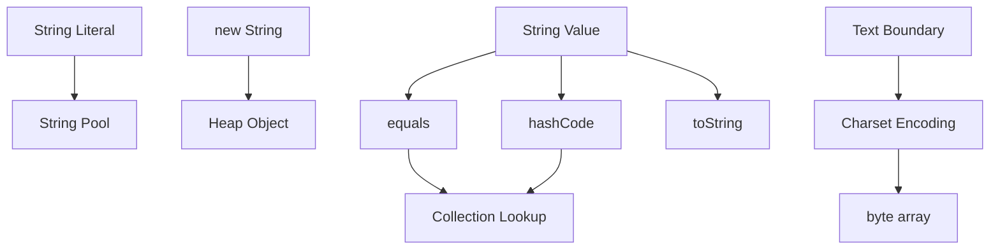

# String

> [!summary]
> `String`은 Java에서 문자열을 표현하는 불변 참조 타입이다. 단순한 문자 배열 포장이 아니라 Unicode 문자 데이터, 불변성, 문자열 리터럴, 동등성 비교, 해시 캐싱, 인코딩 변환, 보안과 메모리 비용까지 연결되는 핵심 클래스다. 실무에서는 `String`의 불변성과 값 기반 동작을 이해해야 컬렉션 키, 로그, API 경계, 대용량 텍스트 처리, 민감 정보 처리에서 안전한 판단을 할 수 있다.

## 1. 개요

`java.lang.String`은 Java 애플리케이션에서 가장 자주 쓰이는 클래스 중 하나다. 문자열 리터럴, HTTP 요청 값, JSON 필드, SQL, 로그 메시지, 설정 값, 식별자, 에러 메시지 대부분이 결국 `String`으로 표현된다.

`String`의 핵심 특징은 다음과 같다.

1. 불변 객체다.
2. 참조 타입이지만 값처럼 사용하는 경우가 많다.
3. 문자열 리터럴은 String Pool과 연결된다.
4. `equals`는 문자열 내용을 비교하도록 재정의되어 있다.
5. `hashCode`는 문자열 내용 기반이며 해시 기반 컬렉션에서 중요하다.
6. 문자 집합 인코딩 변환의 경계에서 자주 사용된다.
7. 연결 연산과 대용량 처리에서 성능 비용이 발생할 수 있다.

이 장은 `String` 자체의 개념과 실무 사용을 다룬다. String Pool의 상세 동작은 별도 주제에서 더 깊게 다루고, `StringBuilder`와 `StringBuffer`의 차이는 이후 장에서 비교한다.

## 2. 왜 필요한가

### 안정적인 값 표현이 필요하다

문자열은 애플리케이션 경계에서 가장 널리 쓰이는 값이다. 요청 파라미터, 메시지 키, 사용자 ID, 주문 번호, 설정 값처럼 여러 계층을 지나가는 데이터가 중간에 바뀌면 추적과 검증이 어려워진다.

`String`이 불변이면 다음 장점이 생긴다.

- 여러 객체가 같은 문자열을 공유해도 값이 바뀌지 않는다.
- 해시 기반 컬렉션의 Key로 사용하기 쉽다.
- 메서드 호출 사이에서 방어적 복사 부담이 줄어든다.
- 문자열 리터럴과 Pool 최적화가 가능해진다.
- 동시성 환경에서 읽기 공유가 안전하다.

### API 경계의 공통 언어다

대부분의 외부 시스템은 결국 텍스트 프로토콜 또는 텍스트 표현을 사용한다. HTTP Header, JSON, XML, SQL, CSV, 환경 변수, 설정 파일은 문자열 처리가 중심이다.

다만 모든 값을 `String`으로만 유지하는 것은 좋지 않다. 도메인 내부에서는 `Email`, `OrderId`, `Money`, `LocalDateTime`처럼 의미 있는 타입으로 변환해 검증과 제약을 명확히 하는 편이 안전하다.

## 3. 핵심 개념

### String은 불변이다

`String`의 메서드는 기존 문자열을 직접 바꾸지 않고 새 문자열을 만든다.

```java
String name = "java";
String upper = name.toUpperCase();

System.out.println(name);  // java
System.out.println(upper); // JAVA
```

이 특성 때문에 같은 `String` 인스턴스를 여러 곳에서 공유해도 문자열 내용이 바뀌지 않는다. 하지만 문자열을 자주 변경하는 것처럼 코드를 작성하면 많은 중간 객체가 생길 수 있다.

### `==`와 `equals`는 다르다

`String`은 참조 타입이다. `==`는 두 참조가 같은 객체를 가리키는지 비교하고, `equals`는 문자열 내용을 비교한다.

```java
String a = new String("java");
String b = new String("java");

System.out.println(a == b);      // false
System.out.println(a.equals(b)); // true
```

문자열 값 비교에는 일반적으로 `equals`를 사용한다. `==`가 우연히 true가 되는 리터럴 사례를 일반 규칙으로 착각하면 운영 버그로 이어질 수 있다.

### 문자열 리터럴과 String Pool

```java
String a = "java";
String b = "java";
System.out.println(a == b); // true일 수 있음
```

문자열 리터럴은 JVM의 String Pool과 관련된다. 같은 리터럴이 같은 인스턴스를 참조할 수 있기 때문에 `==`가 true로 보일 수 있다. 그러나 이는 값 비교 방식으로 사용하면 안 된다.

`new String("java")`는 보통 새 객체 생성을 유발하므로 특별한 이유 없이 사용하지 않는다. Pool의 세부 구현과 `intern()`의 비용은 별도 String Pool 장에서 다룬다.

### 문자와 바이트는 다르다

`String`은 문자 데이터이고, 네트워크나 파일은 바이트를 다룬다. 둘 사이에는 문자 집합 인코딩이 필요하다.

```java
byte[] bytes = "안녕하세요".getBytes(java.nio.charset.StandardCharsets.UTF_8);
String decoded = new String(bytes, java.nio.charset.StandardCharsets.UTF_8);
```

운영에서는 기본 인코딩에 의존하지 말고 UTF-8 같은 명시적 문자 집합을 사용해야 한다. 로컬과 서버의 기본 인코딩 차이는 한글 깨짐, 서명 검증 실패, 외부 연동 오류로 이어질 수 있다.

## 4. 내부 동작 원리



### 4.1 불변성과 내부 저장

Java 17의 `String`은 공개 API 관점에서 불변이다. 내부 저장 방식은 Java 버전과 JVM 구현에 따라 달라질 수 있다. 예를 들어 현대 JDK에서는 Compact Strings 최적화로 문자열 내용에 따라 내부 표현을 달리할 수 있다.

하지만 실무 답변에서 더 중요한 것은 내부 필드 이름을 외우는 것이 아니다. `String` 값은 생성 후 바뀌지 않는다는 공개 계약, 그리고 이 계약이 동등성·해시·공유·동시성에 어떤 영향을 주는지 설명하는 것이다.

### 4.2 문자열 연결

`+` 연산으로 문자열을 연결하면 컴파일러와 런타임이 최적화할 수 있다.

```java
String message = "user=" + userId + ", status=" + status;
```

간단한 한 줄 연결은 가독성이 좋고 일반적으로 문제 되지 않는다. 그러나 반복문 안에서 많은 문자열을 누적하면 중간 문자열이 계속 만들어질 수 있으므로 `StringBuilder`를 고려한다.

```java
StringBuilder builder = new StringBuilder();
for (String token : tokens) {
    builder.append(token);
}
String result = builder.toString();
```

정확한 바이트코드 변환 방식은 Java 버전과 컴파일러에 따라 달라질 수 있다. Class File 관점은 [[01-Java-Core/004-Class-File-and-Bytecode|Class File & Bytecode]]를 참고한다.

### 4.3 해시 코드

`String.hashCode()`는 문자열 내용 기반이다. 따라서 같은 문자열 내용이면 같은 해시 코드를 반환한다.

```java
String a = "order-100";
String b = new String("order-100");

System.out.println(a.equals(b));       // true
System.out.println(a.hashCode() == b.hashCode()); // true
```

이 특성 덕분에 `String`은 `HashMap` Key로 자주 사용된다. 다만 외부 입력 문자열을 무제한 Key로 저장하면 메모리 증가, 캐시 오염, 해시 충돌 공격 가능성 같은 운영 이슈가 생길 수 있다.

## 5. 상세 설명

### 불변성의 장점

`String` 불변성은 다음 영역에서 중요하다.

| 영역 | 장점 |
|---|---|
| 컬렉션 | Key로 사용해도 값 변경으로 인한 조회 실패가 없다 |
| 동시성 | 읽기 공유에 별도 동기화가 필요하지 않다 |
| 보안 | 공유된 문자열이 다른 코드에 의해 바뀌지 않는다 |
| 캐싱 | 해시 코드와 Pool 같은 최적화가 가능하다 |
| API 설계 | 메서드 인자로 전달해도 방어적 복사 부담이 작다 |

단, 불변성이 민감 정보 삭제를 어렵게 만들 수 있다는 점도 중요하다. 비밀번호나 토큰을 `String`으로 만들면 GC 전까지 메모리에 남을 수 있고, 로그나 Heap Dump에 노출될 수 있다.

### 문자열 비교

문자열 비교는 목적에 따라 다르다.

| 목적 | 사용 방법 |
|---|---|
| 정확한 값 비교 | `equals` |
| 대소문자 무시 비교 | `equalsIgnoreCase` |
| 정렬용 사전식 비교 | `compareTo` 또는 `Comparator` |
| null 안전 비교 | `Objects.equals(a, b)` |
| 접두·접미 확인 | `startsWith`, `endsWith` |
| 패턴 비교 | 정규식 또는 전용 Parser |

Locale이 개입되는 대소문자 변환은 주의해야 한다. 사용자에게 보여줄 텍스트와 시스템 식별자 비교는 목적이 다르다. 시스템 키 정규화에는 `Locale.ROOT` 같은 명시적 정책을 고려한다.

### 빈 문자열과 공백 문자열

```java
String empty = "";
String blank = "   ";

System.out.println(empty.isEmpty()); // true
System.out.println(blank.isBlank()); // true
```

`isEmpty()`는 길이가 0인지 확인한다. `isBlank()`는 공백 문자만 있는 문자열도 비어 있는 값처럼 다룬다. 입력 검증에서는 요구사항에 따라 둘을 구분해야 한다.

## 6. Java 17 예제

도메인 식별자를 `String` 그대로 흘려보내지 않고 값 객체로 감싸면 검증과 의미를 한곳에 모을 수 있다.

```java
import java.util.Locale;
import java.util.Objects;

public record OrderNumber(String value) {
    public OrderNumber {
        Objects.requireNonNull(value, "value must not be null");
        value = value.strip().toUpperCase(Locale.ROOT);
        if (!value.matches("ORD-[0-9]{6}")) {
            throw new IllegalArgumentException("invalid order number: " + value);
        }
    }
}
```

사용 예시는 다음과 같다.

```java
public final class StringExample {
    public static void main(String[] args) {
        OrderNumber first = new OrderNumber(" ord-000123 ");
        OrderNumber second = new OrderNumber("ORD-000123");

        System.out.println(first.value());
        System.out.println(first.equals(second));
    }
}
```

이 코드는 다음을 보여 준다.

- 입력 문자열의 앞뒤 공백을 제거한다.
- 시스템 식별자 정규화에 `Locale.ROOT`를 사용한다.
- 형식 검증을 생성 시점에 수행한다.
- Record가 값 기반 `equals`, `hashCode`, `toString`을 제공한다.

정규식이 너무 복잡해지거나 호출 빈도가 높으면 Pattern 재사용, 전용 Parser, 더 명확한 타입 설계를 검토한다.

## 7. 운영 환경 활용

### 로그와 민감 정보

`String`은 로그에 쉽게 남는다. 요청 본문, Header, 인증 토큰, 개인정보가 문자열로 변환된 뒤 로그 수집 시스템에 전파되면 삭제가 어렵다.

운영에서는 다음 원칙을 둔다.

- 로그에 남길 필드는 허용 목록으로 선택한다.
- 토큰, 비밀번호, 주민등록번호, 카드번호는 마스킹하거나 남기지 않는다.
- 예외 메시지에 원본 입력을 그대로 넣지 않는다.
- Heap Dump와 Thread Dump도 민감 정보를 포함할 수 있다고 본다.

### 인코딩 문제

한글 깨짐, 외부 서명 검증 실패, CSV 파싱 오류는 문자열과 바이트 변환 경계에서 자주 발생한다.

점검 순서는 다음과 같다.

1. 파일 또는 네트워크 바이트의 실제 인코딩을 확인한다.
2. `new String(bytes)`처럼 기본 문자 집합에 의존하는 코드를 찾는다.
3. HTTP Header의 `Content-Type`과 Charset을 확인한다.
4. DB Column Collation과 문자 집합을 확인한다.
5. 로컬, CI, 운영의 기본 Locale과 Charset 차이를 비교한다.

### 대용량 문자열

대용량 파일이나 응답을 한 번에 `String`으로 올리면 Heap 사용량이 급증한다. 운영에서는 스트리밍 처리, Chunk 처리, Reader/Writer 기반 처리, 최대 입력 크기 제한을 고려한다.

## 8. 성능 및 메모리 고려 사항

### 반복 연결 비용

반복문에서 `String`을 계속 더하는 코드는 입력 크기가 커질수록 비용이 커질 수 있다.

```java
String result = "";
for (String value : values) {
    result += value;
}
```

이런 누적에는 `StringBuilder`나 `StringJoiner`, `Collectors.joining()`을 검토한다. 단, 몇 개의 작은 문자열을 한 번 연결하는 코드까지 무리하게 바꿀 필요는 없다.

### substring과 메모리

현대 JDK에서는 `substring` 결과가 원본의 큰 내부 배열을 그대로 공유하던 과거 구현과 다르게 동작한다. 특정 구현 세부 사항을 모든 Java 버전의 보장처럼 말하면 안 된다.

운영 관점에서는 버전에 따른 내부 최적화보다 대용량 문자열을 오래 보관하지 않는 구조, 필요한 범위만 파싱하는 구조, 입력 크기 제한이 더 중요하다.

### String Deduplication

일부 JVM과 GC 조합은 중복 문자열 메모리를 줄이는 최적화를 제공할 수 있다. 하지만 이는 애플리케이션 설계를 대신하지 않는다. 중복 데이터가 많은지, GC 비용이 늘지 않는지, 실제 Heap 지표로 검증해야 한다.

## 9. 동시성과 스레드 안전성

`String`은 불변이므로 여러 스레드가 같은 인스턴스를 읽는 것은 안전하다.

```java
public final class SharedMessage {
    private final String message;

    public SharedMessage(String message) {
        this.message = Objects.requireNonNull(message);
    }

    public String message() {
        return message;
    }
}
```

하지만 `String` 참조를 담은 컨테이너가 자동으로 스레드 안전해지는 것은 아니다. 예를 들어 `ArrayList<String>`에 여러 스레드가 동시에 추가하면 별도 동기화가 필요하다.

또한 문자열을 Lock 객체로 사용하는 것은 피해야 한다.

```java
synchronized ("LOCK") {
    // 위험한 패턴
}
```

문자열 리터럴은 Pool을 통해 예상보다 넓게 공유될 수 있다. Lock은 private final Object 같은 전용 객체를 사용하는 것이 안전하다.

## 10. 실패 시나리오와 문제 해결

### 문자열 값은 같은데 비교가 실패함

**가능한 원인**

- `==`로 비교함
- 앞뒤 공백 또는 보이지 않는 문자 포함
- 대소문자 정규화 정책 불일치
- Unicode 정규화 형태 차이
- Locale 의존 변환 사용

**진단 순서**

1. 비교 코드가 `equals` 또는 목적에 맞는 비교인지 확인한다.
2. 문자열 길이와 문자 코드를 출력해 숨은 문자를 확인한다.
3. 입력 경계의 trim, strip, normalize 정책을 확인한다.
4. Locale과 Charset을 확인한다.

### 운영에서만 한글이 깨짐

기본 Charset에 의존하는 코드가 있는지 확인한다.

```java
String text = new String(bytes); // 피해야 할 수 있음
```

다음처럼 명시적 Charset을 사용한다.

```java
String text = new String(bytes, StandardCharsets.UTF_8);
```

파일, HTTP, DB, 메시지 브로커가 모두 같은 인코딩 계약을 갖는지도 함께 확인해야 한다.

### 로그에 민감 정보가 남음

민감 정보가 `String`으로 만들어진 뒤 여러 로그와 예외 메시지에 퍼질 수 있다. 입력 DTO의 `toString`, 예외 메시지, AOP Logging, HTTP Logging Filter, SQL Parameter Logging 설정을 함께 확인한다.

### 메모리 사용량 급증

큰 파일을 통째로 `String`으로 읽거나, 반복 연결로 중간 문자열을 많이 만들거나, 캐시에 무제한 문자열 Key를 저장하면 Heap 사용량이 증가할 수 있다. Heap Dump에서 중복 문자열, 큰 `byte[]`, `String` 보유 경로를 확인한다.

## 11. 흔한 실수

- 문자열 값 비교에 `==`를 사용한다.
- `new String("literal")`을 습관적으로 사용한다.
- 기본 Charset에 의존한다.
- 반복문에서 `String`을 계속 더한다.
- `String`이 불변이므로 어떤 사용도 메모리 안전하다고 생각한다.
- 비밀번호와 토큰을 `String`으로 오래 보관한다.
- 문자열 리터럴을 Lock 객체로 사용한다.
- Locale을 고려하지 않고 대소문자 변환을 시스템 식별자에 적용한다.

## 12. 모범 사례

- 값 비교에는 `equals` 또는 `Objects.equals`를 사용한다.
- 입출력 경계에서는 Charset을 명시한다.
- 도메인 식별자는 필요하면 값 객체로 감싼다.
- 반복 누적에는 `StringBuilder`, `StringJoiner`, `Collectors.joining()`을 검토한다.
- 민감 정보는 문자열화와 로그 출력을 최소화한다.
- 시스템 키 정규화에는 명시적 Locale 정책을 둔다.
- 문자열 입력에는 최대 길이와 허용 문자 정책을 둔다.
- Lock 객체로 문자열 리터럴을 사용하지 않는다.

## 13. 면접 질문

### 질문 1. Java `String`은 왜 불변인가요?

**면접관이 평가하는 항목**

불변성을 단순 암기가 아니라 Pool, 동시성, 해시, 보안, API 설계와 연결하는지 평가한다.

**간결한 답변**

`String`은 값이 생성 후 바뀌지 않기 때문에 안전하게 공유할 수 있고, 문자열 리터럴 Pool, 해시 코드 사용, 컬렉션 Key, 동시성 읽기 공유에 유리합니다.

**시니어 수준의 확장 답변**

문자열은 애플리케이션 경계와 표준 라이브러리 전반에서 가장 많이 공유되는 값입니다. 불변이면 같은 인스턴스를 여러 곳에서 참조해도 내용이 바뀌지 않아 API 방어적 복사가 줄고, 해시 기반 컬렉션 Key로 안정적으로 사용할 수 있으며, String Pool 같은 공유 최적화가 가능합니다. 다만 민감 정보가 한 번 문자열로 만들어지면 즉시 지우기 어렵다는 보안상 단점도 함께 고려해야 합니다.

**예상 후속 질문**

- String Pool은 무엇인가요?
- `String`은 스레드 안전한가요?
- 비밀번호를 `String`으로 다루면 어떤 문제가 있나요?

**약하거나 잘못된 답변**

"String Pool 때문에 무조건 불변이어야 합니다." 이유의 일부만 말하고 해시, 공유, API 안정성을 놓친 답변이다.

### 질문 2. `String` 비교에서 `==`와 `equals`는 어떻게 다른가요?

**면접관이 평가하는 항목**

참조 동일성과 값 동등성을 구분하는지 평가한다.

**간결한 답변**

`==`는 두 참조가 같은 객체를 가리키는지 비교하고, `equals`는 문자열 내용을 비교합니다. 문자열 값 비교에는 일반적으로 `equals`를 사용해야 합니다.

**시니어 수준의 확장 답변**

문자열 리터럴은 Pool 때문에 같은 인스턴스를 참조할 수 있어 `==`가 true처럼 보이는 사례가 있습니다. 하지만 런타임에 생성된 문자열, 외부 입력, `new String` 결과는 같은 내용이어도 다른 객체일 수 있습니다. 따라서 도메인 값 비교에서는 `equals`, null 가능성이 있으면 `Objects.equals`를 사용하고, 공백·대소문자·Locale·Unicode 정규화 정책까지 요구사항에 맞게 정해야 합니다.

### 질문 3. 운영에서 문자열 때문에 생기는 대표 문제는 무엇인가요?

**면접관이 평가하는 항목**

문법 지식을 인코딩, 로그 보안, 메모리, 성능으로 확장하는지 평가한다.

**간결한 답변**

대표적으로 인코딩 불일치로 인한 문자 깨짐, `==` 비교 버그, 반복 연결로 인한 메모리 증가, 민감 정보 로그 노출, 대용량 문자열 처리 문제가 있습니다.

**시니어 수준의 확장 답변**

입출력 경계에서는 Charset을 명시하고, 시스템 식별자 정규화에는 Locale 정책을 둬야 합니다. 로그에는 원본 요청 문자열이나 토큰을 그대로 남기지 않고, 큰 파일이나 응답은 한 번에 `String`으로 올리지 않도록 스트리밍 처리합니다. 문자열 비교 실패가 운영에서만 발생하면 숨은 공백, Unicode 정규화, 기본 인코딩, Locale 차이까지 확인합니다.

## 14. 후속 질문

- `String`이 불변이면 문자열 연결은 어떻게 동작하는가?
- `StringBuilder`와 `StringBuffer`는 언제 사용하는가?
- String Pool과 Heap의 관계는 무엇인가?
- `intern()`은 언제 위험할 수 있는가?
- `equalsIgnoreCase`는 모든 Locale 문제를 해결하는가?
- Unicode 정규화가 필요한 상황은 언제인가?
- `String`을 `HashMap` Key로 쓰는 것이 왜 일반적으로 안전한가?
- 비밀번호를 `String` 대신 `char[]`로 다루자는 주장의 한계는 무엇인가?

## 15. 면접관의 관점

주니어 답변은 보통 "String은 불변이고 `equals`로 비교한다"에서 끝난다. 시니어 답변은 다음까지 연결해야 한다.

- 불변성과 공유, 해시, 동시성의 관계
- 참조 동일성과 값 동등성의 구분
- String Pool의 장점과 오해
- Charset, Locale, Unicode 경계
- 반복 연결과 대용량 문자열 처리 비용
- 민감 정보가 문자열로 남는 보안 리스크
- 도메인 내부에서 의미 있는 타입으로 감싸는 설계

## 16. 시니어 수준의 답변

> Java의 `String`은 불변 참조 타입이며 문자열 값을 안정적으로 공유하기 위한 핵심 클래스입니다. 불변성이 있기 때문에 리터럴 Pool, 해시 기반 컬렉션 Key, 동시성 읽기 공유, API 인자 전달에서 안정성이 생깁니다. 하지만 값 비교에는 `==`가 아니라 `equals`를 써야 하고, 입출력 경계에서는 문자와 바이트를 구분해 Charset을 명시해야 합니다. 운영에서는 문자열이 로그와 Heap Dump에 남을 수 있으므로 민감 정보 문자열화를 조심하고, 대용량 문자열은 스트리밍으로 처리하며, 반복 연결은 `StringBuilder` 같은 대안을 검토해야 합니다.

## 17. 흔한 오답

- "String은 Primitive처럼 값 타입이다." — `String`은 참조 타입이다.
- "문자열 리터럴은 항상 `==`로 비교해도 된다." — Pool 동작을 값 비교 규칙으로 사용하면 안 된다.
- "String은 불변이라 메모리 문제가 없다." — 중간 문자열과 대용량 문자열은 비용을 만든다.
- "기본 인코딩을 쓰면 OS가 알아서 처리한다." — 환경 차이로 장애가 날 수 있다.
- "`equalsIgnoreCase`면 대소문자 문제는 끝난다." — Locale과 정규화 정책이 별도로 필요할 수 있다.
- "민감 정보는 로그만 안 찍으면 된다." — 예외 메시지, Heap Dump, APM, 디버그 로그까지 고려해야 한다.

## 18. 운영 경험 체크리스트

- [ ] `==` 문자열 비교로 발생한 버그를 찾아본 적이 있는가?
- [ ] Charset 불일치로 인한 한글 깨짐이나 서명 검증 실패를 분석했는가?
- [ ] 민감 정보가 `String`으로 로그에 남는 경로를 차단했는가?
- [ ] 큰 파일이나 응답을 문자열로 통째로 읽지 않도록 제한했는가?
- [ ] Heap Dump에서 중복 문자열이나 큰 문자열 보유 경로를 분석했는가?
- [ ] 시스템 식별자 정규화에 Locale 정책을 명시했는가?
- [ ] 문자열 Key 기반 캐시에 최대 크기와 만료 정책을 적용했는가?

## 19. 면접 직전 10분 요약

- `String`은 참조 타입이지만 불변 값처럼 자주 사용된다.
- 값 비교에는 `equals`, null 안전 비교에는 `Objects.equals`를 사용한다.
- 문자열 리터럴은 String Pool과 관련되지만 `==` 비교 근거로 삼지 않는다.
- `new String("x")`는 특별한 이유 없이 쓰지 않는다.
- `String`의 불변성은 공유, 해시, 동시성 읽기 안전성에 유리하다.
- 문자와 바이트는 다르며 입출력에서는 Charset을 명시한다.
- 반복 누적에는 `StringBuilder` 등을 고려한다.
- 대용량 입력은 한 번에 `String`으로 올리지 않는다.
- 민감 정보는 문자열화와 로그 출력을 최소화한다.
- 문자열 리터럴을 Lock 객체로 사용하지 않는다.

## 20. 관련 주제

- [[01-Java-Core/001-Java-Architecture|Java 아키텍처]] — Java 타입과 런타임 계층의 기본 구조
- [[01-Java-Core/004-Class-File-and-Bytecode|Class File & Bytecode]] — 문자열 연결과 바이트코드 변환 관점
- [[01-Java-Core/005-Object-Class|Object Class]] — `equals`, `hashCode`, `toString`의 공통 계약

향후 `String Pool`, `StringBuilder vs StringBuffer`, `equals() & hashCode()`, `== vs equals()` 문서가 실제로 생성되면 세부 비교와 성능 내용을 연결한다.

## 21. 요약

`String`은 Java에서 가장 흔한 값 표현이지만, 단순한 텍스트 상자가 아니다. 불변성, 값 비교, Pool, 해시, 인코딩, Locale, 보안, 메모리 비용이 모두 연결된다. 시니어 개발자는 `String`을 사용할 때 값 비교와 참조 비교를 구분하고, 입출력 경계에서는 Charset을 명시하며, 대용량 처리와 민감 정보 노출을 운영 관점에서 통제할 수 있어야 한다.
