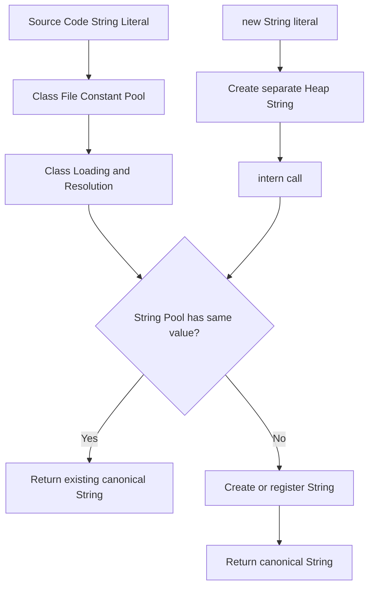

# String Pool

> [!summary]
> String Pool은 Java에서 문자열 리터럴과 `String.intern()`으로 등록된 문자열의 대표 인스턴스를 관리하는 JVM 영역이다. 목적은 같은 문자열 값을 반복해서 만들지 않고 공유해 메모리를 줄이고, 리터럴 비교와 클래스 로딩 과정에서 일관된 문자열 참조를 제공하는 것이다. 하지만 값 비교 수단으로 `==`를 쓰게 해주는 기능이 아니며, 고유한 사용자 입력을 무분별하게 `intern()`하면 오히려 메모리 압박과 성능 저하를 만들 수 있다.

## 1. 개요

`String Pool`은 같은 문자열 값을 가진 `String`을 JVM 내부에서 재사용하기 위한 저장소다. Java 코드를 작성할 때 가장 흔히 만나는 사례는 문자열 리터럴이다.

```java
String a = "java";
String b = "java";

System.out.println(a == b);      // true일 수 있다
System.out.println(a.equals(b)); // true
```

위 코드에서 `a`와 `b`는 같은 리터럴을 사용하므로 일반적인 JVM에서는 같은 풀의 문자열 인스턴스를 참조한다. 이 때문에 `==`가 true로 보인다. 하지만 이것은 리터럴과 풀의 결과일 뿐, 문자열 값 비교 규칙이 아니다. 문자열의 값 비교는 여전히 `equals()`가 기준이다.

String Pool은 다음 질문과 연결된다.

- 문자열 리터럴은 언제 객체가 만들어지는가?
- `new String("java")`는 왜 피하라고 하는가?
- `intern()`은 무엇을 반환하는가?
- String Pool은 Heap인가 Metaspace인가?
- 운영 환경에서 `intern()`은 언제 위험한가?
- String Pool과 G1 String Deduplication은 무엇이 다른가?

## 2. 왜 필요한가

### 같은 문자열이 매우 자주 반복된다

Java 애플리케이션에는 같은 문자열이 반복해서 등장한다. 예를 들어 상태 코드, 설정 키, 로그 키, SQL 조각, JSON 필드명, HTTP 헤더명, Enum 이름, 클래스 이름 같은 값은 애플리케이션 전체에서 계속 사용된다.

매번 별도 `String` 객체를 만들면 다음 비용이 발생한다.

- 객체 헤더와 내부 배열 비용
- GC 추적 비용
- 해시 계산과 비교 비용
- 같은 값이 여러 객체로 흩어지는 메모리 낭비

String Pool은 대표 인스턴스를 공유함으로써 중복 문자열의 메모리 비용을 줄일 수 있다.

### 리터럴의 일관성이 필요하다

문자열 리터럴은 소스 코드와 클래스 파일에 직접 등장한다. JVM은 클래스 로딩과 실행 과정에서 리터럴 문자열을 풀과 연결해 같은 리터럴이 같은 대표 인스턴스를 참조하도록 관리한다.

이 덕분에 다음과 같은 특성이 가능하다.

- 동일 리터럴 재사용
- 컴파일 타임 상수 문자열 최적화
- 클래스와 메서드 실행 중 안정적인 문자열 참조
- 불변 `String` 기반의 공유

## 3. 핵심 개념

### Pool은 값 비교의 기준이 아니다

String Pool은 메모리 공유와 대표 인스턴스 관리를 위한 장치다. 문자열 값 비교는 항상 `equals()`를 기준으로 생각해야 한다.

```java
String literal = "java";
String created = new String("java");

System.out.println(literal == created);      // false
System.out.println(literal.equals(created)); // true
```

`literal`은 풀에 있는 문자열을 참조하지만, `new String("java")`는 보통 별도의 `String` 객체를 만든다. 내용은 같아도 참조가 다르므로 `==`는 false다.

### `intern()`은 대표 인스턴스를 반환한다

`String.intern()`은 문자열 내용과 같은 값이 풀에 있으면 그 대표 인스턴스를 반환하고, 없으면 해당 값을 풀에 등록한 뒤 대표 인스턴스를 반환한다.

```java
String heap = new String("java");
String interned = heap.intern();
String literal = "java";

System.out.println(heap == literal);     // false
System.out.println(interned == literal); // true
```

`intern()`의 핵심은 현재 객체를 반드시 그대로 반환한다는 뜻이 아니라, 같은 값을 대표하는 풀의 canonical reference를 반환한다는 점이다.

### Java 7 이후 String Pool은 Heap과 연결된다

과거 Java에서는 String Pool이 PermGen과 관련되어 설명되는 경우가 많았다. 하지만 Java 7 이후 HotSpot JVM에서는 interned String 객체가 Heap에 위치하는 방식으로 바뀌었고, Java 8부터 PermGen 자체가 제거되어 클래스 메타데이터는 Metaspace로 이동했다.

Java 17 기준으로는 다음처럼 정리하는 편이 안전하다.

- `String` 객체와 내부 데이터는 Heap 객체다.
- String Pool은 JVM이 관리하는 interned string 참조 테이블이다.
- Metaspace는 클래스 메타데이터와 관련된 영역이지, 문자열 객체 저장소라고 보면 안 된다.

구현체마다 내부 자료구조는 다를 수 있으므로, 면접에서는 Java 버전과 JVM 구현을 구분해서 말하는 것이 좋다.

### String Pool과 String Deduplication은 다르다

String Pool은 리터럴과 `intern()`으로 등록된 문자열의 대표 인스턴스를 관리한다. 반면 G1 GC의 String Deduplication은 Heap에 존재하는 여러 `String` 객체의 내부 바이트 배열이 같은 경우 그 내부 데이터를 공유하도록 돕는 GC 최적화다.

둘은 목적이 비슷해 보이지만 대상이 다르다.

| 구분 | String Pool | G1 String Deduplication |
|---|---|---|
| 대상 | 리터럴, `intern()` 문자열 | Heap의 중복 `String` 객체 |
| 트리거 | 클래스 로딩, `intern()` 호출 | G1 GC 과정 |
| 결과 | 대표 `String` 참조 공유 | 내부 문자열 데이터 중복 완화 |
| 사용 방식 | 개발자가 `intern()` 호출 가능 | JVM 옵션과 GC 동작에 의존 |

## 4. 내부 동작 흐름



이 흐름에서 주의할 점은 Class File Constant Pool과 Runtime String Pool을 구분하는 것이다.

- Class File Constant Pool은 `.class` 파일 안의 상수 테이블이다.
- Runtime Constant Pool은 클래스 로딩 이후 JVM 런타임에서 관리되는 상수 정보다.
- String Pool은 interned string을 관리하는 JVM 내부 테이블이다.

이름이 비슷해서 면접에서 자주 섞인다. String Pool은 클래스 파일 포맷 자체가 아니라, 런타임에서 `String` 대표 인스턴스를 관리하는 메커니즘으로 이해해야 한다.

## 5. 상세 설명

### 문자열 리터럴

문자열 리터럴은 소스 코드에 직접 적은 문자열이다.

```java
String language = "java";
```

컴파일러는 이 리터럴을 클래스 파일의 상수 정보에 기록한다. 실행 시 JVM은 해당 리터럴을 풀에서 찾고, 없으면 풀에 등록된 대표 문자열을 준비한다.

같은 클래스 또는 다른 클래스에서 같은 문자열 리터럴을 사용하더라도, 같은 JVM 안에서는 동일한 풀 대표 인스턴스를 참조할 수 있다.

```java
String a = "order";
String b = "order";

System.out.println(a == b); // 일반적으로 true
```

하지만 이 결과를 비즈니스 로직의 비교 조건으로 사용하면 안 된다. 문자열이 리터럴인지, 런타임에 생성된 값인지, 외부 입력인지에 따라 참조 동일성은 달라질 수 있다.

### 컴파일 타임 상수 결합

컴파일러가 값을 확정할 수 있는 문자열 결합은 하나의 리터럴처럼 처리될 수 있다.

```java
String a = "ja" + "va";
String b = "java";

System.out.println(a == b); // true
```

`"ja" + "va"`는 컴파일 타임에 `"java"`로 접힐 수 있기 때문이다.

반면 런타임 값이 섞이면 결과가 달라진다.

```java
String part = "ja";
String a = part + "va";
String b = "java";

System.out.println(a == b);      // false
System.out.println(a.equals(b)); // true
```

`part`는 변수이므로 런타임 문자열 결합이 일어나고, 그 결과는 자동으로 기존 풀 인스턴스가 되지 않는다.

### `final` 상수와 컴파일 타임 상수

`final`이라고 해서 모두 컴파일 타임 상수는 아니다. 리터럴로 초기화된 `static final` 또는 지역 `final` 문자열은 컴파일 타임 상수로 접힐 수 있지만, 메서드 호출 결과나 런타임 계산 결과는 그렇지 않다.

```java
final String prefix = "ja";
String a = prefix + "va";
String b = "java";

System.out.println(a == b); // true
```

```java
final String prefix = getPrefix();
String a = prefix + "va";
String b = "java";

System.out.println(a == b); // false
```

이 차이는 `final` 키워드 자체보다 컴파일러가 값을 확정할 수 있는지가 중요하다는 뜻이다.

### `new String("java")`

```java
String s = new String("java");
```

이 코드는 보통 불필요하다. `"java"` 리터럴은 이미 풀과 연결되고, `new String(...)`은 그 값을 복사한 별도 `String` 객체를 만든다.

따라서 다음처럼 객체가 나뉜다.

```java
String literal = "java";
String created = new String("java");

System.out.println(literal == created); // false
```

특별한 목적 없이 `new String("...")`을 쓰는 코드는 메모리와 가독성 모두에서 손해다.

### `intern()`의 의미

`intern()`은 해당 문자열 값의 대표 풀 인스턴스를 얻는 메서드다.

```java
String input = new String("ACTIVE");
String pooled = input.intern();

System.out.println(pooled == "ACTIVE"); // true
```

하지만 `intern()`을 호출했다고 해서 모든 문제가 해결되는 것은 아니다.

- 고유한 문자열이 많으면 풀에 등록되는 값도 많아진다.
- 한 번 풀에 들어간 문자열은 GC와 테이블 관리 정책에 따라 오래 남을 수 있다.
- `intern()` 호출 자체에도 해시 조회와 동기화 또는 테이블 관리 비용이 있다.
- 외부 입력을 무조건 intern하면 메모리 절약보다 누적 비용이 커질 수 있다.

## 6. Java 17 예제

### 리터럴과 new String

```java
public class StringPoolLiteralExample {
    public static void main(String[] args) {
        String a = "java";
        String b = "java";
        String c = new String("java");

        System.out.println(a == b);      // true
        System.out.println(a == c);      // false
        System.out.println(a.equals(c)); // true
    }
}
```

### 런타임 결합과 intern

```java
public class StringPoolInternExample {
    public static void main(String[] args) {
        String part = "ja";
        String runtime = part + "va";
        String literal = "java";

        System.out.println(runtime == literal);          // false
        System.out.println(runtime.intern() == literal); // true
    }
}
```

### 무분별한 intern의 위험

```java
import java.util.ArrayList;
import java.util.List;
import java.util.UUID;

public class BadInternExample {
    public static void main(String[] args) {
        List<String> values = new ArrayList<>();

        for (int i = 0; i < 1_000_000; i++) {
            String value = UUID.randomUUID().toString().intern();
            values.add(value);
        }

        System.out.println(values.size());
    }
}
```

위 코드는 `UUID`처럼 중복 가능성이 낮은 문자열을 풀에 계속 등록한다. 이런 코드는 Pool의 장점을 거의 얻지 못하고, 오히려 JVM이 관리해야 할 interned string을 늘린다.

### 제한된 도메인 값에만 신중하게 사용

```java
import java.util.Map;
import java.util.concurrent.ConcurrentHashMap;

public final class StatusCanonicalizer {
    private final Map<String, String> cache = new ConcurrentHashMap<>();

    public String canonicalize(String status) {
        if (status == null) {
            throw new IllegalArgumentException("status must not be null");
        }
        return cache.computeIfAbsent(status, String::intern);
    }
}
```

이 예제도 실제 운영 코드에서는 신중해야 한다. 가능한 상태 값이 매우 제한적이고 반복률이 높다는 근거가 있을 때만 의미가 있다. 대부분의 경우 Enum 또는 도메인 타입으로 변환하는 편이 더 낫다.

## 7. 운영 환경 활용

### intern은 프로파일링 후에 선택한다

운영에서 `intern()`은 기본 최적화 수단이 아니다. 먼저 메모리 프로파일링으로 중복 문자열이 실제 병목인지 확인해야 한다.

검토 순서는 다음이 좋다.

1. Heap dump 또는 allocation profiler로 중복 문자열이 많은지 확인한다.
2. 중복 문자열의 cardinality가 낮고 반복률이 높은지 확인한다.
3. 값의 수명과 입력 경로가 통제 가능한지 확인한다.
4. `intern()` 대신 Enum, 코드 테이블, 캐시, 파싱 시점 정규화가 더 나은지 비교한다.
5. 변경 후 GC, Heap 사용량, 응답 시간, CPU 사용률을 함께 본다.

### 로그와 JSON 필드명

대량 JSON 처리나 로그 파싱에서는 같은 필드명이 반복된다. 예를 들어 `userId`, `orderId`, `status`, `createdAt` 같은 키는 매우 자주 나온다.

하지만 애플리케이션 코드에서 무조건 `intern()`을 호출하기보다 다음을 먼저 확인한다.

- 사용하는 JSON 라이브러리가 필드명 canonicalization을 이미 제공하는가?
- 중복되는 값이 key인지 value인지 구분했는가?
- 입력 데이터의 종류가 제한되어 있는가?
- Heap dump에서 실제로 문자열 중복이 문제로 보이는가?

라이브러리 내부 최적화와 애플리케이션 레벨 `intern()`을 동시에 적용하면 효과보다 복잡성이 커질 수 있다.

### 고유 사용자 입력에는 부적합하다

사용자 ID, 요청 ID, UUID, JWT, 검색어, 자유 입력 텍스트처럼 고유 값이 많은 데이터는 String Pool에 적합하지 않다. 이런 값은 반복률이 낮기 때문에 풀에 넣어도 재사용 효과가 거의 없다.

특히 외부 입력을 제한 없이 `intern()`하면 공격자가 고유 문자열을 계속 보내 JVM 메모리를 압박하는 형태의 문제가 생길 수 있다.

## 8. 성능 및 메모리 고려 사항

### 장점

String Pool의 장점은 명확하다.

- 동일 리터럴의 중복 객체 생성을 줄인다.
- 반복되는 제한 값의 메모리를 줄일 수 있다.
- 불변 `String`과 결합해 안전한 공유가 가능하다.
- 일부 비교나 해시 사용에서 캐시 효과를 기대할 수 있다.

### 비용

반대로 Pool 관리에는 비용이 있다.

- 풀 테이블 조회 비용
- 해시 충돌 관리 비용
- 너무 많은 interned string이 있을 때의 관리 비용
- GC가 추적해야 하는 참조 증가
- 고유 값이 많은 경우 메모리 절감 효과 부족

### Compact Strings와의 관계

Java 9부터 HotSpot은 Compact Strings를 도입했다. 문자열 내부 표현이 항상 `char[]`인 것이 아니라, Latin-1로 표현 가능한 문자열은 더 작은 `byte[]`와 coder 정보를 사용해 저장할 수 있다.

따라서 Java 17에서 문자열 메모리를 이야기할 때는 다음을 함께 구분해야 한다.

- String 객체 자체의 중복
- 내부 바이트 배열의 중복
- String Pool의 대표 인스턴스 공유
- G1 String Deduplication의 내부 배열 공유
- 문자열 내용이 Latin-1인지 UTF-16이 필요한지

String Pool은 모든 문자열 메모리 문제를 해결하는 단일 도구가 아니다.

## 9. 동시성과 스레드 안전성

`String`은 불변 객체이므로 여러 스레드가 같은 인스턴스를 읽어도 안전하다. String Pool이 가능한 이유도 이 불변성에 있다.

만약 `String`이 가변 객체였다면, 같은 풀 인스턴스를 여러 코드가 공유하는 순간 한 곳의 변경이 전체 애플리케이션에 영향을 줄 수 있다. 불변성이 있기 때문에 대표 인스턴스 공유가 안전하다.

다만 `intern()` 호출이 많은 고부하 경로에서는 풀 테이블 접근 비용이 누적될 수 있다. 과거 JVM에서는 StringTable 경합이 성능 이슈로 언급되기도 했고, 최신 JVM에서도 고유 문자열을 대량 intern하는 코드는 성능상 유리하다고 단정할 수 없다.

## 10. 실패 시나리오와 문제 해결

### 장애 시나리오 1: 외부 입력 무분별 intern

증상:

- Heap 사용량이 계속 증가한다.
- Full GC 또는 긴 GC Pause가 늘어난다.
- 요청량과 함께 `String` 관련 객체가 급증한다.
- Heap dump에서 고유한 문자열이 매우 많다.

원인:

- 사용자 입력, 검색어, UUID, 토큰 같은 고유 문자열을 `intern()`했다.

대응:

- `intern()` 호출 지점을 제거하거나 제한한다.
- 값 종류가 제한된 필드만 canonicalize한다.
- 문자열을 도메인 타입, Enum, 숫자 ID로 변환한다.
- Heap dump로 중복률과 고유 값 수를 다시 확인한다.

### 장애 시나리오 2: `==` 비교로 인한 간헐적 버그

증상:

- 테스트에서는 통과했는데 운영에서 문자열 비교가 실패한다.
- 리터럴끼리는 비교가 되지만 DB나 API에서 온 값은 실패한다.
- 동일한 텍스트인데 조건문이 false가 된다.

원인:

- String Pool 특성을 오해하고 `==`로 문자열 값을 비교했다.

대응:

```java
if ("ACTIVE".equals(status)) {
    activate();
}
```

상수 문자열을 왼쪽에 두면 `status`가 null이어도 NPE를 피할 수 있다. 다만 도메인 상태는 가능하면 `enum`으로 파싱해 비교하는 것이 더 안전하다.

### 장애 시나리오 3: 상수 결합 오해

증상:

- 어떤 문자열 결합은 `==`가 true인데, 다른 결합은 false다.
- 개발자가 JDK 또는 JVM 버그로 오해한다.

원인:

- 컴파일 타임 상수 결합과 런타임 결합을 구분하지 못했다.

대응:

- 컴파일러가 확정 가능한 표현식만 리터럴처럼 접힐 수 있음을 설명한다.
- 런타임 문자열 결과가 필요하면 `equals()`를 사용한다.
- `javap -c`로 바이트코드를 확인해 상수 접힘 여부를 학습한다.

## 11. 진단 방법

### 코드 검색

먼저 코드베이스에서 `intern()` 호출을 찾는다.

```text
rg "\.intern\(\)"
```

`intern()`이 외부 입력 처리 경로, 파싱 경로, 요청마다 실행되는 hot path에 있다면 점검 대상이다.

### Heap dump 확인

Heap dump에서는 다음을 본다.

- `java.lang.String` 인스턴스 수
- 문자열 내부 `byte[]` 또는 관련 배열 메모리
- 동일 값 반복률
- 고유 값 cardinality
- 문자열을 참조하는 상위 객체

중복 문자열이 많아 보여도 원인이 String Pool 부족이라고 바로 결론 내리면 안 된다. 캐시, 컬렉션, DTO, 로그 버퍼, JSON 파싱 구조가 원인일 수 있다.

### JVM 옵션과 도구

HotSpot JVM에서는 환경에 따라 StringTable 통계를 확인하는 옵션이나 `jcmd` 진단 명령을 사용할 수 있다.

```text
jcmd <pid> VM.stringtable
```

또는 종료 시 통계를 출력하는 방식으로 StringTable 상태를 볼 수 있다.

```text
-XX:+PrintStringTableStatistics
```

운영에서는 진단 옵션 사용 가능 여부와 출력 비용을 환경별로 확인해야 한다.

## 12. 흔한 실수

### `==`를 값 비교로 사용한다

```java
if (status == "ACTIVE") {
    // 잘못된 비교
}
```

리터럴끼리만 우연히 동작하는 코드를 운영 입력에도 적용하면 버그가 된다.

### 모든 문자열에 intern을 붙인다

```java
String normalized = request.getParameter("q").intern();
```

검색어처럼 고유 값이 많은 데이터는 Pool에 적합하지 않다.

### Pool을 캐시처럼 생각한다

String Pool은 애플리케이션 캐시가 아니다. 만료 정책, 크기 제한, 도메인별 제거 정책을 직접 제어하기 어렵다. 캐시가 필요하면 Caffeine, Redis, Map 기반 bounded cache처럼 목적에 맞는 도구를 사용해야 한다.

### Metaspace에 저장된다고 설명한다

Java 17 기준으로 `String` 객체는 Heap 객체다. 과거 PermGen 설명을 그대로 가져오면 틀린 답변이 된다.

## 13. 모범 사례

- 문자열 값 비교에는 `equals()`를 사용한다.
- `new String("literal")`은 특별한 이유가 없으면 사용하지 않는다.
- `intern()`은 중복률이 높고 값 종류가 제한된 경우에만 검토한다.
- 외부 입력, UUID, 토큰, 검색어는 무분별하게 intern하지 않는다.
- 상태 값은 가능하면 `enum`이나 도메인 타입으로 변환한다.
- Heap dump와 profiler 없이 intern 최적화를 먼저 적용하지 않는다.
- String Pool과 G1 String Deduplication을 구분한다.
- Java 버전에 따른 String Pool 위치 설명을 구분한다.

## 14. 면접 질문

### Q1. String Pool이 무엇인가요?

String Pool은 JVM이 문자열 리터럴과 `intern()`으로 등록된 문자열의 대표 인스턴스를 관리하는 영역입니다. 같은 문자열 값을 가진 리터럴이 반복될 때 매번 새 객체를 만들지 않고 대표 인스턴스를 공유할 수 있게 합니다. 다만 이것은 메모리 공유 메커니즘이지 문자열 값 비교 규칙이 아니므로, 값 비교는 `equals()`를 사용해야 합니다.

### Q2. `new String("java")`는 왜 권장되지 않나요?

`"java"` 리터럴은 이미 String Pool과 연결됩니다. 그런데 `new String("java")`를 호출하면 같은 값을 가진 별도 Heap 객체를 만들게 됩니다. 특별한 목적이 없다면 객체를 하나 더 만드는 셈이라 메모리와 가독성 면에서 손해입니다.

### Q3. `intern()`은 언제 사용하나요?

중복률이 매우 높고 값의 종류가 제한적인 문자열을 대표 인스턴스로 정규화할 때 사용할 수 있습니다. 예를 들어 통제된 코드 값이나 반복되는 제한된 식별자에는 검토할 수 있습니다. 하지만 사용자 입력, UUID, 토큰처럼 고유 값이 많은 데이터에 쓰면 Pool 관리 비용과 메모리 압박이 커질 수 있으므로 프로파일링 후에 선택해야 합니다.

### Q4. String Pool은 Heap에 있나요, Metaspace에 있나요?

Java 17 기준으로 `String` 객체와 내부 데이터는 Heap 객체입니다. String Pool은 JVM이 interned string 참조를 관리하는 구조로 이해하는 것이 안전합니다. 과거 Java의 PermGen 설명을 그대로 적용하면 안 되고, Java 8 이후 PermGen은 제거되어 클래스 메타데이터는 Metaspace로 이동했습니다.

### Q5. String Pool과 G1 String Deduplication의 차이는 무엇인가요?

String Pool은 리터럴과 `intern()` 문자열의 대표 `String` 참조를 공유합니다. G1 String Deduplication은 Heap에 이미 존재하는 중복 `String` 객체들의 내부 문자열 데이터를 GC 과정에서 공유하도록 돕는 최적화입니다. 하나는 대표 참조 관리이고, 다른 하나는 내부 데이터 중복 완화입니다.

## 15. 후속 질문

- 문자열 리터럴은 언제 Pool에 들어가나요?
- `intern()`이 항상 현재 객체를 반환하나요?
- 컴파일 타임 문자열 결합과 런타임 문자열 결합은 어떻게 다른가요?
- Java 7 이전과 이후 String Pool 위치 차이는 무엇인가요?
- String Pool이 있는데 왜 `equals()`를 써야 하나요?
- 운영에서 `intern()`이 장애 원인이 될 수 있는 경우는 무엇인가요?
- G1 String Deduplication을 켜면 `intern()`이 필요 없어지나요?

## 16. 면접관의 관점

면접관은 단순히 "String Pool은 같은 문자열을 저장하는 곳"이라는 정의보다 다음을 본다.

- `==`와 `equals()` 차이를 정확히 이해하는가
- 리터럴, `new String`, `intern()`의 객체 관계를 설명할 수 있는가
- Java 버전에 따른 Heap, PermGen, Metaspace 설명을 구분하는가
- 컴파일 타임 상수 결합과 런타임 결합을 구분하는가
- 운영 환경에서 무분별한 `intern()`의 위험을 이해하는가
- String Pool과 GC 최적화를 혼동하지 않는가

## 17. 시니어 수준의 답변

String Pool은 JVM이 문자열 리터럴과 명시적으로 intern된 문자열에 대해 canonical reference를 관리하는 구조입니다. `String`이 불변이기 때문에 같은 값을 여러 곳에서 안전하게 공유할 수 있고, 리터럴 중복으로 인한 메모리 낭비를 줄일 수 있습니다.

다만 Pool은 값 비교를 `==`로 해도 된다는 뜻이 아닙니다. 리터럴은 같은 참조일 수 있지만 DB, HTTP, JSON 파싱 결과처럼 런타임에 만들어진 문자열은 같은 값이어도 다른 객체일 수 있습니다. 그래서 비즈니스 로직에서는 `equals()` 또는 도메인 타입 비교를 사용해야 합니다.

운영에서는 `intern()`을 일반 최적화로 먼저 적용하지 않습니다. 중복률이 높고 값 종류가 제한된다는 근거가 있을 때 Heap dump와 profiler로 확인한 뒤 적용합니다. 고유 값이 많은 외부 입력을 intern하면 Pool 관리 비용과 메모리 압박이 커질 수 있고, Java 17 기준으로 String 객체는 Heap에 있다는 점도 함께 고려해야 합니다.

## 18. 흔한 오답

### "String Pool에 있으니까 String 비교는 ==로 해도 됩니다."

틀렸다. 리터럴끼리는 참조가 같을 수 있지만 모든 문자열이 Pool 대표 인스턴스를 참조하는 것은 아니다. 값 비교는 `equals()`다.

### "String Pool은 Metaspace에 있습니다."

Java 17 기준으로 부정확하다. `String` 객체는 Heap 객체이며, Metaspace는 클래스 메타데이터 영역이다.

### "intern()을 쓰면 항상 메모리가 줄어듭니다."

틀렸다. 고유 문자열이 많으면 재사용 효과가 없고 Pool 관리 비용만 늘 수 있다.

### "String Deduplication과 String Pool은 같은 기능입니다."

틀렸다. Pool은 대표 참조 공유이고, Deduplication은 GC가 중복 내부 데이터를 줄이는 최적화다.

## 19. 운영 경험 체크리스트

- `intern()` 호출 위치가 요청 hot path에 있는가?
- 외부 입력을 제한 없이 Pool에 넣고 있지 않은가?
- 중복률이 높은 문자열과 고유 문자열을 구분했는가?
- Heap dump에서 문자열 중복이 실제 병목으로 확인됐는가?
- String Pool 대신 Enum, 코드 테이블, bounded cache가 더 적합하지 않은가?
- `==` 문자열 비교가 코드베이스에 남아 있지 않은가?
- Java 버전별 String Pool 설명을 문서와 면접 답변에서 구분했는가?
- G1 String Deduplication과 intern 최적화를 혼동하지 않았는가?

## 20. 면접 직전 10분 요약

- String Pool은 문자열 리터럴과 interned string의 대표 인스턴스를 관리한다.
- `String`이 불변이기 때문에 Pool 공유가 안전하다.
- 리터럴끼리는 `==`가 true일 수 있지만 값 비교는 `equals()`가 원칙이다.
- `new String("x")`는 리터럴과 별도 Heap 객체를 만들 수 있어 일반적으로 불필요하다.
- `intern()`은 Pool의 canonical reference를 반환한다.
- Java 17 기준 `String` 객체는 Heap 객체이며, Metaspace 저장소라고 설명하면 안 된다.
- 컴파일 타임 상수 결합은 리터럴처럼 접힐 수 있지만 런타임 결합은 다르다.
- 외부 입력, UUID, 토큰 같은 고유 값에는 `intern()`을 피한다.
- String Pool과 G1 String Deduplication은 다르다.
- 운영 최적화는 Heap dump와 profiler로 근거를 확인한 뒤 적용한다.

## 21. 관련 주제

- [[01-Java-Core/004-Class-File-and-Bytecode|Class File & Bytecode]]
- [[01-Java-Core/006-String|String]]
- `StringBuilder vs StringBuffer`
- `equals() & hashCode()`
- `== vs equals()`
- `JVM Architecture`
- `Garbage Collection Overview`

## 22. 요약

String Pool은 Java 문자열 리터럴과 `intern()` 문자열을 대표 인스턴스로 공유하기 위한 JVM 메커니즘이다. 불변 `String`과 결합해 메모리 절감과 참조 일관성을 제공하지만, 문자열 값 비교를 `==`로 대체하지는 않는다.

실무에서는 `String Pool = 무조건 좋은 최적화`로 이해하면 위험하다. 반복률이 높고 종류가 제한된 값에는 도움이 될 수 있지만, 고유한 외부 입력을 무분별하게 intern하면 메모리와 성능 문제가 생긴다. Java 17 기준으로 Heap, Metaspace, String Deduplication의 차이를 구분해 설명할 수 있어야 면접과 운영 환경 모두에서 신뢰할 수 있는 답변이 된다.
