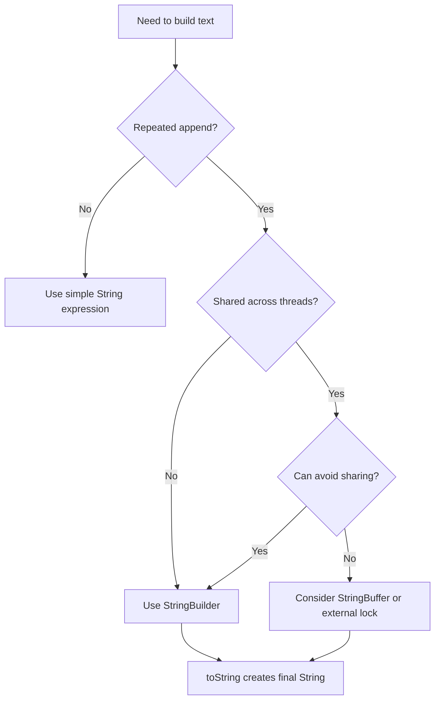

# StringBuilder vs StringBuffer

> [!summary]
> `StringBuilder`와 `StringBuffer`는 불변인 `String`을 반복해서 새로 만들지 않고, 내부 버퍼를 변경하며 문자열을 누적하기 위한 가변 문자열 클래스다. 둘의 핵심 차이는 동기화 여부다. `StringBuilder`는 동기화하지 않아 단일 스레드 또는 메서드 내부 지역 변수에서 빠르고, `StringBuffer`는 주요 메서드가 `synchronized`라 여러 스레드가 같은 인스턴스를 공유할 때 더 안전하지만 비용이 있다. 실무에서는 대부분 `StringBuilder`, 공유 가변 상태가 정말 필요할 때만 `StringBuffer`나 더 명확한 동시성 설계를 검토한다.

## 1. 개요

Java의 `String`은 불변 객체다. 문자열을 연결하거나 변경하는 것처럼 보여도 기존 `String`을 수정하는 것이 아니라 새 `String`을 만든다.

```java
String result = "";
for (int i = 0; i < 3; i++) {
    result += i;
}
```

이 코드는 간단해 보이지만 반복 누적에서는 중간 문자열이 계속 만들어질 수 있다. 이런 경우 `StringBuilder`나 `StringBuffer`를 사용해 내부 버퍼에 문자를 추가한 뒤 마지막에 `String`으로 변환한다.

```java
StringBuilder builder = new StringBuilder();
for (int i = 0; i < 3; i++) {
    builder.append(i);
}
String result = builder.toString();
```

## 2. 왜 필요한가

### 반복 문자열 연결 비용을 줄인다

`String`이 불변이라는 점은 안전성과 공유 측면에서 장점이다. 하지만 문자열을 여러 번 누적하는 코드에서는 매번 새 문자열을 만들면 객체 생성과 복사가 반복된다.

`StringBuilder`와 `StringBuffer`는 내부 배열을 확장하며 같은 객체 안에서 값을 누적한다. 마지막에 `toString()`으로 결과 문자열을 만들기 때문에 반복 연결에서 불필요한 중간 객체를 줄일 수 있다.

### 코드 의도를 명확히 한다

반복문에서 문자열을 누적하는 코드는 `StringBuilder`를 쓰면 의도가 분명해진다.

- 이 값은 여러 조각을 조립해서 만든다.
- 중간 결과는 외부에 노출하지 않는다.
- 최종 결과만 `String`으로 사용한다.

운영 코드에서는 성능뿐 아니라 의도 표현도 중요하다. 특히 로그 메시지, SQL 조립, CSV 생성, 대용량 응답 생성 같은 곳에서는 문자열 누적 방식이 메모리와 지연 시간에 직접 영향을 준다.

## 3. 핵심 차이

| 구분 | StringBuilder | StringBuffer |
|---|---|---|
| 도입 | Java 5 | Java 1.0 |
| 동기화 | 하지 않음 | 주요 메서드가 `synchronized` |
| 성능 | 일반적으로 더 빠름 | 동기화 비용이 있음 |
| 스레드 안전성 | 같은 인스턴스 공유 시 안전하지 않음 | 단일 메서드 호출 단위의 동기화 제공 |
| 실무 기본 선택 | 대부분의 경우 기본 선택 | 레거시 API 또는 공유 인스턴스가 필요한 제한적 상황 |

핵심은 "StringBuilder는 빠르고 StringBuffer는 안전하다"로만 끝나지 않는다. `StringBuffer`도 복합 연산 전체를 자동으로 안전하게 만들어주지는 않는다. 여러 메서드 호출 사이의 조건 검사와 변경은 여전히 별도 동기화가 필요할 수 있다.

## 4. 내부 동작 흐름



대부분의 백엔드 코드에서는 문자열 누적 객체를 메서드 내부 지역 변수로 만들고 한 요청 안에서만 사용한다. 이 경우 공유되지 않으므로 `StringBuilder`가 자연스러운 선택이다.

## 5. 상세 설명

### StringBuilder

`StringBuilder`는 가변 문자 시퀀스다. `append`, `insert`, `delete`, `replace`, `reverse` 같은 메서드로 내부 버퍼를 변경한다.

```java
StringBuilder builder = new StringBuilder();
builder.append("orderId=");
builder.append(1001);
builder.append(", status=");
builder.append("PAID");

String message = builder.toString();
```

`StringBuilder`는 동기화하지 않기 때문에 같은 인스턴스를 여러 스레드가 동시에 수정하면 결과가 깨질 수 있다. 하지만 지역 변수로 쓰면 각 스레드가 자기 객체를 사용하므로 문제가 되지 않는다.

### StringBuffer

`StringBuffer`도 가변 문자 시퀀스이며 API는 `StringBuilder`와 매우 비슷하다. 차이는 주요 메서드가 `synchronized`라는 점이다.

```java
StringBuffer buffer = new StringBuffer();
buffer.append("orderId=");
buffer.append(1001);
String message = buffer.toString();
```

동기화가 있으므로 같은 인스턴스를 여러 스레드가 동시에 호출할 때 단일 메서드 내부 변경은 보호된다. 하지만 이 때문에 단일 스레드 환경에서는 불필요한 비용이 붙는다.

### 문자열 연결 연산과 컴파일러 최적화

Java 컴파일러와 런타임은 단순 문자열 연결을 최적화한다. 따라서 모든 `+` 연결을 무조건 `StringBuilder`로 바꾸는 것은 좋은 스타일이 아니다.

```java
String message = "user=" + userId + ", status=" + status;
```

이런 한 줄짜리 단순 연결은 가독성이 좋고, 컴파일러가 효율적인 방식으로 처리할 수 있다. 반면 반복문 안에서 누적하는 코드는 `StringBuilder`를 직접 쓰는 편이 명확하다.

```java
StringBuilder builder = new StringBuilder();
for (Order order : orders) {
    builder.append(order.id()).append(',').append(order.status()).append('\n');
}
return builder.toString();
```

### 초기 용량

`StringBuilder`와 `StringBuffer`는 내부 버퍼 용량이 부족하면 더 큰 배열로 확장한다. 결과 문자열 크기를 대략 알 수 있다면 초기 용량을 지정해 재할당 비용을 줄일 수 있다.

```java
StringBuilder builder = new StringBuilder(orders.size() * 32);
```

정확한 크기를 맞추려 과도하게 복잡한 계산을 넣을 필요는 없다. 대략적인 상한 또는 평균 크기만으로도 반복 확장을 줄이는 데 도움이 된다.

## 6. Java 17 예제

### CSV 문자열 만들기

```java
import java.util.List;

public class CsvExample {
    public static String toCsv(List<String> values) {
        StringBuilder builder = new StringBuilder(values.size() * 16);

        for (int i = 0; i < values.size(); i++) {
            if (i > 0) {
                builder.append(',');
            }
            builder.append(values.get(i));
        }

        return builder.toString();
    }
}
```

### 메서드 내부 지역 변수는 공유되지 않는다

```java
public class MessageFormatter {
    public String format(long orderId, String status) {
        StringBuilder builder = new StringBuilder(64);
        builder.append("orderId=").append(orderId);
        builder.append(", status=").append(status);
        return builder.toString();
    }
}
```

위 코드의 `builder`는 메서드 호출마다 새로 만들어지는 지역 변수다. 여러 스레드가 동시에 `format`을 호출해도 같은 `StringBuilder` 인스턴스를 공유하지 않는다.

### 공유 StringBuilder는 위험하다

```java
public class UnsafeSharedBuilder {
    private final StringBuilder builder = new StringBuilder();

    public String appendAndGet(String value) {
        builder.append(value);
        return builder.toString();
    }
}
```

이 클래스는 여러 스레드가 동시에 사용하면 내부 버퍼가 섞일 수 있다. 특히 Spring Singleton Bean 필드에 `StringBuilder`를 두면 요청 간 데이터가 섞이는 심각한 버그가 될 수 있다.

### StringBuffer도 만능은 아니다

```java
public class SharedBuffer {
    private final StringBuffer buffer = new StringBuffer();

    public void appendIfEmpty(String value) {
        if (buffer.length() == 0) {
            buffer.append(value);
        }
    }
}
```

`length()`와 `append()` 각각은 동기화되어도 두 호출을 합친 "비어 있으면 추가" 연산 전체가 원자적인 것은 아니다. 복합 연산에는 별도 Lock이나 구조 변경이 필요하다.

## 7. 운영 환경 활용

### 로그 메시지

로그 프레임워크는 파라미터화 로그를 제공한다.

```java
log.info("orderId={}, status={}", orderId, status);
```

단순 로그를 만들려고 직접 `StringBuilder`를 쓰기보다 로깅 프레임워크의 지연 평가와 파라미터화 기능을 활용하는 편이 좋다. 특히 비활성 로그 레벨에서 문자열을 미리 조립하면 쓸데없는 비용이 발생할 수 있다.

### 대용량 응답 생성

CSV, XML, SQL 스크립트, 대량 텍스트 응답을 한 번에 큰 `String`으로 만드는 것은 위험할 수 있다. `StringBuilder`가 중간 객체는 줄여도 최종 결과 전체를 메모리에 올리는 사실은 변하지 않는다.

대용량 데이터는 다음을 검토한다.

- `Writer` 기반 스트리밍
- HTTP response streaming
- 파일 또는 임시 저장소 사용
- 페이지 단위 처리
- backpressure가 있는 비동기 처리

### SQL 조립

동적 SQL을 문자열로 직접 조립하면 SQL Injection 위험과 유지보수 문제가 생긴다. `StringBuilder`는 문자열 조립 도구일 뿐 보안 도구가 아니다. 값 바인딩은 PreparedStatement, JPA parameter binding, QueryDSL 같은 안전한 방식을 사용해야 한다.

## 8. 성능 및 메모리 고려 사항

### 반복 연결

반복문 안의 `+=`는 많은 중간 문자열을 만들 수 있다. 데이터 수가 적으면 문제가 드러나지 않지만, 요청당 수천 건 이상의 데이터를 처리하면 allocation과 GC 비용으로 이어질 수 있다.

### 초기 용량과 재할당

내부 버퍼가 부족하면 더 큰 배열을 만들고 기존 내용을 복사한다. 예상 크기를 알고 있다면 초기 용량을 지정한다.

```java
StringBuilder builder = new StringBuilder(expectedLength);
```

단, 너무 큰 초기 용량은 사용하지 않는 메모리를 선점한다. 실무에서는 평균 크기와 최대 크기의 차이가 큰 입력을 조심해야 한다.

### StringBuffer 동기화 비용

`StringBuffer`는 동기화 비용 때문에 단일 스레드 누적에는 대체로 불리하다. 최신 JVM에서 uncontended lock 최적화가 있더라도, 의미상 필요 없는 동기화를 넣는 것은 좋은 기본값이 아니다.

### `toString()` 비용

최종 결과는 결국 `String`이다. `toString()` 호출 시 결과 문자열 객체가 만들어진다. 큰 문자열을 자주 만들면 `StringBuilder`를 써도 최종 할당 비용과 메모리 점유는 남는다.

## 9. 동시성과 스레드 안전성

`StringBuilder`는 thread-safe하지 않다. 같은 인스턴스를 여러 스레드가 동시에 변경하면 내부 상태가 깨질 수 있다.

`StringBuffer`는 주요 메서드가 동기화되어 있다. 하지만 다음을 구분해야 한다.

- 단일 메서드 호출의 thread-safety
- 여러 메서드 호출을 묶은 비즈니스 연산의 원자성
- 여러 객체 상태를 함께 변경하는 일관성

실무에서는 공유 가변 문자열 객체를 두기보다 요청이나 작업 단위로 `StringBuilder`를 지역 변수로 만들어 사용하는 편이 단순하고 안전하다.

## 10. 실패 시나리오와 문제 해결

### 장애 시나리오 1: 반복 문자열 연결로 GC 증가

증상:

- 요청량 증가 시 Young GC가 급증한다.
- allocation rate가 높다.
- CPU 사용률 중 GC 비중이 커진다.
- 프로파일러에서 `StringConcat`, `String`, `byte[]` 할당이 많이 보인다.

원인:

- 반복문 안에서 `String += value`로 누적했다.

대응:

- 반복 누적을 `StringBuilder`로 바꾼다.
- 예상 크기를 알면 초기 용량을 준다.
- 최종 문자열이 너무 크면 스트리밍으로 전환한다.

### 장애 시나리오 2: Spring Singleton Bean에 공유 Builder 사용

증상:

- 다른 요청의 문자열이 응답에 섞인다.
- 간헐적으로 깨진 JSON 또는 CSV가 생성된다.
- 로컬 테스트에서는 재현이 어렵다.

원인:

- Singleton Bean 필드에 `StringBuilder`를 두고 여러 요청이 공유했다.

대응:

- `StringBuilder`를 메서드 지역 변수로 옮긴다.
- 공유 상태를 제거한다.
- 꼭 공유가 필요하면 명확한 Lock과 범위 제한을 둔다.

### 장애 시나리오 3: StringBuffer를 썼는데도 경쟁 조건 발생

증상:

- `StringBuffer`를 썼는데도 중복 추가나 순서 꼬임이 발생한다.

원인:

- `length()` 확인 후 `append()`처럼 여러 메서드 호출을 하나의 원자적 작업으로 착각했다.

대응:

- 복합 연산 전체를 같은 Lock으로 보호한다.
- 공유 객체 설계를 제거한다.
- Queue, immutable message, per-request builder 같은 구조로 바꾼다.

## 11. 진단 방법

### 코드 검색

```text
rg "\+=|new StringBuilder|new StringBuffer|StringBuffer" src
```

반복문 안의 `+=`, Singleton 필드의 `StringBuilder`, 불필요한 `StringBuffer` 사용을 우선 확인한다.

### Heap과 allocation 확인

Java Flight Recorder, async-profiler, YourKit, VisualVM 같은 도구로 allocation hot spot을 본다. 문자열 연결이 병목이라면 `String`, `byte[]`, 문자열 결합 관련 프레임이 많이 보일 수 있다.

### Thread-safety 확인

`StringBuilder`가 필드, static 변수, 캐시 값에 들어가 있다면 공유 가능성을 점검한다. Spring Bean은 기본적으로 Singleton이므로 필드에 둔 가변 객체는 요청 간 공유될 수 있다.

## 12. 흔한 실수

### 모든 문자열 연결을 Builder로 바꾼다

```java
String message = new StringBuilder()
        .append("user=")
        .append(userId)
        .toString();
```

단순한 한 줄 연결은 `+`가 더 읽기 쉽다. 최적화는 반복 누적, 대용량 조립, hot path에서 근거를 갖고 적용한다.

### StringBuffer를 쓰면 완전한 thread-safe라고 믿는다

`StringBuffer`는 메서드 단위 동기화만 제공한다. 여러 호출을 조합한 비즈니스 로직은 별도 보호가 필요하다.

### Builder를 재사용하려고 필드에 둔다

객체 생성을 아끼려다 요청 간 데이터 섞임과 동시성 버그를 만들 수 있다. 대부분의 경우 지역 변수 생성 비용보다 공유 가변 상태의 위험이 훨씬 크다.

### 대용량 데이터를 StringBuilder 하나로 끝까지 모은다

최종 문자열이 너무 크면 결국 메모리에 큰 객체가 생긴다. 대량 다운로드나 export는 스트리밍을 우선 검토한다.

## 13. 모범 사례

- 반복문 안의 문자열 누적은 `StringBuilder`를 우선 검토한다.
- 단순한 짧은 연결은 `+`를 사용해 가독성을 유지한다.
- 결과 크기를 예측할 수 있으면 초기 용량을 지정한다.
- `StringBuilder`는 메서드 내부 지역 변수로 사용한다.
- Spring Singleton Bean 필드에 가변 Builder를 두지 않는다.
- 공유 가변 문자열이 필요하면 먼저 설계를 재검토한다.
- `StringBuffer`는 레거시 API나 제한된 공유 상황에서만 검토한다.
- 큰 결과 문자열은 `Writer` 또는 스트리밍으로 처리한다.
- SQL 값은 문자열 조립이 아니라 parameter binding을 사용한다.

## 14. 면접 질문

### Q1. StringBuilder와 StringBuffer의 차이는 무엇인가요?

둘 다 가변 문자열을 누적하기 위한 클래스입니다. 핵심 차이는 동기화입니다. `StringBuilder`는 동기화하지 않아서 단일 스레드나 지역 변수 사용에서 일반적으로 빠르고, `StringBuffer`는 주요 메서드가 `synchronized`라 같은 인스턴스를 여러 스레드가 호출할 때 단일 메서드 단위로 보호됩니다. 실무에서는 대부분 `StringBuilder`를 기본으로 선택합니다.

### Q2. 왜 반복문에서 String 연결을 조심해야 하나요?

`String`은 불변 객체라 연결할 때 기존 문자열을 수정하지 않고 새 문자열을 만듭니다. 반복문에서 계속 연결하면 중간 문자열과 내부 배열 할당이 많아져 allocation과 GC 비용이 커질 수 있습니다. 그래서 반복 누적에는 `StringBuilder`를 사용하고, 결과 크기를 알면 초기 용량을 지정합니다.

### Q3. StringBuffer를 쓰면 thread-safe가 완전히 보장되나요?

아닙니다. `StringBuffer`의 주요 메서드는 동기화되어 있지만, 여러 메서드 호출을 묶은 복합 연산 전체가 자동으로 원자적이 되는 것은 아닙니다. 예를 들어 `length()`로 확인한 뒤 `append()`하는 로직은 두 호출 사이에 다른 스레드가 끼어들 수 있습니다.

### Q4. StringBuilder를 항상 써야 하나요?

아닙니다. 짧고 단순한 문자열 연결은 `+`가 더 읽기 쉽고 컴파일러가 효율적으로 처리할 수 있습니다. `StringBuilder`는 반복 누적, 대량 조립, hot path처럼 실제로 중간 객체 생성 비용이 문제가 되는 상황에서 명시적으로 쓰는 편이 좋습니다.

### Q5. Spring Singleton Bean에서 StringBuilder 필드를 두면 왜 위험한가요?

Spring Bean은 기본적으로 Singleton이라 여러 요청 스레드가 같은 인스턴스를 공유합니다. 필드에 `StringBuilder`를 두면 요청 간 문자열이 섞이거나 내부 상태가 깨질 수 있습니다. 문자열 조립은 메서드 지역 변수로 처리해야 합니다.

## 15. 후속 질문

- `String`이 불변인 이유는 무엇인가요?
- Java 컴파일러는 문자열 `+` 연산을 어떻게 최적화하나요?
- `StringJoiner`와 `Collectors.joining()`은 언제 쓰나요?
- `StringBuffer`의 동기화는 어떤 범위까지 보장하나요?
- ThreadLocal StringBuilder 재사용은 좋은 방법인가요?
- 대용량 CSV 응답은 StringBuilder와 streaming 중 무엇이 적합한가요?

## 16. 면접관의 관점

면접관은 단순히 "StringBuilder는 빠르고 StringBuffer는 느리다"를 듣고 싶은 것이 아니다. 다음을 확인한다.

- `String` 불변성과 반복 연결 비용을 연결해 설명하는가
- 동기화 여부와 thread-safety 범위를 정확히 구분하는가
- 단순 연결과 반복 누적을 구분해 과도한 최적화를 피하는가
- Spring Singleton Bean과 공유 가변 상태 위험을 이해하는가
- 대용량 문자열 생성 시 최종 `String` 메모리 비용까지 고려하는가

## 17. 시니어 수준의 답변

`StringBuilder`와 `StringBuffer`는 모두 가변 문자열 누적 도구이고, 차이는 동기화입니다. `StringBuilder`는 동기화하지 않으므로 메서드 내부 지역 변수처럼 공유되지 않는 상황에서 기본 선택이고, `StringBuffer`는 주요 메서드가 synchronized라 같은 인스턴스를 공유할 때 단일 호출 단위의 보호를 제공합니다.

다만 실무에서는 공유 가변 Builder 자체를 피하는 편이 좋습니다. Spring Singleton Bean 필드에 Builder를 두면 요청 간 데이터가 섞일 수 있고, `StringBuffer`를 써도 복합 연산 전체의 원자성이 자동으로 보장되지는 않습니다. 따라서 문자열 조립은 요청 또는 작업 단위 지역 변수로 처리하고, 큰 데이터는 `StringBuilder` 하나에 모두 모으기보다 `Writer`나 response streaming을 검토합니다.

성능 면에서는 반복문 안의 `+=`를 조심해야 합니다. 반대로 짧은 한 줄 연결까지 무리하게 Builder로 바꾸면 가독성이 떨어집니다. Java의 문자열 연결 최적화와 코드 의도를 함께 보고 선택하는 것이 좋은 답변입니다.

## 18. 흔한 오답

### "StringBuilder는 무조건 String보다 빠릅니다."

상황에 따라 다르다. 단순 연결은 `+`가 더 읽기 쉽고 충분히 최적화될 수 있다. 반복 누적에서 `StringBuilder`가 의미 있다.

### "StringBuffer를 쓰면 동시성 문제는 모두 해결됩니다."

틀렸다. 메서드 단위 동기화와 비즈니스 연산 전체의 원자성은 다르다.

### "Spring Bean 필드에 StringBuilder를 두면 객체 생성을 줄여서 좋습니다."

위험하다. Singleton Bean 필드는 여러 요청 스레드가 공유할 수 있다.

### "StringBuilder를 쓰면 큰 파일도 메모리 문제 없이 만들 수 있습니다."

틀렸다. 최종 결과가 큰 `String`이면 여전히 메모리에 올라간다. 스트리밍을 검토해야 한다.

## 19. 운영 경험 체크리스트

- 반복문 안에서 `String +=`를 사용하지 않는가?
- 문자열 조립 대상이 요청당 얼마나 커질 수 있는가?
- `StringBuilder`가 지역 변수인지 필드인지 확인했는가?
- Spring Singleton Bean에 가변 Builder가 남아 있지 않은가?
- 비활성 로그 레벨에서도 문자열을 미리 조립하지 않는가?
- 대용량 export를 `StringBuilder` 하나로 만들고 있지 않은가?
- `StringBuffer` 사용 이유가 실제 공유 동기화 요구인지 확인했는가?
- SQL 조립에서 값 바인딩을 누락하지 않았는가?

## 20. 면접 직전 10분 요약

- `String`은 불변이고, 반복 연결은 중간 객체를 많이 만들 수 있다.
- `StringBuilder`와 `StringBuffer`는 가변 문자열 누적 도구다.
- `StringBuilder`는 동기화하지 않아 대부분의 지역 변수 사용에서 기본 선택이다.
- `StringBuffer`는 주요 메서드가 `synchronized`지만 복합 연산 전체를 보장하지 않는다.
- 단순한 짧은 문자열 연결은 `+`가 더 읽기 쉽다.
- 반복문 안의 누적, 대량 조립, hot path에서는 `StringBuilder`를 검토한다.
- 예상 크기를 알면 초기 용량을 지정한다.
- Spring Singleton Bean 필드에 `StringBuilder`를 두면 요청 간 데이터가 섞일 수 있다.
- 큰 결과 문자열은 결국 메모리에 올라가므로 streaming을 고려한다.
- SQL 보안은 `StringBuilder`가 아니라 parameter binding으로 해결한다.

## 21. 관련 주제

- [[01-Java-Core/006-String|String]]
- [[01-Java-Core/007-String-Pool|String Pool]]
- [[01-Java-Core/051-Process-vs-Thread|Process vs Thread]]
- `Thread Safety`
- `ExecutorService`
- `Logging (SLF4J & Logback)`
- `REST API Design`

## 22. 요약

`StringBuilder`와 `StringBuffer`는 불변 `String`의 반복 연결 비용을 줄이기 위한 가변 문자열 클래스다. 실무 기본 선택은 대부분 `StringBuilder`다. 공유되지 않는 지역 변수로 쓰면 동기화 비용 없이 명확하게 문자열을 누적할 수 있다.

`StringBuffer`는 동기화된 메서드를 제공하지만, 이것이 모든 동시성 문제를 해결한다는 뜻은 아니다. 공유 가변 상태 자체를 줄이고, 대용량 데이터는 스트리밍으로 처리하며, 문자열 조립과 보안 검증을 혼동하지 않는 것이 중요하다.
