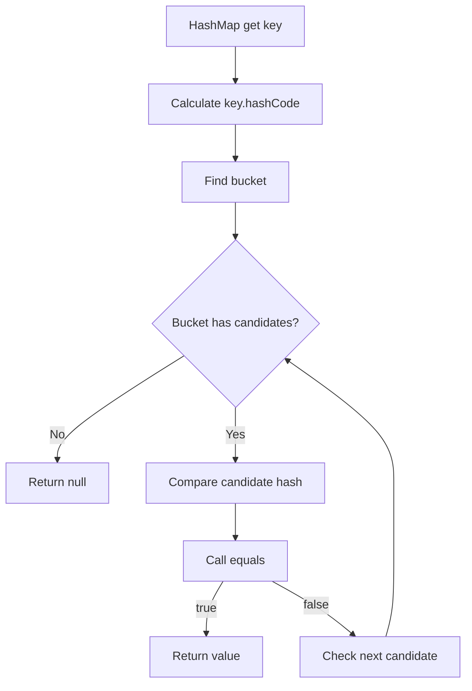

# equals() & hashCode()

> [!summary]
> `equals()`는 객체의 논리적 동등성을 판단하는 메서드이고, `hashCode()`는 해시 기반 자료구조에서 객체를 빠르게 찾기 위한 정수 해시 값을 제공하는 메서드다. Java에서 두 메서드는 독립 기능처럼 보이지만 하나의 계약으로 묶여 있다. `equals()`가 true인 두 객체는 반드시 같은 `hashCode()`를 반환해야 하며, 이 계약이 깨지면 `HashMap`, `HashSet`, `ConcurrentHashMap` 같은 컬렉션에서 조회 실패, 중복 저장, 캐시 미스 같은 운영 버그가 발생할 수 있다.

## 1. 개요

모든 Java 객체는 [[01-Java-Core/005-Object-Class|Object Class]]에서 상속받은 `equals()`와 `hashCode()`를 가진다. 기본 구현은 대체로 객체의 참조 동일성을 기준으로 동작한다. 하지만 도메인에서는 서로 다른 인스턴스라도 같은 값이면 같은 객체로 취급해야 하는 경우가 많다.

예를 들어 주문 번호가 같은 두 `OrderId` 객체는 서로 다른 인스턴스라도 논리적으로 같은 식별자일 수 있다. 이런 경우 `equals()`와 `hashCode()`를 함께 재정의해야 한다.

```java
OrderId a = new OrderId("O-100");
OrderId b = new OrderId("O-100");

System.out.println(a == b);      // false
System.out.println(a.equals(b)); // true여야 할 수 있다
```

이 장은 값 객체, 컬렉션 키, JPA Entity, 캐시 키, 동시성 컬렉션에서 `equals()`와 `hashCode()` 계약이 왜 중요한지 다룬다.

## 2. 왜 필요한가

### 도메인 동등성을 표현한다

객체 지향에서는 객체가 단순 데이터 묶음이 아니라 의미를 가진다. 실무에서는 다음과 같은 기준으로 객체의 같음을 판단한다.

- 같은 사용자 ID인가
- 같은 주문 번호인가
- 같은 이메일 주소인가
- 같은 금액과 통화인가
- 같은 좌표나 기간인가

이 기준은 참조 동일성과 다르다. 따라서 값 기반 비교가 필요한 타입은 `equals()`를 재정의해야 한다.

### 해시 기반 컬렉션의 정확성을 보장한다

`HashMap`과 `HashSet`은 먼저 `hashCode()`로 저장 위치 후보를 찾고, 그 후보 안에서 `equals()`로 실제 동등성을 확인한다. 그래서 두 메서드의 계약이 맞지 않으면 컬렉션이 정상적으로 동작하지 않는다.

대표적인 문제는 다음이다.

- 같은 값인데 `HashSet`에 중복 저장된다.
- 넣어 둔 `HashMap` key를 다시 찾지 못한다.
- 캐시 key가 계속 miss난다.
- 중복 제거 로직이 운영 데이터에서 깨진다.

## 3. 핵심 계약

Java의 `equals()`와 `hashCode()`는 다음 계약을 지켜야 한다.

### equals() 계약

`equals()`는 다음 성질을 만족해야 한다.

| 성질 | 의미 |
|---|---|
| 반사성 | `x.equals(x)`는 true |
| 대칭성 | `x.equals(y)`가 true면 `y.equals(x)`도 true |
| 추이성 | `x.equals(y)`와 `y.equals(z)`가 true면 `x.equals(z)`도 true |
| 일관성 | 비교에 쓰인 값이 변하지 않으면 결과도 변하지 않음 |
| null 비교 | `x.equals(null)`은 false |

### hashCode() 계약

`hashCode()`는 다음 성질을 만족해야 한다.

- 같은 실행 중 객체의 동등성 판단에 쓰이는 값이 바뀌지 않으면 같은 값을 반환해야 한다.
- `equals()`가 true인 두 객체는 반드시 같은 `hashCode()`를 반환해야 한다.
- `equals()`가 false인 두 객체가 반드시 다른 `hashCode()`를 반환해야 하는 것은 아니다.

마지막이 특히 중요하다. 해시 충돌은 가능하다. 그래서 해시 기반 컬렉션은 `hashCode()`만 보지 않고 최종적으로 `equals()`를 확인한다.

## 4. 내부 동작 흐름



`HashMap`은 `hashCode()`로 후보 위치를 좁히고, `equals()`로 최종 판단한다. 이 때문에 `equals()`와 `hashCode()` 중 하나만 잘못되어도 컬렉션 동작이 깨질 수 있다.

## 5. 상세 설명

### equals만 재정의하면 안 된다

다음 코드는 값은 같다고 판단하지만 `hashCode()`를 재정의하지 않았다.

```java
public final class UserId {
    private final String value;

    public UserId(String value) {
        this.value = value;
    }

    @Override
    public boolean equals(Object o) {
        if (this == o) {
            return true;
        }
        if (!(o instanceof UserId other)) {
            return false;
        }
        return value.equals(other.value);
    }
}
```

이 객체를 `HashSet`에 넣으면 논리적으로 같은 값도 중복 저장될 수 있다. 기본 `hashCode()`가 참조 기반으로 다르게 나올 수 있기 때문이다.

### 올바른 값 객체 구현

```java
import java.util.Objects;

public final class UserId {
    private final String value;

    public UserId(String value) {
        if (value == null || value.isBlank()) {
            throw new IllegalArgumentException("value must not be blank");
        }
        this.value = value;
    }

    @Override
    public boolean equals(Object o) {
        if (this == o) {
            return true;
        }
        if (!(o instanceof UserId other)) {
            return false;
        }
        return value.equals(other.value);
    }

    @Override
    public int hashCode() {
        return Objects.hash(value);
    }
}
```

값 객체는 불변으로 만들고, `equals()`와 `hashCode()`에 사용하는 필드도 변경되지 않게 두는 것이 안전하다.

### record의 자동 구현

Java Record는 컴포넌트 기반의 `equals()`, `hashCode()`, `toString()`을 자동으로 제공한다.

```java
public record Email(String value) {
    public Email {
        if (value == null || value.isBlank()) {
            throw new IllegalArgumentException("email must not be blank");
        }
    }
}
```

Record는 불변 값 객체에 잘 맞는다. 다만 모든 도메인 객체가 Record에 적합한 것은 아니다. 식별자 기반 Entity, 지연 로딩 프록시, 복잡한 생명주기를 가진 객체에는 신중해야 한다.

### getClass와 instanceof

`equals()` 구현에서 타입을 비교할 때 `getClass()`와 `instanceof` 중 무엇을 쓸지 고민하게 된다.

```java
if (o == null || getClass() != o.getClass()) {
    return false;
}
```

`getClass()`는 정확히 같은 런타임 클래스만 같다고 본다. 상속 구조에서 대칭성 문제를 줄이는 데 도움이 된다. 반면 프록시 기반 프레임워크, 특히 JPA/Hibernate Entity에서는 프록시 클래스가 개입할 수 있어 단순 `getClass()` 비교가 문제를 만들 수 있다.

```java
if (!(o instanceof UserId other)) {
    return false;
}
```

`instanceof`는 하위 타입까지 허용한다. 값 객체가 `final`이면 대체로 안전하다. 상속 가능한 클래스에서 `instanceof`를 잘못 쓰면 대칭성이나 추이성을 깨뜨릴 수 있다.

## 6. Java 17 예제

### HashSet 중복 문제

```java
import java.util.HashSet;
import java.util.Set;

public class BrokenHashCodeExample {
    static final class UserId {
        private final String value;

        UserId(String value) {
            this.value = value;
        }

        @Override
        public boolean equals(Object o) {
            if (this == o) {
                return true;
            }
            if (!(o instanceof UserId other)) {
                return false;
            }
            return value.equals(other.value);
        }
    }

    public static void main(String[] args) {
        Set<UserId> ids = new HashSet<>();
        ids.add(new UserId("u1"));
        ids.add(new UserId("u1"));

        System.out.println(ids.size()); // 2가 될 수 있다
    }
}
```

### 올바른 구현

```java
import java.util.HashSet;
import java.util.Objects;
import java.util.Set;

public class CorrectEqualsHashCodeExample {
    static final class UserId {
        private final String value;

        UserId(String value) {
            this.value = Objects.requireNonNull(value);
        }

        @Override
        public boolean equals(Object o) {
            if (this == o) {
                return true;
            }
            if (!(o instanceof UserId other)) {
                return false;
            }
            return value.equals(other.value);
        }

        @Override
        public int hashCode() {
            return Objects.hash(value);
        }
    }

    public static void main(String[] args) {
        Set<UserId> ids = new HashSet<>();
        ids.add(new UserId("u1"));
        ids.add(new UserId("u1"));

        System.out.println(ids.size()); // 1
    }
}
```

### Mutable key 문제

```java
import java.util.HashMap;
import java.util.Map;
import java.util.Objects;

public class MutableKeyExample {
    static final class UserKey {
        private String email;

        UserKey(String email) {
            this.email = email;
        }

        void changeEmail(String email) {
            this.email = email;
        }

        @Override
        public boolean equals(Object o) {
            if (this == o) {
                return true;
            }
            if (!(o instanceof UserKey other)) {
                return false;
            }
            return Objects.equals(email, other.email);
        }

        @Override
        public int hashCode() {
            return Objects.hash(email);
        }
    }

    public static void main(String[] args) {
        UserKey key = new UserKey("a@example.com");
        Map<UserKey, String> map = new HashMap<>();
        map.put(key, "A");

        key.changeEmail("b@example.com");

        System.out.println(map.get(key)); // null이 될 수 있다
    }
}
```

객체를 `HashMap` key로 넣은 뒤 `hashCode()`에 쓰이는 필드를 바꾸면 저장된 버킷과 조회 버킷이 달라질 수 있다.

## 7. 운영 환경 활용

### 캐시 키

분산 캐시나 로컬 캐시에서 key 객체의 동등성 계약이 깨지면 같은 요청도 계속 cache miss가 발생할 수 있다. 특히 Caffeine 같은 로컬 캐시에서 도메인 key 객체를 사용할 때 `equals()`와 `hashCode()`가 중요하다.

### 중복 제거

배치나 이벤트 처리에서 `HashSet`으로 중복 제거를 하는 경우가 많다. 동등성 기준이 잘못되면 같은 이벤트가 중복 처리되거나, 반대로 다른 이벤트가 같은 것으로 취급될 수 있다.

### JPA Entity

JPA Entity는 값 객체보다 `equals()`와 `hashCode()` 설계가 어렵다. 생성 전에는 DB 식별자가 없을 수 있고, 영속성 컨텍스트와 프록시가 개입할 수 있다. 무조건 모든 필드를 비교하면 지연 로딩이 발생하거나, 변경 가능한 필드 때문에 컬렉션 key가 깨질 수 있다.

Entity는 프로젝트의 식별자 전략, 생명주기, 프록시 사용 여부를 고려해 별도 기준을 정해야 한다. 이 문서에서는 값 객체 중심으로 원칙을 잡고, JPA Entity 세부 전략은 JPA 관련 장에서 더 깊게 다룬다.

## 8. 성능 및 메모리 고려 사항

### hashCode 비용

`hashCode()`는 해시 기반 컬렉션에서 자주 호출될 수 있다. 큰 배열, 깊은 객체 그래프, 지연 로딩 연관관계, 네트워크 호출 같은 비싼 작업을 `hashCode()`에 넣으면 안 된다.

좋은 `hashCode()`는 다음 특성을 가진다.

- 빠르게 계산된다.
- 동등성에 쓰이는 필드와 일관된다.
- 실행 중 불필요하게 변하지 않는다.
- 해시 분포가 지나치게 치우치지 않는다.

### 해시 충돌

서로 다른 객체가 같은 `hashCode()`를 가질 수 있다. 이것은 계약 위반이 아니다. 하지만 너무 많은 객체가 같은 해시 값을 반환하면 해시 컬렉션의 성능이 나빠진다.

```java
@Override
public int hashCode() {
    return 1; // 계약은 지킬 수 있어도 성능에는 매우 나쁘다
}
```

이 구현은 `equals()`가 true인 객체의 hashCode가 같다는 계약은 지킬 수 있지만, 모든 객체가 같은 버킷으로 몰리므로 성능이 악화된다.

### Objects.hash의 비용

`Objects.hash(...)`는 편하지만 내부적으로 varargs 배열을 만들 수 있다. 대부분의 도메인 코드에서는 문제가 되지 않지만, 매우 뜨거운 경로의 작은 객체라면 직접 계산하는 방식도 검토할 수 있다.

```java
@Override
public int hashCode() {
    int result = 17;
    result = 31 * result + type.hashCode();
    result = 31 * result + value.hashCode();
    return result;
}
```

단, 성능 최적화를 이유로 가독성과 정확성을 먼저 희생하면 안 된다. 측정 후 바꾸는 것이 좋다.

## 9. 동시성과 스레드 안전성

`equals()`와 `hashCode()` 자체가 동시성 도구는 아니다. 하지만 동시성 컬렉션에서도 이 계약은 그대로 중요하다. `ConcurrentHashMap`도 key의 `hashCode()`와 `equals()`를 사용한다.

특히 변경 가능한 key를 여러 스레드가 수정하면 문제가 더 심해진다.

- 저장 시점의 hash와 조회 시점의 hash가 달라질 수 있다.
- 한 스레드가 비교 중인 값을 다른 스레드가 바꿀 수 있다.
- 동등성 결과가 호출할 때마다 달라질 수 있다.

따라서 Map/Set key는 불변 값 객체로 만드는 것이 가장 안전하다.

## 10. 실패 시나리오와 문제 해결

### 장애 시나리오 1: HashMap에 넣은 값을 찾지 못한다

증상:

- `put`은 성공했는데 `get`이 null을 반환한다.
- 같은 객체 인스턴스로 조회해도 실패한다.
- key의 필드가 중간에 변경된 이력이 있다.

원인:

- `hashCode()`에 쓰인 필드가 Map 저장 후 변경되었다.

대응:

- key 객체를 불변으로 만든다.
- key로 쓰는 필드를 변경하지 않는다.
- 변경 가능한 Entity를 Map key로 쓰지 않는다.

### 장애 시나리오 2: HashSet 중복 제거가 안 된다

증상:

- 같은 사용자 ID나 주문 번호가 중복 저장된다.
- `equals()` 결과는 true인데 Set size가 줄지 않는다.

원인:

- `equals()`만 재정의하고 `hashCode()`를 재정의하지 않았다.

대응:

- 두 메서드를 함께 재정의한다.
- 테스트에 같은 값의 서로 다른 인스턴스를 넣어 검증한다.
- Record 또는 IDE 생성 코드를 활용하되 기준 필드를 직접 확인한다.

### 장애 시나리오 3: JPA Entity 비교가 환경에 따라 다르다

증상:

- 테스트에서는 같다고 나오는데 운영에서는 프록시 객체와 비교가 실패한다.
- `HashSet`에 Entity를 넣은 뒤 영속화하면 조회가 꼬인다.

원인:

- DB ID 생성 시점, 프록시 타입, 변경 가능한 필드를 고려하지 않은 `equals()` 구현이다.

대응:

- Entity와 Value Object의 동등성 전략을 분리한다.
- Entity는 식별자 생성 전략과 프록시 정책을 고려한다.
- 컬렉션 key로 Entity를 쓰는 설계를 줄인다.

## 11. 진단 방법

### 코드 검색

```text
rg "equals\(|hashCode\(" src
```

다음 패턴을 우선 본다.

- `equals()`만 있고 `hashCode()`가 없는 클래스
- 변경 가능한 필드를 key 동등성에 사용하는 클래스
- `hashCode()`가 상수이거나 너무 단순한 클래스
- JPA Entity에서 모든 필드를 비교하는 구현
- 배열 필드에 `Objects.equals`를 사용한 구현

### 테스트 케이스

동등성 테스트는 최소한 다음을 포함한다.

```java
import static org.assertj.core.api.Assertions.assertThat;

import org.junit.jupiter.api.Test;

class UserIdTest {
    @Test
    void sameValueIsEqualAndHasSameHashCode() {
        UserId a = new UserId("u1");
        UserId b = new UserId("u1");

        assertThat(a).isEqualTo(b);
        assertThat(a.hashCode()).isEqualTo(b.hashCode());
    }
}
```

가능하면 EqualsVerifier 같은 라이브러리로 계약을 자동 검증할 수도 있다. 단, 프로젝트 정책과 의존성 기준에 맞는지 확인해야 한다.

## 12. 흔한 실수

### equals만 재정의한다

해시 컬렉션에서 가장 흔한 실수다. `equals()`를 재정의하면 거의 항상 `hashCode()`도 함께 재정의해야 한다.

### hashCode가 같으면 equals도 true라고 생각한다

틀렸다. 해시 충돌이 가능하므로 최종 동등성은 `equals()`가 판단한다.

### 변경 가능한 필드를 key에 사용한다

`HashMap` key로 넣은 뒤 필드가 바뀌면 다시 찾지 못할 수 있다. key는 불변으로 만든다.

### 배열 비교를 잘못한다

배열 필드는 `Objects.equals`가 아니라 `Arrays.equals` 또는 `Arrays.hashCode`가 필요할 수 있다. 다차원 배열은 `Arrays.deepEquals`, `Arrays.deepHashCode`를 검토한다.

### Entity와 Value Object를 같은 기준으로 본다

Value Object는 값 전체 비교가 자연스럽지만, Entity는 식별자와 생명주기가 중요하다. JPA 프록시와 ID 생성 시점까지 고려해야 한다.

## 13. 모범 사례

- `equals()`를 재정의하면 `hashCode()`도 함께 재정의한다.
- Map/Set key는 불변 값 객체로 만든다.
- 동등성에 사용하는 필드는 명확하고 변경되지 않아야 한다.
- 값 객체는 가능하면 `final` class 또는 record로 설계한다.
- `equals()` 안에서 DB 조회, 네트워크 호출, 지연 로딩을 유발하지 않는다.
- `hashCode()`는 빠르고 안정적으로 계산되게 한다.
- 배열 필드는 배열 전용 비교 메서드를 사용한다.
- JPA Entity는 값 객체와 다른 동등성 전략을 검토한다.
- IDE 생성 코드나 Lombok을 쓰더라도 포함 필드를 반드시 검토한다.

## 14. 면접 답변 압축

`equals()`는 객체의 논리적 동등성을 판단하고, `hashCode()`는 해시 기반 컬렉션에서 객체를 찾기 위한 해시 값을 제공합니다. 두 메서드의 핵심 계약은 `equals()`가 true인 두 객체는 반드시 같은 `hashCode()`를 가져야 한다는 것입니다. `HashMap`이나 `HashSet`은 먼저 `hashCode()`로 버킷을 찾고 그 안에서 `equals()`로 최종 비교하기 때문에, 이 계약이 깨지면 같은 값인데도 조회가 실패하거나 중복 저장될 수 있습니다. 반대로 `hashCode()`가 같다고 항상 같은 객체라는 뜻은 아니며, 해시 충돌이 가능하므로 최종 판단은 `equals()`가 합니다. 실무에서는 key 객체를 불변 값 객체로 만들고, 동등성에 쓰이는 필드가 저장 후 바뀌지 않도록 해야 합니다. 특히 JPA Entity는 ID 생성 시점과 프록시 때문에 값 객체와 같은 방식으로 단순 구현하면 문제가 생길 수 있습니다. 정리하면 `equals()`와 `hashCode()`는 문법 문제가 아니라 컬렉션 정확성, 캐시 적중률, 중복 제거 품질을 좌우하는 객체 계약입니다.

## 15. 면접 질문

### Q1. equals()와 hashCode()의 관계는 무엇인가요?

`equals()`가 true인 두 객체는 반드시 같은 `hashCode()`를 반환해야 합니다. 해시 기반 컬렉션은 `hashCode()`로 후보 버킷을 찾고 `equals()`로 최종 비교하므로 이 계약이 깨지면 조회나 중복 제거가 실패할 수 있습니다.

### Q2. hashCode가 같으면 equals도 true인가요?

아닙니다. 서로 다른 객체도 같은 해시 값을 가질 수 있습니다. 이것을 해시 충돌이라고 하며, 그래서 해시 컬렉션은 hash가 같은 후보 안에서 다시 `equals()`를 호출합니다.

### Q3. equals만 재정의하면 어떤 문제가 생기나요?

논리적으로 같은 객체라도 기본 `hashCode()`가 다르면 서로 다른 버킷에 저장될 수 있습니다. 그 결과 `HashSet` 중복 제거가 실패하거나 `HashMap` 조회가 실패할 수 있습니다.

### Q4. HashMap key로 mutable 객체를 쓰면 왜 위험한가요?

저장 후 key의 `hashCode()`에 쓰이는 필드가 바뀌면 저장된 버킷과 조회할 버킷이 달라질 수 있습니다. 그러면 같은 key 인스턴스로도 값을 찾지 못할 수 있습니다.

### Q5. JPA Entity의 equals/hashCode는 왜 조심해야 하나요?

Entity는 생성 직후에는 DB ID가 없을 수 있고, 영속화 이후 ID가 생기며, Hibernate 프록시가 타입 비교에 개입할 수 있습니다. 또한 변경 가능한 필드나 연관관계를 비교하면 지연 로딩과 컬렉션 오류가 발생할 수 있어 값 객체와 다른 전략이 필요합니다.

## 16. 후속 질문

- `==`와 `equals()`는 어떻게 다른가요?
- `equals()`의 반사성, 대칭성, 추이성은 무엇인가요?
- `Objects.hash()`와 직접 hash 계산은 어떤 차이가 있나요?
- 배열 필드를 가진 객체의 equals/hashCode는 어떻게 구현하나요?
- Lombok `@EqualsAndHashCode`를 사용할 때 무엇을 조심해야 하나요?
- Record의 equals/hashCode는 어떤 기준으로 생성되나요?
- JPA Entity에서 ID 기반 equals를 쓰면 어떤 문제가 생길 수 있나요?

## 17. 면접관의 관점

면접관은 단순히 "둘 다 같이 재정의해야 한다"는 암기 답변보다 다음을 본다.

- `equals()` 계약을 정확히 이해하는가
- `hashCode()` 충돌 가능성을 설명할 수 있는가
- HashMap 내부 조회 흐름과 연결해 말할 수 있는가
- mutable key 문제를 운영 버그로 설명할 수 있는가
- Value Object와 Entity의 동등성 전략을 구분하는가
- Lombok, Record, IDE 생성 코드도 기준 필드를 검토해야 함을 아는가

## 18. 시니어 수준의 답변

`equals()`와 `hashCode()`는 객체가 컬렉션과 프레임워크 안에서 어떻게 같은 것으로 취급되는지를 정하는 계약입니다. 값 객체에서는 논리적으로 같은 값을 가진 인스턴스가 같아야 하므로 두 메서드를 같은 기준 필드로 함께 구현해야 합니다.

특히 `HashMap`은 key의 `hashCode()`로 버킷을 찾고 그 안에서 `equals()`를 사용해 최종 key를 찾습니다. 그래서 `equals()`는 true인데 `hashCode()`가 다르면 같은 값의 key를 넣어도 조회가 실패할 수 있고, `HashSet`의 중복 제거도 깨질 수 있습니다.

실무에서는 key를 불변으로 만드는 것이 중요합니다. `hashCode()`에 사용되는 필드를 저장 후 변경하면 컬렉션 내부 위치와 조회 위치가 어긋날 수 있습니다. JPA Entity는 프록시와 ID 생성 시점 때문에 더 조심해야 하며, 값 객체처럼 모든 필드를 비교하는 방식이 항상 맞지 않습니다.

## 19. 흔한 오답

### "equals만 재정의해도 됩니다."

틀렸다. 해시 기반 컬렉션에서 계약이 깨질 수 있으므로 `hashCode()`도 함께 재정의해야 한다.

### "hashCode가 다르면 equals도 false입니다."

계약상 `equals()`가 true이면 hashCode가 같아야 하므로 보통 false로 볼 수 있지만, 직접 `equals()`를 호출하면 구현에 따라 true가 나올 수 있다. 그런 구현은 계약 위반이며 컬렉션에서 문제를 만든다.

### "hashCode가 같으면 같은 객체입니다."

틀렸다. 해시 충돌이 가능하다. 최종 동등성은 `equals()`로 확인한다.

### "Lombok이나 IDE가 만들어주면 항상 안전합니다."

아니다. 어떤 필드가 포함되는지가 중요하다. mutable 필드, 연관관계, 민감한 필드, 지연 로딩 필드가 들어가면 문제가 생길 수 있다.

## 20. 운영 경험 체크리스트

- `equals()`만 있고 `hashCode()`가 없는 클래스가 있는가?
- HashMap/HashSet key로 mutable 객체를 사용하고 있지 않은가?
- 캐시 key의 동등성 기준이 요청 파라미터 정규화 기준과 일치하는가?
- `hashCode()`에 비싼 연산이나 지연 로딩이 들어가지 않았는가?
- JPA Entity와 Value Object의 동등성 기준을 분리했는가?
- Lombok `@EqualsAndHashCode`의 include/exclude 필드를 검토했는가?
- 배열 필드 비교를 올바르게 구현했는가?
- 중복 제거 로직에 같은 값의 다른 인스턴스를 넣는 테스트가 있는가?

## 21. 면접 직전 10분 요약

- `equals()`는 논리적 동등성 비교다.
- `hashCode()`는 해시 컬렉션의 후보 위치 계산에 쓰인다.
- `equals()`가 true인 두 객체는 반드시 같은 `hashCode()`를 가져야 한다.
- `hashCode()`가 같다고 `equals()`가 true인 것은 아니다.
- `HashMap`은 hash로 버킷을 찾고 equals로 최종 비교한다.
- `equals()`만 재정의하면 `HashSet`, `HashMap`이 깨질 수 있다.
- key 객체는 불변으로 만드는 것이 안전하다.
- 저장 후 key의 동등성 필드가 바뀌면 조회 실패가 발생할 수 있다.
- Record는 값 객체의 equals/hashCode를 자동 생성한다.
- JPA Entity는 프록시와 ID 생성 시점 때문에 별도 전략이 필요하다.

## 22. 관련 주제

- [[01-Java-Core/005-Object-Class|Object Class]]
- [[01-Java-Core/006-String|String]]
- [[01-Java-Core/007-String-Pool|String Pool]]
- `== vs equals()`
- `Immutable Object`
- `HashMap`
- `Hash Function`
- `Hash Collision`
- `JPA Architecture`

## 23. 요약

`equals()`와 `hashCode()`는 객체의 논리적 동등성과 해시 기반 탐색을 연결하는 핵심 계약이다. 둘 중 하나만 맞아도 되는 것이 아니라, 같은 기준으로 함께 설계되어야 한다.

실무에서 이 계약이 깨지면 단순한 코드 스타일 문제가 아니라 컬렉션 조회 실패, 중복 제거 실패, 캐시 미스, Entity 비교 오류 같은 운영 버그로 이어진다. 값 객체는 불변으로 만들고, Entity는 생명주기와 프록시를 고려하며, 해시 기반 자료구조가 내부에서 어떤 순서로 두 메서드를 사용하는지 이해해야 한다.
