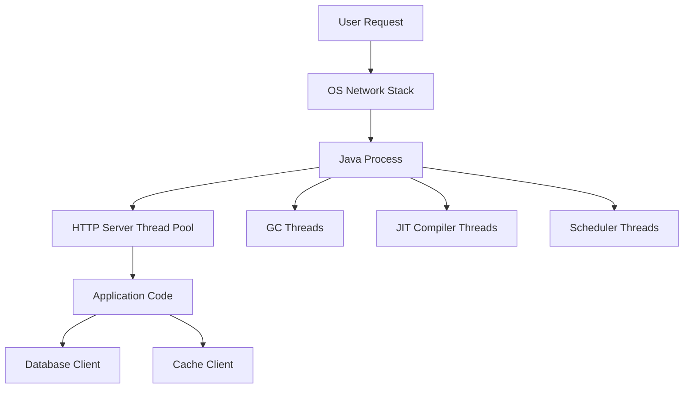

# Process vs Thread

> [!summary]
> Process는 운영체제가 실행 중인 프로그램을 자원 단위로 격리해 관리하는 실행 컨테이너이고, Thread는 하나의 Process 안에서 CPU 실행 흐름을 담당하는 더 작은 실행 단위다. Java 백엔드에서는 보통 하나의 JVM이 하나의 OS Process로 실행되고, 요청 처리, GC, JIT, 로깅, 스케줄러, 커넥션 풀 작업이 여러 Thread로 나뉘어 수행된다. Process와 Thread의 차이를 알아야 메모리 예산, 장애 격리, 컨텍스트 스위칭, 스레드 덤프, 동시성 버그를 제대로 해석할 수 있다.

## 1. 개요

백엔드 애플리케이션은 코드만으로 실행되지 않는다. 운영체제는 실행 중인 프로그램을 Process로 관리하고, CPU는 Thread 단위로 실행 흐름을 스케줄링한다. Java 애플리케이션도 예외가 아니다.

일반적인 Spring Boot 애플리케이션을 실행하면 다음 구조가 된다.

```text
Operating System
└── java process
    ├── main thread
    ├── HTTP worker threads
    ├── scheduler threads
    ├── database pool housekeeping thread
    ├── GC threads
    ├── JIT compiler threads
    └── logging or async worker threads
```

즉, Java 개발자가 작성한 비즈니스 로직은 JVM이라는 Process 안에서 여러 Thread에 의해 실행된다.

## 2. 왜 필요한가

### 장애 분석의 단위가 달라진다

Process 문제와 Thread 문제는 증상과 대응 방식이 다르다.

- Process가 죽으면 애플리케이션 인스턴스 전체가 종료된다.
- Thread 하나가 막히면 일부 요청 또는 특정 작업만 지연될 수 있다.
- 모든 worker thread가 막히면 Process는 살아 있어도 서비스는 응답하지 못한다.
- Process 메모리가 한계를 넘으면 컨테이너나 OS가 종료시킬 수 있다.

운영에서 "서버가 죽었다"와 "요청 처리가 멈췄다"는 다른 문제다. 전자는 Process 생존 여부, 종료 코드, 컨테이너 이벤트, OOM Killer 로그를 봐야 하고, 후자는 Thread dump, Lock 경합, connection pool 고갈, blocking I/O를 봐야 한다.

### 성능 병목의 위치가 달라진다

Process는 주소 공간과 자원 소유의 단위이고, Thread는 CPU 실행과 동시성의 단위다. 따라서 성능 문제도 구분해야 한다.

- CPU가 높은가?
- runnable thread가 너무 많은가?
- blocking thread가 많은가?
- context switching이 과도한가?
- Process RSS가 컨테이너 제한을 넘는가?
- Thread stack 메모리가 예상보다 큰가?

이 구분이 없으면 `-Xmx`만 늘리거나 thread pool만 키우는 식의 위험한 처방을 하게 된다.

## 3. 핵심 개념

### Process

Process는 실행 중인 프로그램의 인스턴스다. 운영체제는 Process마다 독립된 주소 공간과 자원 정보를 관리한다.

Process가 소유하거나 연결되는 대표 자원은 다음과 같다.

- 가상 메모리 주소 공간
- Heap, Stack, Native Memory
- 열린 파일과 Socket
- 환경 변수
- Process ID
- 권한과 사용자 정보
- Signal 처리 정보

Java에서는 보통 `java -jar app.jar`로 실행된 JVM 하나가 하나의 OS Process다.

### Thread

Thread는 Process 안에서 실행되는 흐름이다. 같은 Process에 속한 Thread들은 Process의 Heap과 열린 자원을 공유하지만, 각 Thread는 자신의 Stack과 Program Counter 같은 실행 상태를 가진다.

Thread의 특징은 다음과 같다.

- 같은 Process 안의 메모리를 공유한다.
- 각 Thread는 별도 Call Stack을 가진다.
- Context Switching 비용이 Process보다 일반적으로 작다.
- 공유 상태 접근 시 Race Condition이 발생할 수 있다.
- Java에서는 `Thread`, `ExecutorService`, `CompletableFuture`, ForkJoinPool 등으로 다룬다.

### Java Thread와 OS Thread

Java 17 기준 일반적인 Platform Thread는 OS Thread와 매핑된다. Java 코드에서 `new Thread(...)`를 만들면 JVM은 운영체제의 Thread 자원을 사용한다.

Java 21의 Virtual Thread는 이 관계를 바꾼다. Virtual Thread는 JVM이 관리하는 가벼운 Thread이며, 실행될 때 carrier OS Thread 위에서 동작한다. 하지만 이 문서는 Java 17 기준을 기본으로 하므로 Platform Thread 중심으로 설명한다.

## 4. 구조와 실행 흐름



Process는 애플리케이션 전체의 자원 경계다. Thread는 그 안에서 동시에 여러 작업을 진행하는 실행 단위다. 요청이 몰리면 Process가 여러 개 생기는 것이 아니라, 대개 같은 Java Process 안의 worker thread들이 요청을 나누어 처리한다.

## 5. Process와 Thread 비교

| 구분 | Process | Thread |
|---|---|---|
| 기본 의미 | 실행 중인 프로그램 인스턴스 | Process 내부 실행 흐름 |
| 자원 소유 | 주소 공간과 OS 자원 소유 | Process 자원을 공유 |
| 메모리 | 독립 주소 공간 | Heap 공유, Stack 개별 보유 |
| 생성 비용 | 상대적으로 큼 | 상대적으로 작음 |
| 통신 방식 | IPC, Socket, Pipe 등 | 공유 메모리, 동기화 도구 |
| 장애 영향 | 종료 시 애플리케이션 인스턴스 종료 | 개별 Thread 실패는 범위가 작을 수 있음 |
| Java 예 | JVM Process | `Thread`, executor worker |

## 6. Java 17 예제

### 현재 Process 정보 확인

```java
public class ProcessInfoExample {
    public static void main(String[] args) {
        ProcessHandle current = ProcessHandle.current();

        System.out.println("pid = " + current.pid());
        System.out.println("command = " + current.info().command().orElse("unknown"));
        System.out.println("thread = " + Thread.currentThread().getName());
    }
}
```

`ProcessHandle`은 Java 9부터 제공되는 API로 현재 Process나 하위 Process 정보를 다룰 수 있다.

### Thread 생성

```java
public class ThreadExample {
    public static void main(String[] args) throws InterruptedException {
        Thread worker = new Thread(() -> {
            System.out.println("worker thread = " + Thread.currentThread().getName());
        }, "order-worker");

        worker.start();
        worker.join();
    }
}
```

`start()`는 새 실행 흐름을 시작한다. `run()`을 직접 호출하면 새 Thread가 만들어지지 않고 현재 Thread에서 일반 메서드처럼 실행된다.

### ExecutorService 사용

```java
import java.util.concurrent.ExecutorService;
import java.util.concurrent.Executors;
import java.util.concurrent.TimeUnit;

public class ExecutorExample {
    public static void main(String[] args) throws InterruptedException {
        ExecutorService executor = Executors.newFixedThreadPool(4);

        for (int i = 0; i < 10; i++) {
            int taskId = i;
            executor.submit(() -> {
                System.out.println(taskId + " handled by " + Thread.currentThread().getName());
            });
        }

        executor.shutdown();
        executor.awaitTermination(3, TimeUnit.SECONDS);
    }
}
```

실무에서는 매번 `new Thread()`를 만들기보다 Thread Pool을 통해 Thread 수와 작업 큐를 제어한다.

### 공유 상태 문제

```java
public class RaceConditionExample {
    private static int count = 0;

    public static void main(String[] args) throws InterruptedException {
        Thread t1 = new Thread(RaceConditionExample::increaseMany);
        Thread t2 = new Thread(RaceConditionExample::increaseMany);

        t1.start();
        t2.start();
        t1.join();
        t2.join();

        System.out.println(count);
    }

    private static void increaseMany() {
        for (int i = 0; i < 100_000; i++) {
            count++;
        }
    }
}
```

`count++`는 읽기, 증가, 쓰기로 나뉘는 복합 연산이다. 두 Thread가 같은 변수를 동시에 변경하면 갱신 손실이 발생할 수 있다.

## 7. Spring Boot 운영 관점

Spring Boot 애플리케이션은 하나의 JVM Process 안에서 여러 종류의 Thread를 사용한다.

대표적인 Thread는 다음과 같다.

- Tomcat, Jetty, Undertow 같은 웹 서버 worker thread
- `@Async` executor thread
- `@Scheduled` scheduler thread
- HikariCP housekeeping thread
- Kafka listener thread
- logging async appender thread
- GC thread
- JIT compiler thread

따라서 Thread dump를 보면 개발자가 직접 만든 Thread 외에도 프레임워크와 JVM이 만든 Thread가 많이 보인다.

### Thread Pool 크기는 자원 예산이다

Thread Pool은 단순히 크게 잡는다고 좋은 것이 아니다. Platform Thread는 Stack 메모리와 OS 스케줄링 비용을 가진다. Thread가 너무 많으면 다음 문제가 생길 수 있다.

- 메모리 사용량 증가
- Context Switching 증가
- CPU cache 효율 저하
- Lock 경합 증가
- DB connection pool보다 많은 요청 대기로 인한 지연 확대

웹 worker thread, DB connection pool, 외부 API timeout, queue size는 함께 설계해야 한다.

## 8. 성능 및 메모리 고려 사항

### Process 메모리

Java Process 메모리는 Heap만으로 구성되지 않는다.

- Java Heap
- Thread Stack
- Metaspace
- Code Cache
- Direct Buffer
- JVM native memory
- Native library memory

컨테이너 환경에서 `-Xmx`를 메모리 제한과 같게 잡으면 Thread Stack, Direct Buffer, Metaspace 같은 Heap 외 메모리 여유가 없어 OOM Kill이 발생할 수 있다.

### Thread Stack

각 Platform Thread는 Stack 메모리를 가진다. Thread 수가 늘어나면 Stack 메모리 총량도 증가한다.

```text
thread count x stack size = rough stack memory budget
```

예를 들어 Stack 크기와 Thread 수를 고려하지 않고 executor를 여러 개 만들면, Heap 사용량은 낮아 보이는데 Process RSS가 계속 높아지는 상황이 생길 수 있다.

### Context Switching

Thread 수가 CPU Core보다 훨씬 많으면 운영체제는 Thread를 자주 교체해야 한다. I/O 대기 Thread가 많을 수는 있지만, CPU-bound 작업에서 Thread를 과도하게 늘리면 처리량이 오히려 떨어질 수 있다.

CPU-bound 작업은 보통 CPU Core 수 근처로 제한하고, I/O-bound 작업은 대기 시간을 고려해 더 크게 잡을 수 있다. 하지만 실제 값은 부하 테스트와 운영 지표로 확인해야 한다.

## 9. 동시성과 스레드 안전성

Thread는 Heap을 공유한다. 이것이 빠른 통신의 장점이지만 동시에 Race Condition의 원인이 된다.

공유 상태를 다룰 때는 다음을 고려한다.

- 불변 객체 사용
- 지역 변수 우선 사용
- Thread-safe 컬렉션 사용
- `synchronized`, `Lock`, `Atomic*` 사용
- 작업 큐와 메시지 기반 설계
- 상태를 DB transaction이나 외부 저장소에 위임

단, Thread-safe 자료구조를 사용한다고 전체 비즈니스 로직이 자동으로 안전해지는 것은 아니다. 여러 단계의 읽기-검증-쓰기 로직은 별도의 원자성 보장이 필요하다.

## 10. 실패 시나리오와 문제 해결

### 장애 시나리오 1: Process는 살아 있지만 응답하지 않는다

증상:

- 컨테이너는 Running 상태다.
- Health check가 timeout된다.
- CPU는 낮거나 중간 수준이다.
- Thread dump에서 worker thread가 대부분 `WAITING` 또는 `BLOCKED`다.

가능한 원인:

- DB connection pool 고갈
- 외부 API timeout 미설정
- Lock 경합
- Thread pool queue 적체
- Deadlock

대응:

- Thread dump를 여러 번 떠서 상태가 고정되어 있는지 본다.
- blocked thread의 lock owner를 찾는다.
- connection pool active, idle, pending 지표를 확인한다.
- 외부 호출 timeout과 circuit breaker 설정을 확인한다.

### 장애 시나리오 2: Thread가 너무 많아 메모리가 부족하다

증상:

- Heap 사용량은 제한 이하인데 Process RSS가 높다.
- `unable to create native thread` 오류가 발생한다.
- 컨테이너 OOM Kill이 발생한다.

가능한 원인:

- executor를 요청마다 만들었다.
- Thread Pool을 여러 컴포넌트에서 과도하게 크게 잡았다.
- Thread Stack과 native memory 예산을 고려하지 않았다.

대응:

- Thread 수를 지표와 dump로 확인한다.
- executor 생성 위치를 점검한다.
- 공유 executor 또는 bounded executor를 사용한다.
- `-Xss`, `-Xmx`, 컨테이너 메모리 제한을 함께 검토한다.

### 장애 시나리오 3: CPU 사용률이 높고 처리량이 낮다

증상:

- CPU 사용률은 높은데 TPS가 오르지 않는다.
- run queue가 길다.
- context switch가 많다.
- Thread dump에서 runnable thread가 과도하게 많다.

가능한 원인:

- CPU-bound 작업에 Thread를 너무 많이 할당했다.
- busy waiting 코드가 있다.
- Lock 경쟁이 심하다.

대응:

- CPU profiler와 Thread dump를 함께 본다.
- CPU-bound executor 크기를 Core 수 기준으로 조정한다.
- busy loop를 제거한다.
- 공유 Lock 범위를 줄인다.

## 11. 진단 방법

### Process 확인

운영에서는 먼저 Process가 살아 있는지 확인한다.

```text
jps -l
ps -ef | grep java
```

컨테이너 환경에서는 다음도 함께 본다.

```text
docker ps
docker inspect <container>
kubectl describe pod <pod>
kubectl logs <pod> --previous
```

Process가 종료됐다면 현재 로그뿐 아니라 이전 컨테이너 로그, 종료 코드, OOM Kill 이벤트를 확인해야 한다.

### Thread dump 확인

Java Thread 상태는 `jstack`, `jcmd`, Actuator threaddump 등으로 확인할 수 있다.

```text
jcmd <pid> Thread.print
jstack <pid>
```

Thread dump에서 주로 보는 것은 다음이다.

- `RUNNABLE` Thread가 CPU를 실제로 쓰고 있는가
- `BLOCKED` Thread가 어떤 Lock을 기다리는가
- `WAITING`, `TIMED_WAITING` Thread가 외부 I/O나 Queue에서 대기 중인가
- Deadlock 탐지 결과가 있는가
- 같은 stack trace를 가진 Thread가 대량으로 있는가

### 지표와 함께 해석

Thread dump 하나만으로 결론을 내리면 위험하다. 최소한 다음과 함께 봐야 한다.

- CPU 사용률
- Load average 또는 run queue
- Heap, non-heap, RSS
- GC pause
- HTTP worker active count
- DB connection pool active, idle, pending count
- 외부 API latency와 timeout

## 12. 흔한 실수

### Process와 Thread를 같은 의미로 사용한다

"Thread가 죽어서 서버가 내려갔다"는 표현은 정확하지 않을 수 있다. 일반적으로 Thread 하나의 예외는 Process 전체 종료와 다르다. 반대로 main thread 종료나 non-daemon thread 상태, uncaught exception 정책에 따라 애플리케이션 생명주기에 영향을 줄 수 있으므로 구체적으로 확인해야 한다.

### Thread를 늘리면 항상 빨라진다고 생각한다

I/O 대기 시간이 큰 경우 Thread를 늘리면 처리량이 증가할 수 있다. 그러나 CPU-bound 작업에서 Thread를 과도하게 늘리면 context switching과 경합 때문에 성능이 나빠질 수 있다.

### Heap만 보고 메모리를 판단한다

Java Process는 Heap 외 메모리를 많이 쓴다. Thread Stack, Direct Buffer, Metaspace, Code Cache를 보지 않으면 컨테이너 OOM Kill 원인을 놓친다.

### Thread Pool을 무제한으로 둔다

무제한 Thread 생성이나 무제한 Queue는 장애를 늦게 드러내는 방식일 뿐이다. 요청이 몰릴 때 지연이 폭발하고 메모리 압박으로 이어질 수 있다.

## 13. 모범 사례

- Java 애플리케이션을 Process 단위와 Thread 단위로 나눠 관찰한다.
- Thread Pool은 bounded size와 bounded queue를 기본으로 검토한다.
- CPU-bound와 I/O-bound 작업 executor를 구분한다.
- 외부 I/O에는 timeout을 반드시 둔다.
- Thread dump, Heap 지표, RSS, CPU 지표를 함께 본다.
- 공유 mutable state를 줄이고 불변 객체와 지역 변수를 우선한다.
- executor를 요청마다 만들지 않는다.
- 컨테이너 메모리 제한에는 Heap 외 메모리 여유를 남긴다.

## 14. 면접 질문

### Q1. Process와 Thread의 차이는 무엇인가요?

Process는 운영체제가 실행 중인 프로그램을 자원 단위로 격리해 관리하는 단위입니다. 독립된 주소 공간과 파일, 소켓 같은 자원 정보를 가집니다. Thread는 Process 내부에서 CPU가 실행하는 흐름이며 같은 Process의 Heap과 자원을 공유하지만 각자 Stack을 가집니다. Java에서는 보통 JVM 하나가 Process이고, 요청 처리나 GC 같은 작업이 여러 Thread에서 수행됩니다.

### Q2. Thread가 Process보다 가볍다고 하는 이유는 무엇인가요?

Thread는 같은 Process의 주소 공간과 자원을 공유하기 때문에 새 독립 주소 공간을 준비하는 Process보다 생성과 전환 비용이 일반적으로 작습니다. 하지만 공짜는 아닙니다. Platform Thread는 Stack 메모리와 OS 스케줄링 비용을 가지며, 너무 많으면 context switching과 메모리 사용량이 증가합니다.

### Q3. Java Process의 메모리를 Heap만 보면 안 되는 이유는 무엇인가요?

Java Process는 Heap 외에도 Thread Stack, Metaspace, Code Cache, Direct Buffer, JVM native memory를 사용합니다. 컨테이너 메모리 제한과 `-Xmx`를 거의 같게 잡으면 Heap은 여유가 있어도 Process 전체 RSS가 제한을 넘어 OOM Kill될 수 있습니다.

### Q4. Process는 살아 있는데 서비스가 응답하지 않는다면 무엇을 확인하나요?

Thread dump를 떠서 HTTP worker thread가 어떤 상태인지 확인합니다. `BLOCKED`가 많으면 Lock 경합이나 deadlock을 보고, `WAITING`이 많으면 DB connection pool, 외부 API timeout, Queue 적체를 의심합니다. 동시에 CPU, GC, connection pool active/pending, 외부 API latency 지표를 함께 확인합니다.

### Q5. CPU-bound 작업과 I/O-bound 작업의 Thread Pool 크기는 어떻게 다르게 보나요?

CPU-bound 작업은 실제 계산이 CPU를 점유하므로 Core 수보다 Thread를 과도하게 늘리면 context switching 때문에 처리량이 떨어질 수 있습니다. I/O-bound 작업은 대기 시간이 많기 때문에 더 많은 Thread가 유리할 수 있지만, 외부 시스템 한계와 connection pool, timeout, queue size를 함께 고려해야 합니다.

## 15. 후속 질문

- `Thread.start()`와 `Thread.run()`의 차이는 무엇인가요?
- Java Thread는 OS Thread와 항상 1:1인가요?
- Daemon Thread와 User Thread는 무엇이 다른가요?
- Context Switching이 많으면 왜 성능이 떨어지나요?
- Thread dump에서 `BLOCKED`, `WAITING`, `TIMED_WAITING`은 어떻게 해석하나요?
- Virtual Thread가 Process와 Thread의 관계를 어떻게 바꾸나요?
- Thread Pool과 DB Connection Pool은 왜 함께 봐야 하나요?

## 16. 면접관의 관점

면접관은 정의 암기보다 다음을 본다.

- Process를 자원 격리 단위로 설명할 수 있는가
- Thread를 실행 흐름과 공유 메모리 관점으로 설명할 수 있는가
- Java 애플리케이션에서 JVM Process와 Java Thread를 연결해 설명하는가
- Heap 외 메모리와 Thread Stack을 운영 관점에서 이해하는가
- Thread dump를 장애 분석 도구로 사용할 수 있는가
- Thread를 늘리는 것이 항상 성능 개선이 아니라는 점을 아는가

## 17. 시니어 수준의 답변

Process는 운영체제가 실행 중인 프로그램을 격리하고 자원을 관리하는 단위이고, Thread는 그 Process 안에서 CPU가 실행하는 흐름입니다. Java 백엔드에서는 보통 JVM 하나가 하나의 Process로 뜨고, HTTP worker, scheduler, GC, JIT, connection pool 관련 작업이 여러 Thread로 실행됩니다.

운영에서는 Process 생존 여부와 Thread 상태를 구분해서 봐야 합니다. Process가 죽으면 종료 코드, OOM Kill, 컨테이너 이벤트를 확인하고, Process는 살아 있는데 응답하지 않으면 Thread dump로 worker thread가 blocking I/O, Lock, connection pool에서 대기 중인지 확인합니다.

또한 Thread는 가볍지만 공짜가 아닙니다. Platform Thread마다 Stack과 OS 스케줄링 비용이 있고, 너무 많은 Thread는 RSS 증가와 context switching을 유발합니다. 그래서 Thread Pool 크기는 CPU Core, 작업 성격, 외부 I/O timeout, DB connection pool, queue size와 함께 설계해야 합니다.

## 18. 흔한 오답

### "Process와 Thread는 거의 같은 실행 단위입니다."

부정확하다. Process는 자원 격리와 소유 단위이고, Thread는 Process 내부 실행 흐름이다.

### "Thread는 메모리를 전혀 사용하지 않습니다."

틀렸다. Platform Thread는 개별 Stack과 실행 상태를 가진다.

### "Thread를 많이 만들수록 처리량이 올라갑니다."

항상 그렇지 않다. CPU-bound 작업에서는 context switching과 경합으로 처리량이 떨어질 수 있다.

### "Java 메모리는 Xmx만 보면 됩니다."

틀렸다. Java Process 전체 메모리는 Heap 외 영역까지 포함한다.

## 19. 운영 경험 체크리스트

- Process가 실제로 살아 있는지 먼저 확인했는가?
- 종료됐다면 이전 로그, 종료 코드, OOM Kill 이벤트를 확인했는가?
- Thread dump를 한 번이 아니라 시간 간격을 두고 여러 번 확보했는가?
- HTTP worker thread 상태와 connection pool 지표를 함께 봤는가?
- executor와 queue가 bounded인지 확인했는가?
- CPU-bound 작업과 I/O-bound 작업이 같은 pool을 공유하지 않는가?
- Thread 수와 Stack 메모리가 컨테이너 메모리 예산에 포함되어 있는가?
- `new Thread()` 또는 executor 생성이 요청 경로에 있지 않은가?

## 20. 면접 직전 10분 요약

- Process는 OS의 자원 격리 단위다.
- Thread는 Process 안의 실행 흐름이다.
- 같은 Process의 Thread들은 Heap을 공유하고 Stack은 각자 가진다.
- Java 17의 일반 Platform Thread는 OS Thread와 매핑된다고 이해하면 된다.
- JVM 하나는 보통 하나의 OS Process로 실행된다.
- Spring Boot 요청 처리는 worker thread에서 수행된다.
- Process가 죽은 문제와 Thread가 막힌 문제는 다르게 진단한다.
- Heap만 보지 말고 Thread Stack, Direct Buffer, Metaspace, RSS를 함께 본다.
- Thread Pool은 크기와 Queue를 제한해야 한다.
- Thread를 늘리는 것은 성능 개선이 아니라 자원 트레이드오프다.

## 21. 관련 주제

- [[01-Java-Core/001-Java-Architecture|Java 아키텍처]]
- [[01-Java-Core/002-JVM-vs-JRE-vs-JDK|JVM vs JRE vs JDK]]
- `Thread Lifecycle`
- `Thread Creation (extends vs Runnable)`
- `Executor Framework`
- `Thread Pool`
- `Race Condition`
- `Process vs Thread (OS)`

## 22. 요약

Process와 Thread의 차이는 Java 백엔드 운영의 출발점이다. Process는 JVM 인스턴스와 자원 경계를 설명하고, Thread는 요청 처리와 동시성 실행 흐름을 설명한다.

면접에서는 "Process는 독립 메모리, Thread는 공유 메모리"라는 한 줄 정의를 넘어, Java Process의 Heap 외 메모리, Thread Stack, Thread Pool, Context Switching, Thread dump 기반 장애 분석까지 연결해 답해야 한다. 실무에서는 Process 생존 여부와 Thread 상태를 분리해 관찰하는 습관이 장애 대응 품질을 크게 좌우한다.
