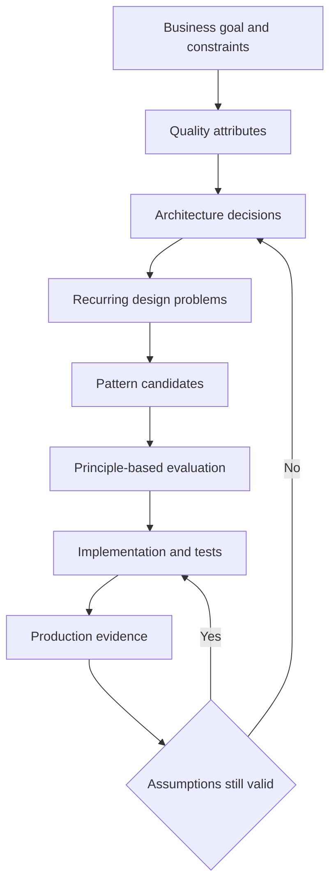

# Pattern vs Principle vs Architecture

> [!summary]
> Principle은 판단 기준, Pattern은 반복 문제에 대한 검증된 해법의 형태, Architecture는 시스템의 핵심 구조와 제약이다. 셋은 경쟁 관계가 아니라 서로 다른 추상화 수준에서 설계 결정을 돕는다.

## 1. 개요

시니어 개발자는 “이 패턴을 적용했다”는 사실보다 왜 그 선택이 현재 문제와 제약에 맞는지 설명해야 한다. Principle, Pattern, Architecture를 구분하지 못하면 작은 코드 문제에 거대한 구조를 도입하거나, 시스템 경계를 Method 수준 Refactoring으로 해결하려는 오류가 생긴다.

세 개념의 역할은 다음과 같다.

| 구분 | 핵심 질문 | 예시 | 영향 범위 |
|---|---|---|---|
| Principle | 무엇을 좋은 결정으로 볼 것인가? | SRP, OCP, DIP, Separation of Concerns | 판단 전반 |
| Pattern | 반복되는 문제를 어떤 구조로 해결할 것인가? | Strategy, Adapter, Outbox | 국소 코드부터 분산 시스템까지 |
| Architecture | 시스템의 주요 요소와 관계를 어떻게 조직할 것인가? | Layered, Hexagonal, Microservices | 시스템 전반과 장기 진화 |

Pattern은 Recipe가 아니며 Architecture는 폴더 구조가 아니다. Principle도 예외 없는 법칙이 아니라 Trade-off를 평가하기 위한 지침이다.

## 2. 왜 필요한가

같은 단어를 서로 다른 수준으로 사용하면 설계 리뷰에서 다음 문제가 발생한다.

- 팀원이 “DIP를 적용하자”를 Interface를 무조건 추가하자는 뜻으로 이해한다.
- Strategy Pattern 하나를 적용한 것을 전체 Architecture라고 부른다.
- Layered Architecture를 Package 이름만 나눈 구조로 축소한다.
- 유명 Pattern을 먼저 고르고 거기에 문제를 끼워 맞춘다.
- Architecture 결정의 운영 비용과 변경 비용을 Class Diagram만으로 평가한다.

구분의 목적은 용어 시험이 아니라 의사결정의 범위, 비용, 가역성과 검증 방법을 명확히 하는 데 있다.

## 3. 핵심 개념

### Principle

Principle은 설계 판단의 방향을 제공한다. 예를 들어 Dependency Inversion Principle은 상위 정책이 하위 구현 세부 사항에 직접 끌려가지 않도록 의존성 방향을 설계하라는 지침이다. 특정 Interface 개수나 Framework 사용을 강제하지 않는다.

Principle은 서로 충돌할 수 있다. 중복 제거를 위한 DRY와 결합을 피하려는 독립성 사이에서 선택해야 할 수 있으며, 단순성을 위한 YAGNI와 미래 변경 가능성을 위한 확장성 사이에도 긴장이 생긴다.

### Pattern

Pattern은 특정 Context에서 반복되는 Problem, 이를 해결하는 Solution Structure와 Consequence를 함께 설명한다. 이름만 붙이는 것이 Pattern 적용은 아니다.

좋은 Pattern 설명에는 최소한 다음이 포함된다.

- Context: 어떤 조건에서 문제가 발생하는가?
- Problem: 반복되는 힘과 제약은 무엇인가?
- Solution: 책임과 협력을 어떻게 구성하는가?
- Consequence: 얻는 이점과 추가 비용은 무엇인가?

### Architecture

Architecture는 시스템의 중요한 구성요소, 책임, 관계, 제약과 주요 설계 결정을 포함한다. 모든 구현 세부 사항이 Architecture인 것은 아니다. 변경 비용이 크고 품질 속성에 광범위한 영향을 주는 결정이 핵심이다.

대표 품질 속성은 다음과 같다.

- Availability와 Recoverability
- Performance와 Scalability
- Security와 Compliance
- Modifiability와 Deployability
- Observability와 Operability

## 4. 내부 메커니즘

세 개념은 일반적으로 다음 흐름으로 연결된다.



실제 과정은 일방향이 아니다. 운영 지표가 기존 가정을 반박하면 Architecture Decision을 다시 검토하고 Pattern을 제거하거나 교체한다.

### 추상화 수준과 의사결정 반경

Method 내부의 분기 교체는 국소적 Pattern 결정일 수 있다. Module 간 의존성 방향은 Component Design이면서 Architecture에 영향을 줄 수 있다. Service 분리, 데이터 소유권과 배포 단위는 조직과 운영 체계까지 바꾸는 Architecture 결정이다.

결정 반경이 커질수록 다음 비용이 증가한다.

- 참여자와 승인 범위
- Migration 및 Rollback 난이도
- 테스트와 관측 범위
- 실패 시 Blast Radius
- 조직 간 Coordination Cost

## 5. 상세 설명

### Principle은 자동 해답이 아니다

“Single Responsibility”의 Responsibility는 Method 개수나 Class 크기가 아니라 변경 이유와 이해관계자의 축에 가깝다. 지나치게 분할하면 Navigation Cost, Indirection과 Transaction Boundary 복잡성이 증가한다.

따라서 Principle 적용은 “준수/위반” 이분법보다 다음 질문이 유용하다.

- 어떤 변경이 함께 일어나는가?
- 어떤 책임이 다른 속도로 진화하는가?
- 결합을 줄여 얻는 이익이 간접 계층의 비용보다 큰가?
- 테스트와 운영 진단이 더 쉬워지는가?

### Pattern은 이름보다 Consequence가 중요하다

Strategy는 Algorithm 교체를 쉽게 만들지만 Class와 Object 수, 조립 복잡성을 늘린다. Decorator는 조합 가능성을 높이지만 호출 순서와 디버깅을 어렵게 할 수 있다. Outbox는 DB 변경과 Event 발행의 원자성 문제를 완화하지만 Relay, 중복 소비와 지연 관리가 추가된다.

Pattern 이름만 나열하는 답변보다 적용하지 않았을 때의 문제와 적용 후 감수할 비용을 설명하는 답변이 강하다.

### Architecture는 품질 속성의 Trade-off다

Microservices는 독립 배포와 팀 자율성을 지원할 수 있지만 Network Failure, Data Consistency, Observability와 운영 자동화 비용을 만든다. Monolith는 단순한 배포와 Transaction을 제공하지만 조직과 Codebase가 성장하면 변경 격리와 배포 Coordination이 어려워질 수 있다.

어느 구조가 절대적으로 우수한 것이 아니라 현재 규모, 팀 구조, 변경 빈도와 실패 허용 범위에 맞는지가 중요하다.

### Architecture Pattern과 Design Pattern의 경계

Pattern은 규모에 따라 분류할 수 있다.

- Object/Code Level: Strategy, Decorator, Factory Method
- Application Level: Repository, Unit of Work, Service Layer
- Architecture Level: Layered, Hexagonal, Event-Driven
- Distributed System Level: Saga, Outbox, Circuit Breaker

경계는 절대적이지 않다. Pattern이 적용되는 범위와 결정 반경을 명시하는 것이 분류 이름보다 중요하다.

### Standard, Convention, Idiom과의 차이

- Standard: 조직 또는 산업이 준수하도록 정한 규칙이나 규격
- Convention: 팀이 일관성을 위해 합의한 선택
- Idiom: 특정 언어 또는 생태계에서 자연스럽게 쓰는 구현 방식
- Pattern: 반복 문제와 해법 및 결과를 설명하는 재사용 가능한 설계 지식

Java의 Try-with-resources는 언어가 지원하는 Resource 관리 Idiom이고, 팀의 Package Naming은 Convention이다. 이를 Architecture라고 부르면 의사결정 중요도가 흐려진다.

## 6. Java 17 예제

### Principle만으로 시작한 단순한 구현

할인 정책이 하나뿐이고 변경 요구가 검증되지 않았다면 단순한 Method가 충분할 수 있다.

```java
import java.math.BigDecimal;
import java.math.RoundingMode;
import java.util.Objects;

public final class PriceCalculator {
    public BigDecimal calculateMemberPrice(BigDecimal price, boolean premiumMember) {
        Objects.requireNonNull(price, "price must not be null");
        if (price.signum() < 0) {
            throw new IllegalArgumentException("price must not be negative");
        }

        BigDecimal rate = premiumMember
                ? new BigDecimal("0.90")
                : BigDecimal.ONE;
        return price.multiply(rate).setScale(2, RoundingMode.HALF_UP);
    }
}
```

YAGNI와 단순성이라는 Principle을 우선한 선택이다. 요구사항이 다양해지기 전에 Strategy를 미리 추가할 필요는 없다.

### 반복되는 변화가 확인된 뒤 Strategy 적용

Channel, Member Grade와 Campaign마다 정책이 독립적으로 변경되고 조합 규칙이 생겼다면 Strategy가 유효할 수 있다.

```java
import java.math.BigDecimal;
import java.math.RoundingMode;
import java.util.List;
import java.util.Objects;

public interface DiscountPolicy {
    boolean supports(OrderContext context);
    BigDecimal discountAmount(OrderContext context);
}

record OrderContext(String memberGrade, BigDecimal originalPrice) {
    OrderContext {
        Objects.requireNonNull(memberGrade, "memberGrade must not be null");
        Objects.requireNonNull(originalPrice, "originalPrice must not be null");
        if (originalPrice.signum() < 0) {
            throw new IllegalArgumentException("originalPrice must not be negative");
        }
    }
}

final class PremiumMemberPolicy implements DiscountPolicy {
    @Override
    public boolean supports(OrderContext context) {
        return "PREMIUM".equals(context.memberGrade());
    }

    @Override
    public BigDecimal discountAmount(OrderContext context) {
        return context.originalPrice()
                .multiply(new BigDecimal("0.10"))
                .setScale(2, RoundingMode.HALF_UP);
    }
}

final class DiscountService {
    private final List<DiscountPolicy> policies;

    DiscountService(List<DiscountPolicy> policies) {
        this.policies = List.copyOf(policies);
    }

    BigDecimal finalPrice(OrderContext context) {
        BigDecimal discount = policies.stream()
                .filter(policy -> policy.supports(context))
                .findFirst()
                .map(policy -> policy.discountAmount(context))
                .orElse(BigDecimal.ZERO);

        return context.originalPrice().subtract(discount);
    }
}
```

여기서 Principle은 정책과 조립 책임의 분리를 평가하고, Strategy Pattern은 반복되는 정책 교체 문제의 구조를 제공한다. 이 코드만으로 전체 시스템 Architecture가 결정되지는 않는다.

### Architecture Boundary 표현

```java
public interface PaymentGateway {
    PaymentResult authorize(PaymentCommand command);
}

public record PaymentCommand(String orderId, long amount) {
    public PaymentCommand {
        if (orderId == null || orderId.isBlank()) {
            throw new IllegalArgumentException("orderId must not be blank");
        }
        if (amount <= 0) {
            throw new IllegalArgumentException("amount must be positive");
        }
    }
}

public record PaymentResult(String transactionId, boolean approved) {
}
```

이 Port가 Architecture 역할을 하려면 단순히 Interface가 있다는 사실이 아니라 Domain 정책이 외부 결제 SDK에 종속되지 않는 의존성 방향, Adapter 교체, Timeout·Retry·관측 정책까지 시스템 경계로 유지되어야 한다.

## 7. 운영 환경 활용

### 설계 결정 기록

큰 결정에는 Architecture Decision Record를 사용할 수 있다. 최소 내용은 다음과 같다.

- 문제와 Context
- 고려한 Option
- 선택과 이유
- 긍정적·부정적 Consequence
- 검증할 지표와 재검토 조건

ADR은 결정을 영구 고정하는 문서가 아니라 당시 가정과 Trade-off를 보존하는 도구다.

### Production Evidence와 연결

설계가 의도대로 동작하는지는 코드 모양만으로 알 수 없다.

- Module 분리: Change Coupling과 Build Dependency
- Cache Pattern: Hit Ratio, Eviction, Staleness, Load Amplification
- Circuit Breaker: Failure Rate, Open Duration, Fallback 성공률
- Microservices: Deployment Frequency, Lead Time, Network Error, MTTR

지표가 없으면 Pattern 적용의 성공 여부를 평가할 수 없다.

## 8. 성능 및 메모리 고려 사항

Pattern의 Indirection은 대개 Nanosecond 수준 호출 비용보다 복잡성 비용이 더 크지만 Hot Path에서는 실제 측정이 필요하다.

- 다수의 작은 객체는 Allocation과 GC Pressure를 높일 수 있다.
- Decorator Chain과 Proxy는 Stack Trace와 Profiling 해석을 어렵게 할 수 있다.
- Reflection 기반 조립은 Startup과 Native Image 제약에 영향을 줄 수 있다.
- 분산 Architecture는 Serialization, Network Hop과 Queueing Delay를 추가한다.
- Cache Pattern은 메모리를 사용해 Latency와 Backend Load를 줄이는 Trade-off다.

성능 주장은 JMH 같은 Microbenchmark와 실제 부하 테스트의 목적을 구분하고, Tail Latency와 자원 사용량을 함께 측정해야 한다.

## 9. 동시성과 스레드 안전성

Pattern 이름은 Thread Safety를 보장하지 않는다.

- Singleton 객체가 Mutable State를 가지면 경쟁 조건이 생긴다.
- Observer 목록의 등록·순회에는 동시 수정 정책이 필요하다.
- Strategy 구현체가 상태를 공유하면 호출 간 간섭이 발생할 수 있다.
- Event-Driven Architecture는 순서, 중복, 재처리와 Backpressure를 다뤄야 한다.
- Repository 추상화가 DB Transaction 경계를 자동으로 해결하지 않는다.

동시성 요구는 불변성, Ownership, Lock 범위, Atomicity와 Message Ordering으로 구체화해야 한다.

## 10. 실패 시나리오와 문제 해결

### Pattern-First Design

**증상:** 요구사항보다 Interface와 추상 계층이 많고 변경 시 여러 파일을 따라가야 한다.

**원인:** 반복 문제가 검증되기 전에 유명 Pattern을 적용했다.

**대응:** 실제 Variation Point와 Change History를 확인하고 불필요한 계층을 Inline한다. 제거 후 테스트 가능성과 변경 범위를 다시 측정한다.

### Architecture와 폴더 구조의 불일치

**증상:** `domain`, `application`, `infrastructure` Package는 있지만 Domain이 ORM, HTTP Client와 Framework Annotation에 직접 의존한다.

**대응:** Build Dependency와 Import 방향을 검사하고 Architecture Test로 경계를 자동 검증한다. Package 이름이 아니라 의존성 방향을 고친다.

### Pattern 적용 후 운영 복잡성 증가

**증상:** Retry가 장애를 증폭하거나 Event Consumer가 중복 Side Effect를 만든다.

**대응:** Timeout Budget, Retry 횟수와 Jitter, Idempotency Key, Dead Letter 처리와 Observability를 Pattern의 필수 Consequence로 구현한다.

### Principle 충돌을 절대 규칙으로 처리

**증상:** 중복 제거를 위해 서로 독립적인 Module을 결합하거나, 완전한 추상화를 위해 단순한 기능의 Lead Time이 길어진다.

**대응:** 어떤 품질 속성을 우선하는지 기록하고 가역성이 높은 최소 결정을 선택한다.

## 11. 흔한 실수

- Design Pattern 이름을 많이 쓰면 좋은 설계라고 생각한다.
- SOLID를 Interface와 Class 수를 늘리는 규칙으로 해석한다.
- Package 구조를 Architecture 자체라고 생각한다.
- Pattern의 적용 조건 없이 장점만 설명한다.
- Architecture 선택에서 조직 구조와 운영 역량을 제외한다.
- 모든 중복을 같은 Abstraction으로 합친다.
- 미래 요구를 추측해 Extension Point를 과도하게 만든다.
- Framework Annotation을 사용했다는 이유로 특정 Pattern을 구현했다고 주장한다.

## 12. 모범 사례

- 문제와 제약을 먼저 쓰고 Pattern 이름은 나중에 붙인다.
- Principle 충돌 시 우선할 품질 속성과 근거를 기록한다.
- 가장 단순하고 가역적인 해법부터 시작한다.
- Architecture 결정은 ADR과 Fitness Function으로 검증한다.
- Pattern의 장점뿐 아니라 새로 생기는 실패 모드를 설계한다.
- 조직의 배포·관측·장애 대응 역량을 Architecture 선택에 포함한다.
- 반복되지 않는 코드는 성급하게 일반화하지 않는다.
- 운영 지표와 Change History로 추상화의 가치를 재평가한다.

## 13. 면접 질문

### 질문 1. Principle, Pattern, Architecture의 차이는 무엇인가?

**면접관이 평가하는 것**

추상화 수준과 의사결정 범위를 구분하고 Trade-off를 설명하는지 평가한다.

**간결한 답변**

Principle은 좋은 결정을 위한 판단 기준이고, Pattern은 특정 Context의 반복 문제에 대한 재사용 가능한 해결 구조이며, Architecture는 시스템의 핵심 요소와 관계 및 제약을 정하는 큰 범위의 결정이다.

**시니어 확장 답변**

셋은 계층적으로 연결되지만 자동 변환되지는 않는다. 품질 속성과 제약을 바탕으로 Architecture를 선택하고, 그 안의 반복 문제에 Pattern을 적용하며, Principle로 의존성과 책임의 Trade-off를 평가한다. 선택 후에는 운영 지표와 변경 비용으로 가정을 검증한다. Pattern 하나를 적용했다고 Architecture가 되는 것도 아니고, DIP가 Interface 수를 늘리라는 규칙도 아니다.

**가능한 후속 질문**

- Architecture Pattern과 Design Pattern의 경계는 어디인가?
- Pattern을 제거해야 하는 신호는 무엇인가?
- Principle이 충돌할 때 어떻게 결정하는가?

**약한 답변**

“Principle은 이론, Pattern은 코드, Architecture는 서버 구성이다.” 각 개념의 Context와 영향 범위를 지나치게 축소한다.

### 질문 2. Pattern을 적용하지 않기로 한 사례를 설명해 보라.

**면접관이 평가하는 것**

Pattern 암기가 아니라 문제 적합성, YAGNI와 가역성을 판단하는지 평가한다.

**간결한 답변**

변화 축이 하나이고 구현이 단순할 때는 Strategy나 Factory 계층을 미리 만들지 않는다. 요구 변화가 반복되고 테스트·교체 비용이 실제로 커졌을 때 추출한다.

**실무형 예시**

가상의 정산 시스템에서 고객별 수수료 정책이 하나뿐인 초기 단계에는 단일 계산 Method를 유지한다. 계약 종류가 늘고 독립 배포되는 정책 변경이 반복되면 Strategy와 정책 Registry를 도입하며, 정책 선택 실패와 관측 지표도 함께 설계한다.

### 질문 3. 좋은 Architecture인지 어떻게 검증하는가?

**간결한 답변**

목표 품질 속성을 측정 가능한 Scenario로 정의하고 Architecture Test, 부하·장애 테스트, 배포 및 운영 지표로 검증한다.

**시니어 확장 답변**

“Clean하다” 같은 표현 대신 변경 Lead Time, Dependency Violation, Tail Latency, Recovery Time, Deployment Failure Rate 같은 지표를 선택한다. 중요한 가정과 재검토 조건을 ADR에 남기고, 조직과 트래픽이 변하면 결정을 갱신한다.

## 14. 후속 질문

- Pattern과 Idiom은 어떻게 다른가?
- DRY와 Module 독립성이 충돌하면 무엇을 우선하는가?
- Strategy와 단순한 Lambda의 선택 기준은 무엇인가?
- Architecture Decision의 가역성을 어떻게 판단하는가?
- Fitness Function을 어떤 방식으로 자동화할 수 있는가?
- Conway's Law가 Architecture에 미치는 영향은 무엇인가?
- Pattern 적용이 성능 장애를 만든 사례를 어떻게 진단하는가?

## 15. 면접관의 관점

주니어 답변은 개념 정의와 Pattern 목록에 머무르기 쉽다. 시니어 후보자는 다음을 보여줘야 한다.

- 문제, Context, 제약을 Pattern보다 먼저 설명한다.
- 결정의 범위와 Blast Radius를 구분한다.
- Principle 사이의 충돌과 우선순위를 설명한다.
- Pattern의 Consequence와 제거 조건을 말한다.
- Architecture를 품질 속성, 조직과 운영 능력에 연결한다.
- Production Evidence로 결정을 검증한다.

## 16. 시니어 수준의 답변

> Principle은 설계 판단의 기준이고, Pattern은 특정 Context에서 반복되는 문제와 해결 구조 및 Consequence를 정리한 지식이며, Architecture는 시스템의 핵심 구성요소·관계·제약과 품질 속성에 영향을 주는 큰 결정입니다. 저는 Pattern 이름부터 선택하지 않고 Business Goal, 변경 축, 부하와 실패 조건을 먼저 정의합니다. 가장 단순하고 가역적인 해법을 선택한 뒤 반복 문제가 확인되면 Pattern을 도입합니다. Architecture 결정은 ADR로 가정과 대안을 남기고 Dependency Test, Tail Latency, Deployment Lead Time과 MTTR 같은 지표로 검증합니다. Principle이 충돌하면 현재 품질 속성의 우선순위와 결정의 가역성을 기준으로 Trade-off를 명시합니다.

## 17. 흔한 오답

- “Principle은 반드시 지켜야 하는 법이고 Pattern은 정답 코드다.”
- “Architecture는 Controller, Service, Repository 폴더를 나누는 것이다.”
- “Interface를 만들면 DIP와 Strategy Pattern이 적용된다.”
- “Microservices는 Monolith보다 발전된 Architecture다.”
- “Design Pattern을 많이 적용할수록 유지보수성이 높다.”
- “DRY는 모든 중복 코드를 즉시 합치라는 의미다.”
- “Architecture는 처음 정하면 바꾸면 안 된다.”

## 18. 운영 경험 체크리스트

- [ ] 설계 결정의 문제와 제약을 Pattern 이름 없이 설명할 수 있는가?
- [ ] 목표 품질 속성과 우선순위가 합의되어 있는가?
- [ ] 대안과 선택하지 않은 이유가 기록되어 있는가?
- [ ] Pattern 도입 전후의 변경 비용을 비교했는가?
- [ ] 새로 생기는 실패 모드와 운영 절차를 설계했는가?
- [ ] Architecture 경계를 자동 테스트하는가?
- [ ] 성능, 장애와 배포 지표로 가정을 검증하는가?
- [ ] 제거 또는 재검토 조건이 있는가?
- [ ] 팀의 운영 역량과 Ownership이 구조에 반영되어 있는가?

## 19. 면접 직전 10분 요약

- Principle은 판단 기준이다.
- Pattern은 Context, Problem, Solution, Consequence의 묶음이다.
- Architecture는 시스템 핵심 구조와 제약 및 중요한 결정이다.
- Pattern은 정답 Recipe가 아니다.
- Architecture는 Package 이름이 아니다.
- 문제와 품질 속성을 먼저 정의한다.
- 결정 반경이 클수록 Migration과 Rollback 비용이 커진다.
- Principle은 충돌할 수 있으므로 우선순위를 명시한다.
- 가장 단순하고 가역적인 해법부터 시작한다.
- 운영 지표와 변경 비용으로 설계를 검증한다.

## 20. 관련 주제

- [[01-Java-Core/001-Java-Architecture|Java 아키텍처]] — Java Platform의 계층과 각 구성요소의 책임

후속 Design Pattern과 System Architecture 문서는 실제로 생성된 뒤 연결한다.

## 21. 요약

Principle, Pattern, Architecture는 서로 다른 질문에 답한다. Principle은 판단 방향을 제공하고, Pattern은 반복 문제의 해결 구조와 비용을 전달하며, Architecture는 시스템의 장기적인 구조와 품질 속성을 결정한다.

시니어 개발자는 유명한 이름을 적용하는 데서 멈추지 않는다. 문제와 제약을 정의하고 결정의 범위와 가역성을 평가하며, Pattern의 부작용과 운영 실패를 함께 설계한다. 최종적으로 Production Evidence가 처음의 가정을 지지하는지 확인하고 필요하면 구조를 단순화하거나 변경한다.