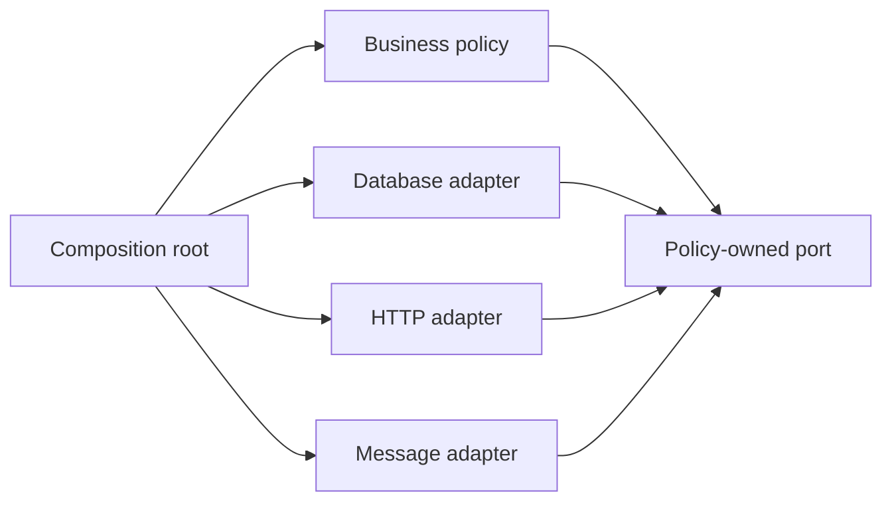

# SOLID Principles

> [!summary]
> SOLID는 Class 수를 늘리는 규칙이 아니라 변경 이유, 확장 지점, 대체 가능성, Client별 계약과 의존성 방향을 점검하는 다섯 가지 설계 원칙이다. 적용 여부는 추상화 개수가 아니라 변경 비용, 결합도, 테스트 가능성과 운영 실패 격리로 평가한다.

## 1. 개요

SOLID는 객체지향 설계를 평가하는 다섯 가지 Principle을 묶은 이름이다.

| 원칙 | 핵심 질문 |
|---|---|
| SRP: Single Responsibility Principle | 이 Module은 하나의 변경 축에 집중하는가? |
| OCP: Open-Closed Principle | 안정된 코드를 반복 수정하지 않고 필요한 변화를 확장할 수 있는가? |
| LSP: Liskov Substitution Principle | 하위 Type이 상위 Type의 계약을 깨지 않고 대체될 수 있는가? |
| ISP: Interface Segregation Principle | Client가 사용하지 않는 계약에 의존하도록 강제되는가? |
| DIP: Dependency Inversion Principle | 중요한 정책이 변동성 높은 구현 세부 사항에 끌려가는가? |

SOLID는 모든 Class에 Interface를 만들거나 Pattern을 최대한 적용하라는 의미가 아니다. 문제와 Principle, Pattern, Architecture의 수준 차이는 [[01-Java-Core/351-Pattern-vs-Principle-vs-Architecture|Pattern vs Principle vs Architecture]]를 참고한다.

## 2. 왜 필요한가

운영 시스템은 최초 구현보다 변경 과정에서 비용이 커진다. 정책 변경 하나가 DB, HTTP, Logging 코드까지 건드리거나, 구현체 교체가 호출자 전체를 수정하게 만들면 회귀 위험과 배포 Lead Time이 증가한다.

SOLID가 줄이려는 대표적인 설계 위험은 다음과 같다.

- 서로 다른 변경 이유가 한 Module에 섞임
- 새 유형 추가 때마다 안정된 분기문을 수정함
- 하위 Type이 상위 Type의 의미적 계약을 위반함
- 거대한 Interface가 무관한 Client를 결합함
- Business Policy가 Framework, DB Driver와 외부 SDK에 직접 의존함

다만 추상화에도 탐색 비용, 객체 수, 조립과 디버깅 비용이 있다. 실제 변화가 없는 곳에 SOLID를 기계적으로 적용하면 오히려 유지보수성이 낮아진다.

## 3. 핵심 개념

### SRP: 하나의 변경 이유

SRP의 Responsibility는 “Method 하나”가 아니라 같은 이해관계자와 변경 이유에 속하는 Cohesive한 책임이다. Invoice 계산, PDF Rendering, 파일 저장과 Email 발송이 한 Class에 있으면 정책, 표현 형식, 저장소와 전달 채널의 변화가 서로 영향을 준다.

Class 크기만으로 SRP를 판정할 수 없다. 큰 Class라도 하나의 응집된 정책을 표현할 수 있고, 작은 Class 여러 개가 같은 변경에 항상 함께 수정된다면 잘못 분리됐을 수 있다.

### OCP: 안정된 부분을 보호하는 확장

OCP는 모든 코드를 미래 확장에 열어 두라는 원칙이 아니다. 반복적으로 변하는 축을 추상화해 안정된 Orchestration을 보호하라는 뜻이다.

- 변화 축이 확인되지 않음: 단순한 조건문이 더 적절할 수 있음
- 독립적인 정책이 반복 추가됨: Strategy 또는 Registry가 유효할 수 있음
- Protocol별 Adapter가 늘어남: Port와 Adapter 분리가 유효할 수 있음

OCP를 적용하면 새 구현 추가는 쉬워지지만 추상화와 조립 규칙은 복잡해진다.

### LSP: 구문이 아니라 의미적 계약

하위 Type은 상위 Type이 약속한 Precondition, Postcondition, Invariant와 관찰 가능한 행동을 보존해야 한다.

- Precondition을 더 강하게 만들면 안 된다.
- Postcondition을 더 약하게 만들면 안 된다.
- 상위 Type이 보장한 불변 조건을 깨면 안 된다.
- 호출자가 기대하는 Exception과 Side Effect 의미를 자의적으로 바꾸면 안 된다.

상속 문법이 컴파일된다고 대체 가능성이 보장되지는 않는다. 동등성 계약과 상속의 긴장은 [[01-Java-Core/005-Object-Class|Object 클래스]]와도 연결된다.

### ISP: Client 중심 계약

ISP는 Interface Method를 무조건 하나씩 쪼개라는 뜻이 아니다. 서로 다른 Client가 다른 속도로 변하는 기능에 의존한다면 계약을 분리하라는 원칙이다.

읽기 전용 Consumer가 쓰기·삭제 Method까지 가진 Repository에 의존하면 권한, 테스트 Double과 변경 범위가 불필요하게 커진다. 반대로 항상 함께 사용되는 Method를 지나치게 분리하면 조립과 탐색 비용만 증가한다.

### DIP: 정책이 세부 사항을 소유하지 않게 하기

DIP는 단순히 Interface를 추가하거나 DI Container를 사용하는 것과 다르다. 중요한 Business Policy가 DB, Messaging, Clock, 외부 SDK 같은 변동성 높은 세부 사항에 직접 의존하지 않도록 Source Code Dependency 방향을 설계한다.

Interface가 하위 Infrastructure Package에 있고 Domain이 이를 Import하면 형식상 Interface가 있어도 정책이 세부 사항에 의존할 수 있다. 추상화의 소유 위치가 중요하다.

## 4. 내부 메커니즘



DIP가 적용된 구조에서 Domain 또는 Application Policy가 필요한 계약을 정의하고 Adapter가 이를 구현한다. Runtime 호출은 Policy에서 Adapter 방향으로 갈 수 있지만 Source Dependency는 Adapter가 Policy의 Port를 향한다.

### 변경 전파와 Stable Boundary

SOLID의 내부 목적은 변경 전파를 줄이는 것이다.

1. 변경이 일어나는 축을 식별한다.
2. 함께 변하는 책임은 응집시키고 독립적으로 변하는 책임은 분리한다.
3. 안정된 Policy와 변동성 높은 Mechanism 사이에 계약을 둔다.
4. 계약은 호출자의 실제 필요와 의미적 보장을 표현한다.
5. Test와 운영 지표로 경계가 유효한지 검증한다.

### Composition Root

객체 생성과 구현체 선택은 Application 진입점 같은 Composition Root에 모을 수 있다. Business Class 내부에서 구체 객체를 생성하면 DIP가 약해지고 테스트에서 교체하기 어렵다.

Spring을 사용하더라도 Container가 자동으로 좋은 경계를 만들어 주지는 않는다. Component Scan과 Constructor Injection은 조립 방법이고, 의존성 방향과 Interface 소유권은 설계자가 결정한다.

## 5. 상세 설명

### SRP와 Transaction Boundary

책임을 나눌 때 Transaction까지 무조건 분리하면 안 된다. 하나의 Business Invariant를 원자적으로 지켜야 하는 계산과 상태 변경은 같은 Application Use Case에서 조정될 수 있다. SRP는 각 행위를 별도 Service와 별도 Transaction으로 만들라는 뜻이 아니다.

좋은 분리는 다음을 확인한다.

- 계산 정책과 I/O가 독립적으로 변하는가?
- 실패와 Retry 정책이 다른가?
- 일관성 경계가 어디인가?
- 별도 배포 또는 Scaling이 필요한가?

### OCP와 잘못된 Generalization

두 코드가 현재 비슷하다는 이유로 하나의 추상화를 만들면 미래 변경 방향이 달라질 때 결합이 생긴다. “세 번 반복되면 무조건 추상화” 같은 규칙보다 Change History와 Variation Axis를 확인해야 한다.

Pattern 적용 시점은 다음 신호로 판단할 수 있다.

- 같은 분기 지점이 반복 수정된다.
- 새 유형 추가가 기존 유형의 Regression을 만든다.
- 정책별 테스트와 배포 주기가 다르다.
- 외부 Provider 교체가 핵심 Use Case까지 전파된다.

### LSP와 Exception 계약

상위 계약이 “결과가 없으면 Empty Optional을 반환한다”고 정했는데 특정 구현이 Runtime Exception을 던지면 호출자의 Control Flow를 깨뜨린다. 반대로 상위 계약이 실패를 명시했는데 구현이 조용히 기본값을 반환하면 장애를 숨길 수 있다.

LSP는 Type Hierarchy뿐 아니라 Interface 구현체와 Test Double에도 적용된다. In-memory Fake가 실제 DB의 Unique Constraint, Transaction과 Ordering을 재현하지 못하면 테스트가 잘못된 대체 가능성을 가정할 수 있다.

### ISP와 API Versioning

내부 Java Interface뿐 아니라 REST, Event Schema와 SDK 계약에도 Client 중심 사고를 적용할 수 있다. 모든 Consumer를 위한 거대한 Payload는 변경 영향과 권한 노출을 키운다. 다만 Network API를 지나치게 잘게 쪼개면 Round Trip과 운영 Endpoint 수가 증가한다.

### DIP와 Dependency Injection의 차이

- Dependency Injection: 객체가 Dependency를 외부에서 전달받는 구성 기법
- Dependency Inversion: 상위 Policy와 하위 Mechanism 모두 안정된 Abstraction을 향하도록 하는 설계 원칙

구체 Class를 Constructor로 주입받으면 DI는 했지만 DIP는 달성하지 못할 수 있다. 반대로 작은 순수 Java Application은 Framework 없이 Factory에서 Port 구현을 연결해 DIP를 적용할 수 있다.

### SOLID 원칙 사이의 긴장

원칙들은 동시에 최대화할 목표가 아니다.

- SRP를 과도하게 적용하면 ISP보다 더 작은 Interface와 Class가 폭증한다.
- OCP를 위해 만든 확장점이 YAGNI와 단순성을 해칠 수 있다.
- LSP를 보장하기 어려운 상속을 제거하면 Composition이 늘어난다.
- DIP Boundary가 많아지면 호출 흐름과 Debugging이 복잡해진다.

현재 Risk와 변화 가능성에 비례해 적용해야 한다.

## 6. Java 17 예제

### 잘못 결합된 결제 완료 처리

```java
import java.time.Instant;

public final class PaymentCompletionService {
    public void complete(String orderId, long amount) {
        // Business validation
        if (amount <= 0) {
            throw new IllegalArgumentException("amount must be positive");
        }

        // 구체 DB 및 HTTP Client 생성이 정책과 결합된 예시
        LegacyPaymentRepository repository = new LegacyPaymentRepository();
        LegacyNotificationClient notificationClient = new LegacyNotificationClient();

        repository.markCompleted(orderId, amount, Instant.now());
        notificationClient.send(orderId, "PAYMENT_COMPLETED");
    }
}
```

검증 정책, 시간, 저장과 알림이 한 Class에 결합돼 있다. DB 또는 알림 Provider 변경과 테스트가 핵심 Use Case에 전파된다.

### SRP와 DIP를 고려한 Port 분리

```java
import java.time.Clock;
import java.time.Instant;
import java.util.Objects;

public record CompletePaymentCommand(String orderId, long amount) {
    public CompletePaymentCommand {
        if (orderId == null || orderId.isBlank()) {
            throw new IllegalArgumentException("orderId must not be blank");
        }
        if (amount <= 0) {
            throw new IllegalArgumentException("amount must be positive");
        }
    }
}

public record CompletedPayment(String orderId, long amount, Instant completedAt) {
}

public interface PaymentStore {
    void save(CompletedPayment payment);
}

public interface PaymentEventPublisher {
    void publishCompleted(CompletedPayment payment);
}

public final class CompletePaymentUseCase {
    private final PaymentStore paymentStore;
    private final PaymentEventPublisher eventPublisher;
    private final Clock clock;

    public CompletePaymentUseCase(
            PaymentStore paymentStore,
            PaymentEventPublisher eventPublisher,
            Clock clock
    ) {
        this.paymentStore = Objects.requireNonNull(paymentStore);
        this.eventPublisher = Objects.requireNonNull(eventPublisher);
        this.clock = Objects.requireNonNull(clock);
    }

    public CompletedPayment complete(CompletePaymentCommand command) {
        Objects.requireNonNull(command, "command must not be null");

        CompletedPayment payment = new CompletedPayment(
                command.orderId(),
                command.amount(),
                clock.instant()
        );
        paymentStore.save(payment);
        eventPublisher.publishCompleted(payment);
        return payment;
    }
}
```

이 구조는 저장과 발행의 원자성을 자동으로 보장하지 않는다. 실제 운영에서는 DB Transaction과 Message 발행 사이의 실패를 Outbox 같은 별도 설계로 해결해야 한다. SOLID가 분산 일관성 문제를 대신 해결하지는 않는다.

### OCP를 적용한 Risk Rule

```java
import java.util.List;

public interface RiskRule {
    RiskDecision evaluate(PaymentRequest request);
}

public record PaymentRequest(String customerId, long amount) {
}

public record RiskDecision(boolean allowed, String reason) {
    public static RiskDecision allow() {
        return new RiskDecision(true, "allowed");
    }

    public static RiskDecision reject(String reason) {
        return new RiskDecision(false, reason);
    }
}

public final class RiskEvaluator {
    private final List<RiskRule> rules;

    public RiskEvaluator(List<RiskRule> rules) {
        this.rules = List.copyOf(rules);
    }

    public RiskDecision evaluate(PaymentRequest request) {
        return rules.stream()
                .map(rule -> rule.evaluate(request))
                .filter(decision -> !decision.allowed())
                .findFirst()
                .orElseGet(RiskDecision::allow);
    }
}
```

새 Rule은 기존 `RiskEvaluator`의 분기문을 수정하지 않고 추가할 수 있다. 하지만 Rule 순서, 중복 Reject, Timeout과 Exception 정책을 명시하지 않으면 확장 가능성만 얻고 운영 예측 가능성을 잃는다.

### LSP 위반과 계약 재설계

```java
public interface Account {
    void withdraw(long amount);
}

public final class FixedDepositAccount implements Account {
    @Override
    public void withdraw(long amount) {
        throw new UnsupportedOperationException("withdrawal is not supported");
    }
}
```

상위 `Account`가 출금을 약속하지만 하위 Type이 항상 거부한다면 대체 가능성이 깨진다. 모든 계좌가 출금 가능하다는 잘못된 계층을 수정한다.

```java
public interface Account {
    long balance();
}

public interface WithdrawableAccount extends Account {
    void withdraw(long amount);
}
```

이 분리는 ISP도 함께 개선한다. 출금 Client는 `WithdrawableAccount`에만 의존하고 조회 Client는 더 작은 계약을 사용할 수 있다.

### 계약 테스트

```java
import static org.junit.jupiter.api.Assertions.assertEquals;
import static org.junit.jupiter.api.Assertions.assertThrows;

interface WithdrawableAccountContract {
    WithdrawableAccount createAccountWithBalance(long balance);

    @org.junit.jupiter.api.Test
    default void rejectsAmountGreaterThanBalance() {
        WithdrawableAccount account = createAccountWithBalance(1_000L);

        assertThrows(IllegalArgumentException.class, () -> account.withdraw(1_001L));
        assertEquals(1_000L, account.balance());
    }
}
```

여러 구현체에 같은 Contract Test를 적용하면 LSP의 일부 관찰 가능한 계약을 자동 검증할 수 있다. 동시성, Transaction과 외부 장애 계약은 별도 통합 테스트가 필요하다.

## 7. Spring 예제

Spring Boot 3.x에서 Constructor Injection을 사용하더라도 Package Dependency가 역전되는 것은 아니다.

```java
import org.springframework.context.annotation.Bean;
import org.springframework.context.annotation.Configuration;

@Configuration
class PaymentConfiguration {
    @Bean
    CompletePaymentUseCase completePaymentUseCase(
            PaymentStore paymentStore,
            PaymentEventPublisher eventPublisher,
            Clock clock
    ) {
        return new CompletePaymentUseCase(paymentStore, eventPublisher, clock);
    }

    @Bean
    Clock systemClock() {
        return Clock.systemUTC();
    }
}
```

Configuration은 Composition Root 역할을 한다. 핵심 Use Case가 Spring Annotation 없이도 실행 가능하게 유지하면 Framework 교체 자체보다 빠른 단위 테스트, 명확한 Dependency와 Boundary 관리에 도움이 된다.

반대로 모든 Domain Class에 Interface를 만들고 구현체가 하나뿐인 상태에서 이유 없이 분리하면 탐색 비용만 커질 수 있다.

## 8. 운영 환경 활용

### 변경 비용 관측

SOLID 적용 효과는 다음 지표와 신호로 관찰할 수 있다.

- 하나의 정책 변경에 수정되는 Module 수
- 같은 파일에서 발생하는 반복 회귀
- Test Fixture 설정 복잡도
- Deploy 단위 간 Change Coupling
- 장애 시 책임 Component 식별 시간
- 외부 Provider 교체에 필요한 수정 범위

### 운영 경계와 실패 격리

DIP로 외부 Provider를 Adapter 뒤에 두면 Timeout, Circuit Breaker와 Metric을 한 경계에서 일관되게 적용할 수 있다. 그러나 추상화가 모든 Provider 차이를 숨길 수는 없다. 동기/비동기 의미, Idempotency, Rate Limit과 Error Model이 다르면 최소 공통 Interface가 중요한 기능을 잃게 만들 수 있다.

### 규제 및 감사 환경

금융 시스템에서는 계산 정책, 승인 권한, 감사 기록과 외부 전송 책임을 분리하면 변경 승인과 추적이 쉬워진다. 다만 Audit Log는 Business Transaction 실패와 어떤 원자성 관계를 갖는지 별도로 정의해야 한다.

## 9. 성능 및 메모리 고려 사항

SOLID 자체가 성능을 높이거나 낮춘다고 단정할 수 없다. 영향은 구현 방식에 달려 있다.

- 작은 객체와 Strategy 목록은 Allocation과 간접 호출을 늘릴 수 있다.
- Proxy와 Decorator Chain은 Stack Depth와 진단 복잡성을 높인다.
- 지나친 Remote Service 분리는 Network Latency와 Serialization 비용을 만든다.
- 잘 분리된 Cache 또는 Batch Adapter는 I/O와 부하를 줄일 수 있다.
- DIP를 통한 Fake 테스트는 빠르지만 실제 Infrastructure 성능을 검증하지 않는다.

Hot Path의 Interface 호출 비용을 추측하기보다 JIT 최적화와 실제 호출 형태를 포함한 Benchmark를 수행한다. 일반적인 Business Service에서는 I/O, Lock과 Allocation이 더 큰 병목일 수 있다.

## 10. 동시성과 스레드 안전성

책임 분리가 공유 상태를 자동으로 제거하지 않는다.

- Singleton Spring Bean의 Mutable Field는 요청 간 Race Condition을 만든다.
- OCP 기반 Rule 목록을 Runtime에 변경하면 Publication과 일관성 문제가 생긴다.
- LSP 구현체마다 Thread Safety 수준이 다르면 상위 계약이 모호해진다.
- 읽기/쓰기 Interface 분리만으로 DB Isolation이 보장되지 않는다.
- Adapter Retry가 Non-idempotent Operation을 중복 실행할 수 있다.

Thread Safety, Blocking 여부와 재진입 가능성은 Interface의 의미적 계약에 포함해야 한다.

## 11. 실패 시나리오와 문제 해결

### Interface Explosion

**증상:** 구현체가 하나뿐인 Interface가 대량으로 존재하고 변경 시 Interface와 구현을 항상 함께 수정한다.

**원인:** DIP와 OCP를 “모든 Class에 Interface 생성”으로 해석했다.

**대응:** 실제 교체 경계, 테스트 경계와 변화 축이 없는 Interface를 제거한다. Concrete Dependency가 안정적이고 국소적이면 직접 의존할 수 있다.

### Anemic Domain과 Service 비대화

**증상:** Entity는 Getter/Setter만 가지고 모든 정책이 거대한 Service에 모인다.

**원인:** SRP를 Data와 Behavior 분리로 단순화했다.

**대응:** Invariant를 소유해야 할 객체를 식별하고 응집된 Behavior를 이동한다. Application Orchestration과 Domain Policy를 구분한다.

### LSP 위반으로 운영 구현만 실패

**증상:** In-memory Fake 테스트는 통과하지만 DB 구현에서 Null, Ordering, Unique Constraint 또는 Transaction 문제가 발생한다.

**대응:** 공유 Contract Test와 실제 Infrastructure 통합 테스트를 함께 사용하고 Interface 계약에 실패 의미를 명시한다.

### DIP 뒤에 숨은 분산 실패

**증상:** 모든 Provider가 같은 Interface를 구현하지만 Timeout, Partial Success와 Retry 의미가 달라 장애 대응이 불가능하다.

**대응:** 지나치게 작은 공통 계약을 재검토하고 Capability, Error Type과 Idempotency 요구를 명시한다. Adapter Metric에 Provider와 Operation을 구분하되 Cardinality를 제한한다.

## 12. 흔한 실수

- SRP를 Class가 Method 하나만 가져야 한다는 뜻으로 해석한다.
- OCP를 미래의 모든 변화에 대비하라는 뜻으로 해석한다.
- 상속이 컴파일되면 LSP를 만족한다고 생각한다.
- ISP를 Interface Method 하나당 Interface 하나로 분리한다.
- Constructor Injection을 사용하면 DIP가 자동 적용된다고 생각한다.
- 구현체가 하나인 모든 Class에 Interface를 만든다.
- SOLID를 성능, Transaction과 분산 실패의 해결책으로 취급한다.
- Principle 적용 여부를 Class와 Package 개수로 평가한다.

## 13. 모범 사례

- 실제 Change History에서 독립적인 변화 축을 찾는다.
- Business Policy와 I/O Mechanism의 경계를 우선 식별한다.
- Interface에 성공뿐 아니라 실패, 동시성과 Side Effect 계약을 표현한다.
- 상속보다 Composition이 계약을 더 정확히 표현하는지 검토한다.
- 가장 단순한 구현에서 시작해 반복 변화가 확인될 때 추상화한다.
- Contract Test와 Architecture Test로 의미와 의존성 방향을 검증한다.
- 운영 지표와 장애 기록으로 경계의 실효성을 재평가한다.
- 추상화 제거 비용도 낮게 유지한다.

## 14. 면접 질문

### 질문 1. SOLID를 실무 관점에서 설명해 보라.

**면접관이 평가하는 것**

약어 암기가 아니라 변경 비용, 계약과 의존성 방향을 설명하는지 평가한다.

**간결한 답변**

SRP는 변경 이유의 응집, OCP는 검증된 변화 축의 확장, LSP는 의미적 대체 가능성, ISP는 Client별 최소 계약, DIP는 정책이 세부 구현이 아닌 안정된 추상화에 의존하도록 하는 원칙이다.

**시니어 확장 답변**

SOLID는 Interface 수를 늘리는 규칙이 아니라 변경 전파를 관리하는 판단 기준이다. 실제 Change History로 변화 축을 찾고, 계약에는 실패와 동시성 의미까지 포함한다. 추상화 비용이 이익보다 크면 단순한 구현을 유지하며, Architecture Test, Contract Test와 Production Metric으로 경계가 효과적인지 검증한다.

**가능한 후속 질문**

- SRP의 Responsibility는 어떻게 찾는가?
- OCP와 YAGNI가 충돌하면 어떻게 하는가?
- DIP와 DI는 어떻게 다른가?

**약한 답변**

각 약어의 한 줄 정의만 말하고 적용 조건, 부작용과 운영 검증을 설명하지 못한다.

### 질문 2. LSP 위반 사례를 들어 보라.

**간결한 답변**

상위 Type이 출금을 보장하는데 특정 하위 계좌가 항상 `UnsupportedOperationException`을 던지면 호출자의 기대를 깨므로 LSP 위반이다. 조회 가능한 계좌와 출금 가능한 계좌 계약을 분리할 수 있다.

**시니어 확장 답변**

LSP는 Method Signature가 아니라 Precondition, Postcondition, Invariant와 실패 의미를 보존하는 문제다. Fake와 실제 DB 구현의 Transaction·Constraint 차이도 대체 가능성을 깨뜨릴 수 있으므로 공유 Contract Test와 실제 통합 테스트를 함께 둔다.

### 질문 3. DIP를 적용하면 어떤 운영상 이점이 있는가?

**간결한 답변**

외부 DB나 Provider를 Adapter Boundary로 격리하면 교체, 테스트와 Timeout·Metric 정책을 집중할 수 있다.

**시니어 확장 답변**

이점은 Framework 독립성이라는 구호보다 실패 격리와 변경 반경 축소에 있다. 다만 Provider별 Error Model과 Idempotency 차이를 지나치게 단순한 Interface로 숨기지 않아야 하며 실제 Adapter 통합 테스트가 필요하다.

## 15. 후속 질문

- SRP와 높은 Cohesion은 어떤 관계인가?
- OCP를 적용해야 할 Variation Point를 어떻게 찾는가?
- LSP를 Test로 어느 범위까지 검증할 수 있는가?
- ISP와 Network API 분리는 어떻게 다른가?
- DIP를 적용했지만 Domain이 Framework에 결합되는 사례는 무엇인가?
- SOLID와 Functional Programming은 충돌하는가?
- 추상화를 제거해야 하는 신호는 무엇인가?

## 16. 면접관의 관점

주니어 후보자는 정의와 간단한 도형 예제를 말하는 데 그치기 쉽다. 시니어 후보자는 다음을 보여줘야 한다.

- Principle을 Change Scenario와 연결한다.
- LSP를 의미적 계약과 실패 행동으로 설명한다.
- DI Container와 DIP를 구분한다.
- 추상화의 비용과 제거 조건을 말한다.
- Transaction, 동시성과 분산 실패는 별도 설계가 필요함을 안다.
- Test와 Production Evidence로 설계를 검증한다.

## 17. 시니어 수준의 답변

> SOLID는 Class와 Interface 수를 늘리는 규칙이 아니라 변경 전파와 의미적 계약을 관리하는 다섯 가지 판단 기준입니다. SRP는 같은 이유로 변하는 책임을 응집시키고, OCP는 실제로 반복되는 변화 축에서 안정된 코드를 보호합니다. LSP는 구현체가 Precondition, Postcondition과 실패 의미를 포함한 상위 계약을 지키는지 확인하며, ISP는 Client가 필요하지 않은 계약에 결합되지 않게 합니다. DIP는 Business Policy가 DB나 외부 SDK 같은 변동성 높은 세부 사항을 소유하지 않도록 Source Dependency 방향을 설계합니다. 저는 Change History, Contract Test, Architecture Test와 운영 지표로 경계의 가치를 검증하고, 변화가 없는 곳에는 YAGNI에 따라 단순한 구현을 유지합니다.

## 18. 흔한 오답

- “SRP는 Class가 기능 하나만 가져야 한다는 뜻이다.”
- “OCP를 위해 모든 변경 가능성을 미리 Interface로 만든다.”
- “상속 관계가 컴파일되면 LSP를 만족한다.”
- “ISP는 Interface를 최대한 작게 쪼개는 것이다.”
- “Spring DI를 사용하면 DIP가 자동으로 적용된다.”
- “SOLID를 적용하면 Microservices Architecture가 된다.”
- “Interface가 많을수록 결합도가 낮다.”

## 19. 운영 경험 체크리스트

- [ ] 최근 변경에서 함께 수정되는 Module을 확인했는가?
- [ ] 독립적인 변화 축과 이해관계자를 식별했는가?
- [ ] Interface의 성공·실패·동시성 계약이 명확한가?
- [ ] Fake와 실제 구현이 공유 Contract Test를 통과하는가?
- [ ] Business Policy의 Import 방향을 자동 검사하는가?
- [ ] 외부 Adapter의 Timeout, Retry와 Idempotency를 정의했는가?
- [ ] 추상화가 장애 원인 파악을 어렵게 하지 않는가?
- [ ] 구현체 하나뿐인 Interface의 존재 이유를 설명할 수 있는가?
- [ ] 적용 전후 변경 비용과 운영 지표를 비교했는가?

## 20. 면접 직전 10분 요약

- SRP: 하나의 변경 이유와 높은 Cohesion
- OCP: 검증된 변화 축에는 확장, 안정된 코드에는 수정 최소화
- LSP: Signature가 아니라 의미적 계약의 대체 가능성
- ISP: 구현자가 아니라 Client 중심 계약 분리
- DIP: Policy가 Mechanism에 끌려가지 않는 Source Dependency
- DI는 DIP를 구현할 수 있는 기법 중 하나다.
- Interface 개수는 SOLID의 성과 지표가 아니다.
- SOLID는 Transaction과 분산 일관성을 자동 해결하지 않는다.
- Change History와 Test로 추상화의 가치를 검증한다.
- YAGNI와 단순성도 함께 고려한다.

## 21. 관련 주제 및 요약

- [[01-Java-Core/351-Pattern-vs-Principle-vs-Architecture|Pattern vs Principle vs Architecture]] — Principle의 역할과 Pattern·Architecture와의 경계
- [[01-Java-Core/005-Object-Class|Object 클래스]] — 동등성 계약, 상속과 Liskov Substitution의 긴장

SOLID는 객체지향 설계의 정답지가 아니라 변경과 결합을 평가하는 언어다. 다섯 원칙은 각기 다른 실패 형태를 다루지만 공통 목표는 중요한 정책을 보호하고 의미적 계약을 명확히 하며 불필요한 변경 전파를 줄이는 것이다.

시니어 개발자는 원칙을 기계적으로 최대화하지 않는다. 실제 변화 축과 운영 실패를 관찰하고 최소한의 경계를 선택하며, Test와 Production Evidence로 효과를 검증한다. 추상화가 더 이상 가치를 주지 않으면 제거할 수 있어야 한다.